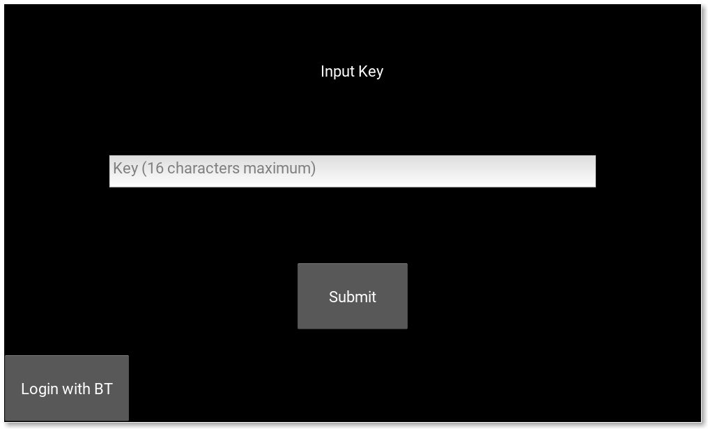
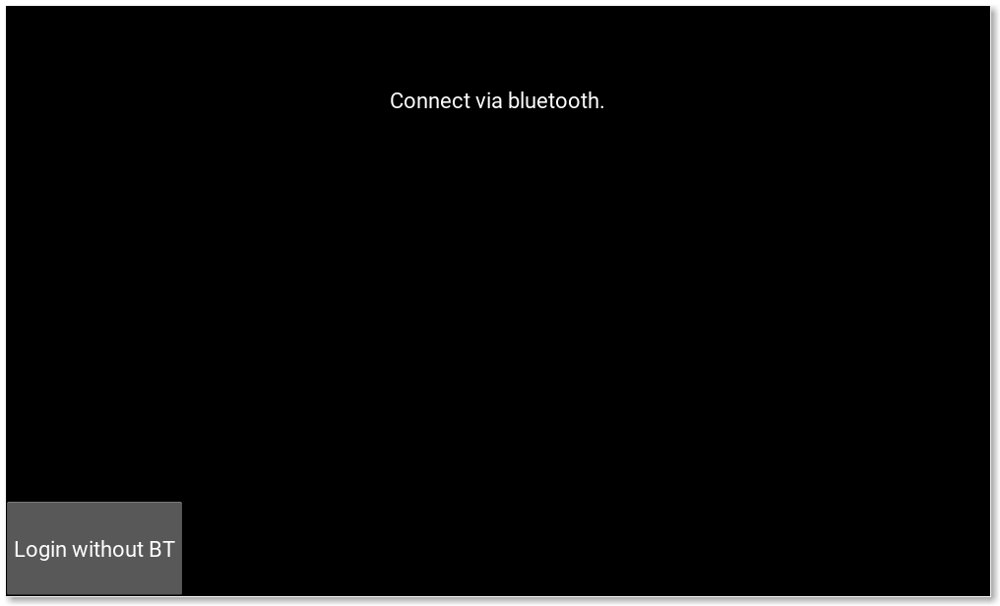
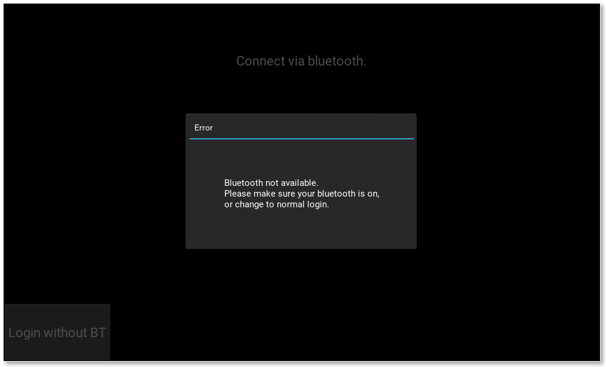
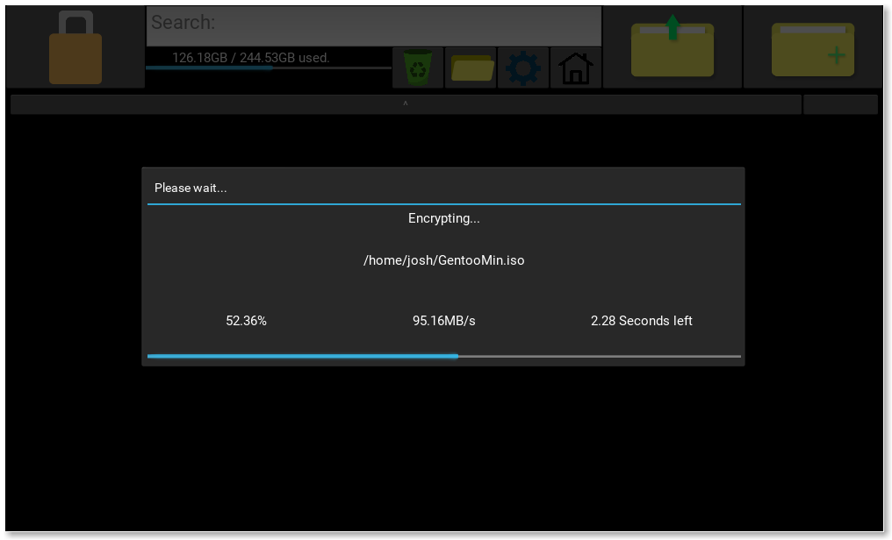

# Analysis

## Project Idea:

The idea for my project, is to have a program that acts as a vault for important files. It will encrypt files given, and store them in a specified location. Once they are encrypted, they will only be accessible from within the program, and will only be accessible within the program if you know the encryption key (passphrase) that you set when creating the “vault”.

Within the vault, you should be able to easily organise your files, add more to the vault, and remove (decrypt) files from the vault to any location (if possible).

My program would be useful for teachers, as they have to keep documents on student’s grades, and any other student details secure. Since this is my use case, I will have to thoroughly test the security and practicality of my program to make sure teachers want to use it, and trust the program with these files. Also, I will add an optional mobile app that the user can download, which lets them connect to the program via Bluetooth to unlock the vault. This is would be useful if you are a teacher, as if you leave the room with your phone in your pocket, and it is connected to the vault, if you have forgotten to lock the vault then a student might try to browse through it while you are gone, but with the app, as soon as you disconnect the Bluetooth connection it locks the vault, so if you forgot to close it then it closes itself.

The Bluetooth app should also be able to receive files from the PC app, so that the user can download files that are in the vault onto their mobile device. This would be useful for teachers that do not take their PC home (e.g not a laptop), so they can upload the files from the computer, to their phone so that they can edit the file at home or on the move (with another mobile app).

The program needs to work on both Windows, Linux and MacOS, as then teachers/users have more flexibility with what operating systems they can use it on, so they can easily go from machine to machine and carry their vault with them (on a USB stick for example), and they know that they can reliably use the program on most machines.

The user experience has to be pretty good. Good design practice will have to be used when making the GUI (e.g not putting the delete button next to the decrypt button), as I want my program to be easy to use by a wide range of people, so that even people who are not so good with computers can easily use the program.
 The way the user is directed around the program has to be logical as to not confuse the user, and adding a panic button to take you back to the main screen may be a good idea.

---

## Client:

An example client for my project could be a teacher/school, as they have to keep files about students secure. For example, pupil details, exam results and other important student details. 
 My program aims to help the teacher/school keep the pupil’s files safe, and prevent the files from being accessed if their device is stolen. It will encrypt files given to the program, and be secured by a pin code that is transferred over Bluetooth to the computer from a mobile device. Once the mobile device is unpaired from the computer, the app will lock again. This will prevent someone from having access to the files if the computer is unlocked and is stolen, as the mobile device will go out of range of the computer, so the computer will lock.

I sent a questionnaire to a member of the IT office at my school to ask what regulations there were about keeping a teacher’s files safe, and what encryption they would suggest for keeping the files secure.

---

<span style="color:#4286f4">Hi Josh,</span>

 What encryption should I use when encrypting the user’s files?
<span style="color:#4286f4">The bare minimum would be 128 bit AES, though 256 bit is recommended.</span>

Are there any standards or laws about what encryption method I should be using for files such as a teacher’s student files (one of the clients for this program)?
<span style="color:#4286f4">Data protection laws. The current UK Law is the Data Protection Act 1998. Though as of 25th May, the law will be General Data Protection Regulations (EU Law regarding all EU Citizens). This is a very complicated law, that is causing headaches for businesses worldwide. I’ve attached some links you might find useful regarding GDPR towards the end of this email.</span>

<span style="color:#4286f4">Hope this helps!</span>

 <span style="color:#4286f4">Many thanks</span>
<span style="color:#4286f4">Mr ___</span>

<https://www.eugdpr.org/>

<https://itpeernetwork.intel.com/gdpr-opportunity-rethink-security/>

<https://ico.org.uk/for-organisations/guide-to-the-general-data-protection-regulation-gdpr/>

<https://media.datalocker.com/marketing/GDPR_infographic_2017.pdf>

<https://www.kingston.com/en/usb/resources/eu-gdpr>

---

I will be using this information as guidance for what I have to take into consideration. I will keep in mind the data protection laws when I am storing the user’s files, and make sure I am within the regulations.

The EU General Data Protection Regulations consist of (As of 25/05/18): 

### Breach Notification:

If a data breach has been found and it might “result in a risk for the rights and freedoms of individuals”, then the person that the data belongs to has to be notified within 72 hours.

### Right to Access:

The person who’s data it is can at any point ask for confirmation as to whether or not data concerning them is being processed, where it is being processed if it is and for what purpose.

### Right to be Forgotten:

The data subject can ask for their data to be erased, and stop the processing of their data. This will be done depending on whether there is public interest in their data (e.g if a politician says something stupid then they can’t ask Google to delete it just because it makes them look bad), and if the data is no longer relevant (e.g your cookies from last week that were used for targeted ads).

### Data Portability:

The data subject should be allowed to ask to receive the data, and they should also be able to change which company is controlling their data.

### Privacy by Design:

Tells the controllers of the data to only use the data absolutely necessary for the purposes they need it for. For example, an advertisement company might use your cookies to target ads to you, however they can’t then use your location unless they are also using that to target ads. Basically don’t take more than you need.

For my project, as the user is the data controller, then they already have the right to access, the right to be forgotten and data portability. For the breach notification, they will probably know it has happened as someone needs to have physical access to where the data is stored to breach it.
However, with privacy by design, I will not be using any of the user’s data for advertising, or any other agenda. I will make this clear to the user when they first use the program. Also the security will be 

Another issue could be that if a file is deleted, the contents of the file might still remain. To fully remove the file I may have to use a one way function that ruins the data before deletion so that it cannot be accessed after it is deleted.

---

## Objectives:

1. GUI should:

   a. Be easy to use:

   ​	i. Logically laid out.

   ​	ii. Have simple options.

   b. Display the files currently stored in the vault, along with the file extension and the size of the file.

   c. Display the storage space remaining on the storage device the program is running on.

   d. The user should be able to easily encrypt and decrypt files:

   ​	i. Using easy to access buttons in the UI.

   ​	ii. Using drag and drop.

   e. Have an options menu, including the options to:

   ​	i. Change security level (from 128 bit AES to 256 bit AES).

   ​	ii. Change the location of the vault.

   ​	iii. Set the default login method (Bluetooth or no Bluetooth).

   ​	iiii. Change if the search in the file browser is recursive or not.

   f. Make it easy to manage the files in the vault (move to other folders in the vault, rename, etc).

   g. Have a secure login screen.

   ​	i. Ask the user to either input the key via their keyboard (no Bluetooth for that session), or connect via the app.

   ​	ii. Tell the user if the key is invalid or not, and smoothly transition into the main program.

   h. Look relatively good without being bloated.

   i. Allow the user to easily read file names, and easily tell folders and files apart.

   j. Let the user preview images without opening them (using thumbnails or an information screen).

2. App should:

   a. Be easy to use.

   b. Connect via Bluetooth to the PC.

   c. Allow the user to input their pin code easily.

   d. Tell the user if the pin code is invalid or not.

   e. Make it easy to recover from mistakes (e.g invalid pin code, or if they make a typo).

   f. Allow the user to see a list of files currently in the vault, and let the user download those files onto their mobile device.

3. File handling:

   a. Store the encrypted contents in the location specified by the user.

   b. Encrypt and decrypt relatively quickly, while still being secure.

   c. When the Bluetooth device goes out of range (if using Bluetooth),  encrypt all decrypted files and lock the program until the pin code is input correctly again.

   e. Have a recycling bin so that the user can recover their files.

   f. When a file is opened, check for changes once it is closed.

   g. Files stored in the vault should not be accessible from outside of the app.

   h. Names of the files stored in the vault should also not be view-able from outside of the app (encrypt the name).

---


# Design

## Bluetooth:

For the file store to be unlocked, I need to send the passcode to the computer via a Bluetooth connection.

For the computer and android device to connect to each other, one device has to be assigned as the server, so it makes sense to me to use the computer as the server, as it will be running for the entire duration that the user wants to use the program.

For the mobile app, I will be using Kivy to program the app. I am using Kivy so that the design is consistent with the design of the PC app. I will be using the android.bluetooth library that is included in the android SDK to transmit the data via Bluetooth.

For the Bluetooth server (on the pc), I will be using Python to receive the pin from the mobile device using PyBluez, check the sent pin, and send a message back saying if the code was valid or not.
 If the code is not valid, a message will be displayed on the computer that the code is invalid, and the code on the screen of the phone will be erased.

Here is a flow diagram for what Bluetooth will be like:


To send the files, I will need a protocol. A protocol is a set of rules for communicating over a network. A protocol will allow the program to distinguish data that is being sent is a key, file list or a file itself.

### Protocol

The protocol rules all have to be strings of bytes that are not likely to appear in a key, file list or a file. This is a necessity because otherwise mid way through sending a key, file list or file, if the program encounters a protocol rule within the key, list or file, then it may cause the program to get confused as to what is being sent, or if the current key, list or file has finished being sent.

For each of the possible items that are going to be sent, each item needs a start header, and an end header.
Start header:

```
!<operation>!
```

End header:

```
~!END!
```

For operations that do not have any extra data (arguments), then only the start header is sent.

For sending more complex operations,  I will use objects that hold the data, pickle them (object sterilisation), and send the object data sandwiched between the `!<operation>!` header (start header) and the `~!END!` header. For more complex operations that have multiple arguments, a separator is used to separate those arguments:

```
~~!~~
```

Here is an example with multiple arguments:

```
!<operation>!<argument1>~~!~~<argument2>~!END!
```

This is especially useful for files, as this way I can send the metadata in one big lump, then send the file bit by bit. Here is what a file would look like when it is sent:

```
!FILE!<metadata_object>~~!~~<data>~!END!
```

For the key however, since it will always be small ( < 16 bytes), I will just send it with a `#` at the start, and a `~` to finish the message. This is acceptable because when the PC program starts, it doesn't expect any requests from the client, so it is just waiting for the key. The key should also only be made up of numbers.

```
#<key>~
```

For items such as file metadata, I will use Python pickle to send an object (more of a structure) containing the metadata, rather than using separators, as then it is much easier for me to add information I want to send.

### Sending files over Bluetooth:

To send a file from the vault, first it has to be decrypted to a temporary location. I could instead send the data from within AES, so that when a block is decrypted it is sent, however I don't plan on writing AES in Python since speed is essential for AES (and a new Bluetooth socket would have to be set up if using a different language).

Metadata will be sent as an object before sending the file contents, as talked about in the above section.

An example class for file metadata may look like this:


```python
class fileMetadata:
    def __init__(self, name, size, isFolder):
        self.name = name 		 # The name of the file being sent.
        self.size = size		 # The size of the file being sent.        
        self.isFolder = isFolder # Boolean for if the file is actually a folder.
```

This is more of a structure than an object, as it has no methods, and is just a collection of data.

After the metadata is sent, a separator will have to be sent to separate the metadata from the file data itself. I discuss this in the above section.

For the file itself, I will send the file in chunks, so that

1. I don't use too much memory (since mobile devices usually have a small amount of memory compared to regular computers).
2. The Bluetooth adapter can keep up with the amount being sent.

This reduces the stress on both the mobile device and the PC.

Once the full file is sent, an end header is sent to tell the program that the full file has been transmitted.

---

## File Storage:

For storing the files, I will store the encrypted files in a directory set by the user.
The directory will be managed using a tree structure, where the root folder contains folders for each file, with the name of every folder and file being encrypted, as otherwise anyone can see the name of your file.

The encryption method I will use AES 128 bit, as it will slightly compromise security over using 256 bit, however it will be faster to decrypt files for use, giving the user a better experience, however I might add an option to use 256 in the settings if the user needs more security over performance.
For the encryption key, the key will be set up every time a new vault is created (this includes first starting the program). It will tell the user to enter the new key, and then from that moment forwards in that vault, that key will remain the same, and will be used every time a file is encrypted/decrypted in the vault.

When a file is encrypted, the key is appended to the start of the data, and is then encrypted. This is so that when the data is decrypted, only the first block has to be decrypted and compared with the key entered to check if the key entered was correct, rather than decrypting the whole file just to find out that the key was incorrect. This will also be used to check the key entered at login, where the login will try to find the first file it can within the vault, decrypt the first block of that file and compare it with the input.

The key will have to be hashed if I send it over Bluetooth, as it may get intercepted, and it is also a good idea to hash it on the computer program as well, as if someone somehow manages to get the key, it will not be the user’s original input, so if the user uses it for something else, their other accounts will be fine.

Here is a data flow diagram showing how the data is handled once logged into the program:


The key is also passed to any stages that encrypt or decrypt, as at this point the user should already be logged in.

When a file is edited, the file should be checked to see if any changes have been made, and if there has been changes, remove the version of the file currently in the vault, and encrypt the latest version into the vault. Also, if there are any new files in the temporary folder (for example if the user renames the file), then encrypt them to the vault as well.

To do this, I need a way of getting a checksum of the file before and after it has been opened. I need a fast algorithm so that the user is not waiting too long for the file to open and close, but it also needs to be unlikely that there will be a collision (where if they change the file and the checksum gives an answer that is the same as before the file was changed, that would be a collision).
I will discuss which checksum I will be using in the next section.


When viewing the files in my program, I will use an object that holds all of the information I need about the file, and any methods that I need to get that information.

Here is what I expect the class to be like:


Where `getCheckSum` will get the BLAKE2b checksum of the file. The hexPath and the hexName will hold the encrypted path and encrypted name of the file, so that I don't keep encrypting and decrypting the file name.


---

## Choosing the right algorithms:

When encrypting, decrypting and hashing data in my program, I want it to be as fast as possible without compromising too much on security. 

### Hashing:

When hashing the key when it is input, the algorithm has to be very secure, and speed does not matter as much. A member of the SHA2 family of algorithms would be a good algorithm to do this, as it is quite slow, but it is very secure (SHA1 was found to have a lot of hash collisions). Speed does not matter as much for the key, as the input data will only ever be less than 16 bytes. A faster algorithm will only provide a few milliseconds over SHA, so there is no point compromising on security for a negligible time decrease.

For getting the checksum of files, the algorithm has to be very fast, as it will be done on the data in the file before and after the file is opened to check for changes. If this algorithm is slow, then the overall user experience will be much worse if the algorithm takes ages to open and close files. I will test each algorithm I am thinking of using for hashing and compare them using this algorithm (Python):

```python
import hashlib				# Library of hashing algorithms.
from random import randint  # Used to generate the data.
from time import time		# Used to measure how long the operation takes.

def generate(times, size):	# Generates data, each block of length "size", and "times" number of blocks.
    data = []
    for i in range(times):
        for j in range(size):
            data.append(randint(0, 255))	# Randomly generate a byte.
    return bytearray(data)

def test(times, size):
    data = generate(times, size)    # Generate the data
    start = time()					# Get the start time
    for i in range(times):
        hashlib.sha256(data[i*size:(i+1)*size]).hexdigest()	# Do the hash (in this case SHA256)

    return (times*size)/(time()-start)		# Return the bytes per second.

print(test(1000, 128))	# Run the program.
```

I will run this algorithm on the same computer and make sure background tasks are closed, so that the results are not affected by other programs.

#### Here are the results:

Megabytes per second for each hash function (using 1000 blocks of 128 bytes (128 kilobytes)):


For my next tests, I will do data hashed against time. For this I will be using different sized files that I will make using this function:

```python
def generateFile(name, totalSize):
    fo = open(name, "wb")
    a = bytearray()
    for i in range(totalSize):
        a.append(randint(0, 255))
    fo.write(a)
    fo.close()
```

First I will test each hash function with encrypting very small data (<= 1 KiB). These were the results:


This image can be found larger in the <b>Large Images</b> section as <b>Figure 3</b>.

Here is the start of the graph, as that is the most interesting bit:


The axis on this graph are the same as the one before it.

Here we can see that SHA256 is the fastest at hashing 16 bytes, but is quickly surpassed by most of the algorithms. Both BLAKE algorithms had a bad performance at the start, but after 64 bytes both were doing alright. MD5 is the quickest overall out of the group. From these results I think I will use SHA256 for hashing the key, since the key is 16 bytes in length, and also because SHA is more aimed at security than BLAKE, and MD5 and SHA1 are obsolete in terms of security.

The BLAKE algorithms were designed for big data, which is what I am going to look at next:


In this graph, the gradient (rate of increase) of each line is the ratio of seconds to megabytes of each function (so $\frac{x}{y} = megabytes/second$). So the less steep the line is, the faster the operation.

SHA256 and SHA224 have taken the longest, at almost identical rates. BLAKE2s is quite slow, and this is because BLAKE2s is designed for 32-bit CPU architectures, and my CPU is 64-bit. MD5 and SHA1 are both the fastest, and have similar performance, but have security problems. BLAKE2b was the fastest out of the secure functions, so I will be using BLAKE2b for checksums in the program, as checksums need to be calculated quickly, as discussed before.

### Encryption:

For encryption, I will definitely be using AES, because it is the standard and has been tested extremely thoroughly by the public. I do not want to compromise on security, and AES is still pretty fast anyway.

I will use 128 bit AES mainly, as it is still proven to be secure from attacks, and may include the option to use 256 bit if desired by the user. The majority of users will not need AES 256 level security, but I will include it for people that may need it.

---

## AES:

### History:

In 1997, the encryption standard at the time, DES, was becoming obsolete due to the advancements in the computer industry. This resulted in the National Institute of Standards and Technology in the United States to call for a new advanced encryption standard (AES).

They held a competition that consisted of 15 different algorithms that had been submitted by different teams. The algorithm that won was an algorithm called Rijndael, an algorithm created by two Belgian cryptographers – Vincent Rijamen and Joan Daemen.

One of the reasons AES has been more successful than DES so far is that AES was thoroughly tested by members of the public during the competition, analysing every aspect of the algorithms to find a way to break them. On the other hand, DES was created in secrecy by IBM in the 70s, and the algorithm was only released a few years later.

This open-source approach ended up helping the new Advanced Encryption Standard, as the program could be heavily analysed by people all across the globe.

### The Algorithm (<u>128 bit AES</u>):

#### <u>How the data is handled:</u>

AES works by using a block cipher, so it splits the data given into 128 bit, 192 bit or 256 bit chunks depending on what AES you choose (128, 192 or 256). You then use the algorithm on each block to get the cipher text, then you write it to the new file, and move onto the next block.

AES is a symmetric cipher, so only one key is needed to both encrypt and decrypt the data.

Here is an example for 128 bit AES encryption:


Decryption works exactly the same, however the cipher text is split up and decrypted.

Each 128 bit "block" of data can also be called a "state".

#### <u>Before the operation starts:</u>

First, the data has to be a multiple of 16 in length. If it isn't then more bytes need to be added to the end such that the data is 16 bytes in length (padding).

However, the padding cannot just be 0's at the end, as when we decrypt the block, we have no way of distinguishing these 0's from the rest of the data, or know if they are supposed to be there. To get around this, when we add the padding, we give each byte the value of how many more bytes we need to add to get the length of the block to 16 bytes. This sounds confusing, but here is an example:

Say we had a block that was = <b>[1, 2, 3, 4, 5, 6, 7, 8, 9, 10, 11, 12, 13]</b>

This block is not 16 bytes in length. To pad this block, we need to add 3 lots of the number 3 to the end (since 16 - length of the block = 3). The new block would look like this:

[1, 2, 3, 4, 5, 6, 7, 8, 9, 10, 11, 12, 13, <b>3, 3, 3</b>]

When we go to decrypt this block, we check to see if the value of the last byte in the block is lower than 16, and that if the number occurs the same number of times as the value, then we remove these bytes.


For each round of the encryption, a different key has to be used. To make the cipher decipherable, these keys have to be derived from the original key given. For 128 bit AES (the main one I will be using in the program), the 16 byte key has to be transformed into a 176 byte list of 16 byte keys (11 keys in total, one for every round).

The first 16 bytes are the key, and then from there, the algorithm is started. Here is the algorithm with example:
<b>Figure 1 (A larger version can be found in the "Large Images" section)</b>

The algorithm in psudocode:

```pseudocode
function expandKey(inputKey)
	expanded := inputKey
	bytesGenerated := 16
	rconIteration  := 1
	temp := uint8[4]
	
	while bytesGenerated < 176
		temp = expanded[bytesGenerated - 4:bytesGenerated]
		
		if bytesGenerated MOD 16 == 0 then
			temp[0], temp[1], temp[2], temp[3] = temp[1], temp[2], temp[3], temp[0]
			temp[0], temp[1], temp[2], temp[3] = sBox[temp[0]], sBox[temp[1]], sBox[temp[2]], sBox[temp[3]]
			
			temp[0] = temp[0] XOR rcon[rconIteration]
			rconIteration = rconIteration + 1
		end if
		
		for i := 0 to 4
			expanded[bytesGenerated] = expanded[bytesGenerated - 16] XOR temp[y]
			bytesGenerated = bytesGenerated + 1
		end
	return expanded
end
```


The array of round keys starts off the exact same as the original key. Then if the length of the round key array is a multiple of 16 (which it is), the last 4 bytes of the previous round key (in this case the last 4 bytes of the original key) is:

1. Rotated (The first element of the 4 bytes is put at the end).
2. Substituted (Using the Rijndael Substitution-Box found at: https://en.wikipedia.org/wiki/Rijndael_S-box).
3. First byte of the 4 is XOR-ed with it's corresponding Round Constant (depending on the round number the key will be used in).
4. The result is appended to the array of round keys.

If the length of the round key array is not a multiple of 16, then the last 4 bytes in the array are XOR-ed with 4 bytes of the array that are 16 bytes before hand (shown in <b>Figure 1</b>).

This process is repeated until the length of the round key array is 176 bytes, then we will have one 16 byte key for each of the 11 rounds.

And that's all of the preparations done.

### <u>The operation:</u>

Here is a diagram of the operation (I will explain each step in detail below):


In total there are 11 rounds (9 regular rounds). For each round, the corresponding round key (that we calculated beforehand) is used in the operation.

The 16 bytes in the state can be represented in a 4x4 grid, to make it easier to visualise what is happening at each stage:


##### Add Round Key:

The Add Round Key step is literally just XOR-ing each byte in the current block of 16 bytes, with each byte in the 16 byte round key, and returning the state.

Here is pseudocode for the <b>Add Round Key</b> step:

```pseudocode
function addRoundKey(state, roundKey)
	for i := to 16
		state[i] = state[i] XOR roundKey[i]
	return state
```


##### Sub Bytes:

Sub bytes substitutes each byte in the state with it's corresponding value in the Rijndael substitution box:


When using the sub-box, you have to think of each byte as hexadecimal (0xYZ). 
Each row of the sub box is the value of the Y value (16s) in the hexadecimal representation of the byte.
Each column of the sub box is the value of the Z value (1s) in the hexadecimal representation of the byte.

For example, if I had the hex `0x1A`, it would be substituted by the value: `0xA2`
, as it is row "1", column "A".

Here is the pseudocode for the **Sub Bytes** step:

```pseudocode
function subBytes(state)
	for i := 0 to 16
		state[i] = sBox[state[i]]
	return state
```

It is pretty much the same as **Add Round Key** but instead of XORing you substitute each byte of the state with the corresponding byte in the sub-box (sBox).


##### Shift Rows:

Shift Rows shifts the rows (really?) left depending on the row number.

For example, the first row is shifted left by 0, second row shifted by 1 and so on:


Here is the algorithm for **Shift Rows**:

```pseudocode
function shiftRows(state)
	temp := []
	
	temp[ 0] = state[ 0]
	temp[ 1] = state[ 5]
	temp[ 2] = state[10]
	temp[ 3] = state[15]
	
	temp[ 4] = state[ 4]
	temp[ 5] = state[ 9]
	temp[ 6] = state[14]
	temp[ 7] = state[ 3]
	
	temp[ 8] = state[ 8]
	temp[ 9] = state[13]
	temp[10] = state[ 2]
	temp[11] = state[ 7]
	
	temp[12] = state[12]
	temp[13] = state[ 1]
	temp[14] = state[ 6]
	temp[15] = state[11]
	
	return temp
```

The array is indexed to correspond to the images above.


##### Mix Columns:

Mix columns is the most confusing step of AES, so I will try to break it down into small pieces.

The mix columns calculation is this:
$$
\begin{bmatrix}
 r_0\\
 r_1\\
 r_2\\
 r_3\\
\end{bmatrix} = \begin{bmatrix}
 2 & 3 & 1 & 1\\
 1 & 2 & 3 & 1\\
 1 & 1 & 2 & 3\\
 3 & 1 & 1 & 2\\
\end{bmatrix}
\begin{bmatrix}
 a_0\\
 a_1\\
 a_2\\
 a_3\\
\end{bmatrix}
$$
Where $r_0$ to $r_3$ is the result of the operation, and $a_0$ to $a_3$ is the 4 bytes that make up the input column.

This is matrix multiplication, but we need to do dot product multiplication. This is where we multiply each corresponding element in each row of the pre-defined matrix (the one with numbers already in it), with the corresponding element in $a_0$ to $a_3$, and then adds them up MOD2, also known as XOR (so that it is still 1 byte).

One way to represent this is like this:
$$
r_0= (2\times a_0)\oplus(3\times a_1)\oplus(1\times a_2)\oplus(1\times a_3)\\
r_1 = (1\times a_0)\oplus(2\times a_1)\oplus(3\times a_2)\oplus(1\times a_3)\\
r_2 = (1\times a_0)\oplus(1\times a_1)\oplus(2\times a_2)\oplus(3\times a_3)\\
r_3 = (3\times a_0)\oplus(1\times a_1)\oplus(1\times a_2)\oplus(2\times a_3)
$$
To dot product two binary numbers, they need to be represented using a Galois field.

A number can be represented by using a Galois field. A Galois field is just a way to represent a number as a polynomial, e.g  $5x^2 + 2x+3  $, where $x^2$ is $10^2$, so the number of 100s in the number (for decimal), while $x$ is the number of tens. In this case, this Galois field would represent the number 523, as there are 5 hundreds, 2 tens and 3 ones.

For example, if we wanted to represent the decimal number: 25301 as a Galois field, it would be:
$$
2x^4+5x^3+3x^2+1
$$
Note that the 0 in 25301​ is not included, as $0x = 0$.

To represent a binary number, the same logic applies. For example, to represent the binary number `10011011` as a Galois field, it would be:
$$
x^7+x^4+x^3+x^1+1
$$

To get back to decimal, we can replace the $x$ with the number 2, as binary is base 2:
$$
2^7+2^4+2^3+2^1+1 = 155 = 10011011
$$


The dot product of two Galois fields is like expanding brackets: $(x+2)(x+3) = x^2+5x+6$,  which is $(x\times x)+(2\times x)+(x\times 3)+(3\times 2)$,  so we just multiply each item in each bracket together.

Now I will do an example of doing one result ($r_0$) of mix columns.

Lets use these values of $a_0$ to $a_3$ for the example:
$$
\begin{bmatrix}
 2 & 3 & 1 & 1\\
 1 & 2 & 3 & 1\\
 1 & 1 & 2 & 3\\
 3 & 1 & 1 & 2\\
\end{bmatrix}
\begin{bmatrix}
 d4\\
 d4\\
 d4\\
 d5\\
\end{bmatrix}
$$
To get $r_0$ I have to do:
$$
r_0= (2\times a_0)\oplus(3\times a_1)\oplus(1\times a_2)\oplus(1\times a_3)
$$
which is:
$$
r_0= (2*d4)\oplus(3*d4)\oplus(1*d4)\oplus(1*d5)
$$
in this example.

I am using $d4, d4, d4, d5$ as test values as they are test vectors used on this page: https://en.wikipedia.org/wiki/Rijndael_MixColumns, to check that we get the right answer.

Now I need to convert the hex values $d4$ and $d5$ to binary:

$d4$ in binary is $11010100$

$d5$ in binary is $11010101$

Now i need to convert both of these into Galois fields:
$$
\begin{align*}
11010100 &= x^7 + x^6 + x^4 + x^2\\
\quad 11010101 &= x^7 + x^6 + x^4 + x^2 + 1
\end{align*}
$$
Then I need to multiply them all by their corresponding value in the pre-defined table expressed as a Galois field (e.g. $2 \equiv x$):
$$
\begin{align*}
(x^7 + x^6 + x^4 + x^2)(x) &= x^8 + x^7 + x^5 + x^3\\
(x^7 + x^6 + x^4 + x^2)(x + 1) &= x^8 + x^7 + x^7 + x^6 + x^5 + x^4 + x^3 + x^2 \\&= x^8 + 2x^7 + x^6 + x^5 + x^4 + x^3 + x^2\\
(x^7 + x^6 + x^4 + x^2)(1) &= x^7 + x^6 + x^4 + x^2\\
(x^7 + x^6 + x^4 + x^2 + 1)(1) &= x^7 + x^6 + x^4 + x^2 + 1\\
\end{align*}
$$

---

But hang on a second, the answer to $d4 * 3$  and $d4 * 2$ both have a $x^8$ term, which means it's bigger than 255 (since $2^8$ = 256), so it is no longer a byte, which means that it no longer fits in with 128 bit AES.

To fix this, we replace all of the $x^8$ terms with this pre-determined polynomial (Rijndael's finite field),  reducing by MOD2 as we go along: 
$$
x^8 \equiv x^4 + x^3 + x + 1
$$
Let's try this with d4*3 :
$$
\begin{align*}
3d4 &= x^8 + 2x^7 + x^6 + x^5 + x^4 + x^3 + x^2\\
&= (x^4 + x^3 + x + 1) + 2x^7 + x^6 + x^5 + x^4 + x^3 + x^2\\
&= 2x^7 + x^6 + x^5 + 2x^4 + 2x^3 + x^2 + x + 1\\
&= 0x^7 + x^6 + x^5 + 0x^4 + 0x^3 + x^2 + x + 1 \space \space \space \text{Here is where I did MOD2} \\
&= x^6 + x^5 + x^2 + x + 1
\end{align*}
$$
Again with d4*2:
$$
\begin{align*}
2d4 &= x^8 + x^7 + x^5 + x^3 \\
&= (x^4 + x^3 + x + 1) + x^7 + x^5 + x^3\\
&= x^7 + x^5 + x^4 + 2x^3 + x + 1\\
&= x^7 + x^5 + x^4 + x + 1
\end{align*}
$$

Now, with our new values for a_0  to a_3, we can finally do the equation:
$$
\begin{align*}
r_0 &= (2\times d4)\oplus(3\times d4)\oplus(1\times d4)\oplus(1\times d5)\\
r_0 &= (x^7 + x^5 + x^4 + x + 1)\oplus(x^6 + x^5 + x^2 + x + 1)\oplus(x^7 + x^6 + x^4 + x^2)\oplus(x^7 + x^6 + x^4 + x^2 + 1)\\
r_0 &= (2^7 + 2^5 + 2^4 + 2 + 1)\oplus(2^6 + 2^5 + 2^2 + 2 + 1)\oplus(2^7 + 2^6 + 2^4 + 2^2)\oplus(2^7 + 2^6 + 2^4 + 2^2 + 1)\\
\end{align*}
$$

$$
\begin{align*}
r_0 = 10110011\\ 01100111\\ 11010100\\ \oplus\space\space 11010101\over
= 11010101 \\
\\
r_0 = 213 (decimal)
\end{align*}
$$
And, thank god, that is the correct answer for the test vector on this page: https://en.wikipedia.org/wiki/Rijndael_MixColumns.

To get $r_1$, $r_2$ and $r_3$, you repeat the process using the equations for each defined at the top of this section.

This whole process has to be done on each column.

On a computer, this would be very demanding on the processor, however since the range of the inputs is 0-255 (since the number has to be represented by 1 byte), you can make a lookup table with all of the 256 possible outputs, for each of the multiplications, for each of the 256 possible inputs. This drastically increases speed, and also makes it easier to program. You would have a table for multiplication by 2 and 3, and for the inverse function of Mix Columns you would need multiplication by 9, 11 and 13.

This trades a few kilobytes of memory for a drastic improvement in speed.

This makes the pseudocode for **Mix Columns** very simple:

```pseudocode
// mul2 and mul3 are the pre-defined tables talked about above.
function mixColumns(state)
	temp := []
	
	temp[ 0] = mul2[state[0]] XOR mul3[state[1]] XOR state[2] XOR state[3]
	temp[ 1] = state[0] XOR mul2[state[1]] XOR mul3[state[2]] XOR state[3]
	temp[ 2] = state[0] XOR state[1] XOR mul2[state[2]] XOR mul3[state[3]]
	temp[ 3] = mul3[state[0]] XOR state[1] XOR state[2] XOR mul2[state[3]]
	
	temp[ 4] =  mul2[state[4]] XOR mul3[state[5]] XOR state[6] XOR state[7]
    temp[ 5] =  state[4] XOR mul2[state[5]] XOR mul3[state[6]] XOR state[7]
    temp[ 6] = state[4] XOR state[5] XOR mul2[state[6]] XOR mul3[state[7]]
    temp[ 7] = mul3[state[4]] XOR state[5] XOR state[6] XOR mul2[state[7]]

    temp[ 8] = mul2[state[8]] XOR mul3[state[9]] XOR state[10] XOR state[11]
    temp[ 9] = state[8] XOR mul2[state[9]] XOR mul3[state[10]] XOR state[11]
    temp[10] = state[8] XOR state[9] XOR mul2[state[10]] XOR mul3[state[11]]
    temp[11] = mul3[state[8]] XOR state[9] XOR state[10] XOR mul2[state[11]]

    temp[12] = mul2[state[12]] XOR mul3[state[13]] XOR state[14] XOR state[15]
    temp[13] = state[12] XOR mul2[state[13]] XOR mul3[state[14]] XOR state[15]
    temp[14] = state[12] XOR state[13] XOR mul2[state[14]] XOR mul3[state[15]]
    temp[15] = mul3[state[12]] XOR state[13] XOR state[14] XOR mul2[state[15]]
    
    return temp
}

```


#### <u>Decryption</u>

Decryption is just encryption, but in reverse. This uses the inverse functions of each function used to encrypt the data. Here is the algorithm:


It is literally just the encryption algorithm in reverse.

Before decryption, the exact same steps need to be taken as in encryption, apart from the padding because  all the blocks should have already been encrypted, so each block should be 16 in length.


##### Inverse Add Round Key:

Add round key is it's own inverse, as XOR is the same forwards as it is backwards.


##### Inverse Sub Bytes:

Inverse sub bytes is the same as sub bytes, it just has an inverse of the S-Box.


##### Inverse Shift Rows:

Inverse shift rows does what shift rows does, but shifts each row right instead of left.

In the diagram below it takes the shifted data and orders it again.


##### Inverse Mix Columns:

Inverse mix columns works the same as normal mix columns, but with a different matrix to multiply each element with:
$$
\begin{bmatrix}
 a_0\\
 a_1\\
 a_2\\
 a_3\\
\end{bmatrix} = \begin{bmatrix}
 14 & 11 & 13 & 9\\
 9 & 14 & 11 & 13\\
 13 & 9 & 14 & 11\\
 11 & 13 & 9 & 14\\
\end{bmatrix}
\begin{bmatrix}
 r_0\\
 r_1\\
 r_2\\
 r_3\\
\end{bmatrix}
$$
The a's are the original data, the r's are the encrypted data.

Just like with normal mix columns, you can just use lookup tables for each possible answer to each possible input.

And that's all for AES.

---

## SHA256:

SHA256 (in the Secure Hash Algorithm 2 family) takes an input of 32 bytes (256 bits), and gives a 32 byte output based on the input, but is meaningless. This is useful for passwords, or pin codes like in my program, where you don't want the original password to be known, but for the password to still be unique.

A small difference in the input gives you a drastic change in the output. For example, if I put in:

```
"test string"
```

I get:

```
d5579c46dfcc7f18207013e65b44e4cb4e2c2298f4ac457ba8f82743f31e930b
```

But when I put in:

```
"test strinh"
```

I get:

```
4e4d20e9fc77e913bf56cc69a2b4685d761a9e44d833198612e80a72dcd563f1
```

A vastly different output to the one above.
This is important, as there should be no pattern to the output, otherwise the original password could be guessed based off of similar inputs.

Now you might be asking "Why are you using 256 bit SHA, when size key you need for AES is 128 bits?". It is because the more bits you have, the less likely you are to have collisions with other inputs. The security of SHA-1 (128 bit SHA) (measured in bits) is less than 63 bits due to collisions (if it was fully secure it would be the full 128 bits).

What I am doing instead, is taking the output of SHA256, splitting it in half, and XORing each half with each other to get a 128 bit output. This doesn't affect how secure it is, as you still have the extra step of XOR, making it still more secure than SHA-1.

### The Algorithm:

Bear in mind that SHA works on a bitwise level, so while I will be explaining it, I will be talking in terms of bits.

#### How the message is handled:

When doing operations on the data, it will be done in 32 bit words. The message is split into 512 bit blocks, containing sixteen 32 bit words.


SHA is operates on every 32 bit word.

Since the maximum key size for my AES will be 16 bytes (128 bits), I don't need to worry about splitting the message into 512 bit chunks, as the input will only ever be 128 bits as SHA will only ever be used for the AES key. So, for the examples below I won't go into detail on how a message bigger than 512 bits will be handled.

#### Before the operation starts:

Before we start, we need to <b>pad the message</b> $M$ so that it is 512 bits in length.

Let $l$ = the length of the message $M​$.

First, we need to append the bit  $1$  to the end of the message, followed by $k$  $0$  bits, where $k$ is the smallest positive solution to the equation:
$$
l + 1 + k \equiv 448\space mod512
$$
To get $k$, the algorithm would look something like this (I wrote this in Python 3):

```python
k = 0
while ((l+1+k)-448) % 512 != 0:
    k += 1
```

Then, you append the binary representation of the length of the message $l$ as a 64 bit binary number. This makes the message 256 bits in length.

Let's do an example: $M$ = "i don't know".
$$
\begin{align*}
&l = 12\times 8 = 96\\
&\text{Append a "1":}\\
&M = \text{b"i don't know"}+1\\
&448-(96+1) = 351 \space \text{Zero Bits}\\
&M = \text{b"i don't know"}+1+351(0s)\\
&l = 96 =01100000\\
&\text{Final Padded Message:}\\
&M = \text{b"i don't know"}+1+351(0s)+56(0s)+01100000\\
\end{align*}
$$
The message has to be 512 bits in length so that it works with the calculations later.

Then, we also need to <b>set the initial hash values</b> for each word in the current block. The initial hash values set by the creators of SHA:

> "These words were obtained by taking the first thirty-two bits of the fractional parts of the square roots of the first eight prime numbers. "

$$
H_0 = 6a09e667\\
H_1 = bb67ae85\\
H_2 = 3c6ef372\\
H_3 = a54ff53a\\
H_4 = 510e527f\\
H_5 = 9b05688c\\
H_6 = 1f83d9ab\\
H_7 = 5be0cd19\\
$$

Next, each 32 bit word in the message has to be expanded from 32 bits to 64 bits.

Here is the algorithm:


To do this, we need two functions,  sigma 0 $\sigma_0$ and sigma 1 $\sigma_1$.

##### Sigma 0 (Expansion) ($\sigma_0$):

Sigma 0 (Expansion) looks like this:
$$
\sigma_0(x) = (x >>> 7) \oplus (x >>> 18) \oplus (x >>  3)
$$
$>>>$ means that we rotate the 32 bit word $x$ right by the number given ($y$). What this does is shift the bytes along $y$ places to the right, and wraps them around to the start of $x$.

I will do an example of $>>>$ with a 4 bit nibble:
$$
\begin{align*}
f(x) &= x >>> 1\\
f(1011) &= 1011 >>> 1\\
f(1011) &= 1101
\end{align*}
$$
As you can see, the $1$ bit at the end gets moved to the front, as I shifted it right by 1.

$>>$ Means shift the 32 bit word $x$ right by the number given ($y$). This is different from $>>>$, because instead of wrapping the bits around to the beginning of the word again, we just shove a $0$ bit at the front instead.

$\bigoplus$ is just XOR.

For example:
$$
\begin{align*}
f(x) &= x >> 1\\
f(1011) &= 1011 >> 1\\
f(1011) &= 0101\\
\\
g(x) &= x >> 2\\
g(0101) &= 0101 >> 2\\
g(0101) &= 0001
\end{align*}
$$
Here the byte is shifted right, and the bytes are removed as they are shifted.


##### Sigma 1 (Expansion)($\sigma_1$):

Sigma 1(Expansion)($\sigma_1$) is the same as Sigma 0 (Expansion)($\sigma_0$), apart from how much you rotate and shift the word:
$$
\sigma_0(x) = (x >>> 17) \oplus (x >>> 19) \oplus (x >> 10)
$$


#### The operation:

All addition is MOD(2^32).

Here is the full algorithm:

<b>Figure 2 (Found larger on "Large Images" section)</b>


In the diagram above, H is the array of initial hash values discussed earlier, wordList is a 2D array containing the 32 bit words. || means append, so $h0||h1||h2||...$ just appends the items together. K is the array with the round constants in (see https://csrc.nist.gov/csrc/media/publications/fips/180/4/archive/2012-03-06/documents/fips180-4.pdf section 4.2.2).

The step "Expand wordList[x]" is covered in the section above.

All of the SHA functions operate on 32 bit words, and return a new 32 bit word. I will now explain what the functions Sigma0 ($\Sigma_0$), Sigma1 ($\Sigma_1$), Ch and Maj.


##### Sigma 0 ($\Sigma_0$):

$\Sigma_0$ is this equation:
$$
\Sigma_0(x) = (x >>> 2) \oplus (x >>> 13) \oplus (x >>> 22)
$$
This looks confusing, but let me break it down.

$>>>$ means that we rotate (shift and move displaced numbers to the begining/end of the number) the number right by the number specified.

$\bigoplus$ means that we XOR the items either side with each other.

Here is an example of the rotate function:
$$
\begin{align*}
A &= 1001110\\
A >>> 2 &= 1010011 \quad \text{The last two bits are moved to the end.}
\end{align*}
$$


Let me do an example with a 32 bit word:
$$
\begin{align*}
&A = 10010111011011111000110111011101\\
&\Sigma_0 = (10010111011011111000110111011101 >>> 2) \oplus (10010111011011111000110111011101 >>> 13) \oplus\\&... (10010111011011111000110111011101 >>> 22)\\
&(10010111011011111000110111011101 >>> 2) = 01100101110110111110001101110111 \\ 
&\text{The two bits at the end have been moved to the front one by one.}\\
&(10010111011011111000110111011101 >>> 13) = 11110001101110111011001011101101\\
&(10010111011011111000110111011101 >>> 22) = 01110111011001011101101111100011\\
&01100101110110111110001101110111 \space\oplus\space 11110001101110111011001011101101 \space\oplus\space 01110111011001011101101111100011\\
&= 11100011000001011000101001111001
\end{align*}
$$

Sorry if that is a bit small.

It isn't too difficult it's just understanding what the $>>>$ does.


##### Sigma 1 ($\Sigma_1$):

Sigma 1 ($\Sigma_1$) is pretty much the same as $\Sigma_0$, the only difference being the amount you rotate by:
$$
\Sigma_0(x) = (x >>> 6)\oplus(x >>> 11)\oplus(x>>>25)
$$


##### Ch:

The Ch function looks like this:
$$
Ch(x, y, z) = (x \and y) \oplus (\neg x \and z)
$$
This also looks a bit confusing, but it really isn't too bad.

The $\and$ symbol is the bitwise operator AND.

The $\oplus$ symbol is the bitwise operator XOR.

The $\neg$ symbol is the bitwise operator NOT.

I will do one example run with Ch with three 4 bit nibbles to keep it simple:
$$
\begin{align*}
&Ch(1011, 1001, 0011) = (1011 \and 1001) \oplus (\neg1011 \and 0011)\\\\
&\quad1011\over\and\space1001\\
&=1001\\\\
&Ch(1011, 1001, 0011) = 1001 \oplus (\neg1011 \and 0011)\\
&\neg1001 = 0110\\\\
&\quad0110\over\and\space0011\\
&=0010\\\\
&Ch(1011, 1001, 0011) = 1001 \oplus 0010\\\\
&\quad1001\over\oplus\space0010\\
&=1011\\\\
&Ch(1011, 1001, 0011) = 1011
\end{align*}
$$

##### Maj:

the Maj function looks like this:
$$
Maj(x, y, z) = (x \and y) \oplus (x \and z) \oplus (y \and z)
$$
You should recognise the symbols in this one, since they appear in the other ones used in SHA that we have covered.
Here is an example with three 4 bit nibbles:
$$
\begin{align*}
&Maj(1011, 1001, 0011) = (1011 \and 1001) \oplus (1011 \and 0011) \oplus (1001 \and 0011)\\\\
&\quad1011\over\and\space1001\\
&=1001\\\\
&\quad1011\over\and\space0011\\
&=0011\\\\
&\quad1001\over\and\space0011\\
&=0001\\\\
&Maj(1011, 1001, 0011) = 1001 \oplus 0011 \oplus 0001\\\\
&\quad\space 1001\\& \quad\space 0011\\&\oplus\space 0001
\over=0101\\\\
&Maj(1011, 1001, 0011) = 0101
\end{align*}
$$

---

## BLAKE 2b:

BLAKE was a finalist in the SHA 3 contest. The SHA 3 contest was announced on November 2nd 2007, as a new hash function was needed, that was very different from the SHA 2 family of hash functions in case a huge issue was found with the SHA 2 family.

BLAKE did not win, as it was too similar to SHA2:

> _“desire for SHA-3 to complement the existing SHA-2 algorithms … BLAKE
> is rather similar to SHA-2.”_

_https://blake2.net/acns/slides.html_

However, BLAKE was the fastest out of all of the competitors (at 8.4 cycles per byte, cycles being the fetch decode execute cycle of a processor), and was tested to be secure. This meant that even though BLAKE did not win the competition, it is still used in numerous programs. Due to BLAKE's speed, it is ideal for getting the checksum of large data.

No preparations have to be done so lets just jump right into the algorithm.

### The Algorithm:

#### How the data is read:

8 initial hash values of size 64-bits are initialised at the start (using pre-defined values), and these are worked on throughout the program.

The data is read in 128 bytes, where each byte is then converted into a 64-bit word (just shove some 0s on the front). Each chunk is operated on using the 8 hash values, creating 8 new hash values. These new hash values are used in computation using the next block and so on.

Here is a diagram showing how the data is converted into data that can be processed:


To transform a list of 16 64-bit words into 1 64-bit word, you do this algorithm (where $a$ is the list of words):
$$
new = a[0] \oplus (a[1] << 8) \oplus (a[2] << 16) \oplus (a[3] << 24) \oplus (a[4] << 32) \oplus (a[5] << 40) \oplus (a[6] << 48) \oplus (a[7] << 56)
$$
What this does is XOR's the bytes in the array with each other in a way that produces a single word at the end.

#### The operation:


Each block has to be compressed and returned as 8 hash values. Above is the compression function. $t$ is the number of bytes in total that have been compressed so far, $h$ is a list of the 8 current hashes, and $k$ is the list of 8 initial hash values set here ***https://tools.ietf.org/pdf/rfc7693.pdf  section 2.6***, the same initial hash values of SHA512.

The operation is quite simple compared to other hash functions like SHA512, as it was built for speed.

The **Mix the data** step looks like this:

```pseudocode
for i := 0 to 12
	v = mix(v, 0, 4,  8, 12, m[sigma[i][0]], m[sigma[i][1]])
    v = mix(v, 1, 5,  9, 13, m[sigma[i][2]], m[sigma[i][3]])
    v = mix(v, 2, 6, 10, 14, m[sigma[i][4]], m[sigma[i][5]])
    v = mix(v, 3, 7, 11, 15, m[sigma[i][6]], m[sigma[i][7]])

    v = mix(v, 0, 5, 10, 15, m[sigma[i][ 8]], m[sigma[i][ 9]])
    v = mix(v, 1, 6, 11, 12, m[sigma[i][10]], m[sigma[i][11]])
    v = mix(v, 2, 7,  8, 13, m[sigma[i][12]], m[sigma[i][13]])
    v = mix(v, 3, 4,  9, 14, m[sigma[i][14]], m[sigma[i][15]])
```

Sigma ($\sigma$) is a 2-dimensional array containing some constant values, that determine what index of the current working vector $v$ (a 16 length array of 64-bit words) will be mixed with what other index of $v$. Sigma is defined here: ***https://tools.ietf.org/pdf/rfc7693.pdf section 2.7*** as:
$$
\sigma[0] = [0, 1, 2, 3, 4, 5, 6, 7, 8, 9, 10, 11, 12, 13, 14, 15]\\
\sigma[1] = [14, 10, 4, 8, 9, 15, 13, 6, 1, 12, 0, 2, 11, 7, 5, 3]\\
\sigma[2] = [11, 8, 12, 0, 5, 2, 15, 13, 10, 14, 3, 6, 7, 1, 9, 4]\\
\sigma[3] = [7, 9, 3, 1, 13, 12, 11, 14, 2, 6, 5, 10, 4, 0, 15, 8]\\
\sigma[4] = [9, 0, 5, 7, 2, 4, 10, 15, 14, 1, 11, 12, 6, 8, 3, 13]\\
\sigma[5] = [2, 12, 6, 10, 0, 11, 8, 3, 4, 13, 7, 5, 15, 14, 1, 9]\\
\sigma[6] = [12, 5, 1, 15, 14, 13, 4, 10, 0, 7, 6, 3, 9, 2, 8, 11]\\
\sigma[7] = [13, 11, 7, 14, 12, 1, 3, 9, 5, 0, 15, 4, 8, 6, 2, 10]\\
\sigma[8] = [6, 15, 14, 9, 11, 3, 0, 8, 12, 2, 13, 7, 1, 4, 10, 5]\\
\sigma[9] = [10, 2, 8, 4, 7, 6, 1, 5, 15, 11, 9, 14, 3, 12, 13, 0]\\
$$
$\sigma$ is defined for BLAKE2s, and BLAKE2s only has 10 rounds, while BLAKE2b has 12, so $\sigma_0$ and $\sigma_1$ are repeated again to make the array 12 in length.

Notice that in the first lot of mixing, the vector is mixed row by row normally (with the same indexing as AES), but in the second lot of mixing, the indices change. They shift each column up depending on the column. Column 0 is shifted 0 places, column 1 is shifted 1 place up, column 2 is shifted 2 places up, and column 3 is shifted 3 places up. This is a much better way of shifting each column than doing it before hand.

The main mixing function takes the inputs:
$$
mix(v, \space a, \space b, \space c, \space d, \space x, \space y)
$$
Where $v$ is the current vector (16 64-bit words), $a$, $b$, $c$, $d$, $x$, and $y$ are the indices of the working vector you want to work with. Here is the main mixing algorithm:


So all together, this is the BLAKE2b checksum algorithm:


The second step ($h[0] = h[0] \oplus 01010000 \oplus hL$) XORs $h[0]$ with $0101kknn$, where $kk$ is the length of the key (which is optional, so I probably will never use it), and $nn$ is the hash length desired.

---

## Quick Sort

My program will need a quick sort for sorting the files by:

- Size
- Name

I have chosen quick sort because it is quicker than most sorts (it's in the name!) with a big-O notation of $O(n \log n)$ on average, with the worst case being $O(n^2)$. Merge sort has a big-O notation of $O(n \log n)$, and worst case of $O(n \log n)$, so why am I not using merge sort? Merge sort is supposed to be quicker mathematically, however merge sort has to access the array of items more often, usually resulting in putting more strain on the hardware, and also slows the overall process down because getting items from memory takes a fair amount of time. Here is a good video comparing merge sort and quick sort (along with a few other algorithms): https://youtu.be/ZZuD6iUe3Pc

The algorithm goes like this (using a list of items to be sorted):

1. Take the item in the middle of the list. Call this the "pivot".
2. Compare each item either side of the pivot. If the item is bigger than the pivot, add it to a new list called "right", if the item is smaller than the pivot, add the item to a new list called "left".
3. Then repeat this process with the left and right lists (making this algorithm recursive).
4. Once the current left and right lists have been sorted, append the left list and right list with the pivot in the middle.

Here is the pseudocode of the algorithm:

```pseudocode
function quickSort(list)
	if length(list) <= 1 then
		return list
	else
		left   = []
		middle = []
		right  = []
		pivot  = list[int(length(list)/2)]
		for i = 0 to length(list) do
			if list[i] < pivot then
				left.append(list[i])
			else if list[i] > pivot then
				right.append(list[i])
			else
				middle.append(list[i])
			end
		end
		return quickSort(left)+middle+quickSort(right)
	end
end
```

Here is a flow diagram to represent this:


---

## UI Research:

For the UI of both apps, I will use Kivy (a Python module) to make both the mobile app and the PC program. I have chosen Kivy because using it on both the app and the main program means that the design will stay consistent, and Kivy does look quite nice "out of the box".

### Main Program (on PC):

The main program has to be designed to be easy to use, and actions that are used a lot should be easily accessible. I think I will go for a similar layout to a program that already exists, SanDisk Secure Access:


SanDisk Secure Access did inspire this project, however I do not want to make a carbon copy of it. I will take what SanDisk have done right, and improve the areas they lacked on.

<b>SanDisk did these things right:</b>

- The layout is pretty good because all buttons you would need regularly are available, and it doesn't differ too much in design from the Windows file explorer, so it feels familiar to it's users.
- Shows the user how much space is left on their device.
- Shows useful information about each file.
- The user can easily sort the list of files however they want.
- More options are hidden unless needed regularly.
- Allows the user to search the vault for a file.
- I can easily drag files in and out of the program.

<b>What I think SanDisk did not do too well:</b>

- Looks a bit cluttered with all the extra stuff at the bottom. If I wanted to see other files on my computer I would open my file manager, and if I wanted to add files to the vault I can just drag it in easily.

- Faded pictures in the background are distracting.

- Some buttons are quite small, so may be hard for some users to click.

- Aesthetically alright but could be better.

- Some icons are confusing when first using the program (like the folder with the green arrow inside of it; too much going on).

- Size is displayed in kilobytes, which is alright but is kind of hard to read for files larger than 1 megabyte.


Taking all of these points into consideration, here is a possible design for the UI of my program:


Everything grey is a clickable button. This helps the user distinguish between buttons and information. The most important buttons are large, as they will be used the most. The user can sort by name or size, and can search the entire vault for a search term.

The information button displays more information, such as:

- The time the file (if it is a file) was added to the vault.
- The full directory path from the vault.
- The size of the file/folder.
- The option to delete the file/folder.

The button with the home picture on it takes the user back to the root directory of the vault. The recycling bin button is for the recycling folder, where the files that have been deleted can be either restored or deleted. The cog wheel button is settings, where all the settings are kept. I gave the settings it's separate section to avoid clutter, as most users will probably not need to use it very often.

The user can sort the files by name alphabetically, or they can sort by size. Space remaining on the current device is shown underneath the search bar.

While searching through large folders, the search results should update every so often since it may take a while to search the full file tree.

When using the recycling bin, the program will look exactly the same, but warn the user that they are in the recycling bin "mode", so when they click files, instead of decrypting the file and opening it the file is instead moved back into the vault, recovering it to where it originally came from.

The login screen will have 2 modes:

1. Login without Bluetooth (can't use any Bluetooth functions while logged in).
2. Login with Bluetooth.

I will also make it so that you can easily switch between Bluetooth and non-Bluetooth login, whether that be a button on the login screen, or in the configuration file. Also, when in non-Bluetooth mode, the user will not need to have PyBluez installed, neither will they need Bluetooth on their PC.

When navigating the app, the navigation should be easy and simple so that the user does not get lost. I will have 2 main screens, a login screen and a main screen (to view files and open other functions once logged in), and within the main screen I will have a screen for settings, and a few other popups.

Here is a class diagram to show the relationship between screens and popups:


These are only the custom classes, so regular buttons and labels and such will be left out of this diagram.

The Encryption/Decryption popup should be opened when the user encrypts/decrypts a file, and should display information including how fast the file is being enc/decrypted (in kb or mb per second), the percentage of the file that has been enc/decrypted so far, and how many items have been done out of the total files to be enc/decrypted. There should also be a progress bar at the bottom, showing the percentage visually.

The Bluetooth sending popup should show the exact same information, but for the current status of the file being sent over Bluetooth.

The add file and add folder popups should both be similar in design, however the add file popup will let the user encrypt a file or folder to the vault, while the add folder popup will allow the user to create a new folder within the vault.

Popups are designed for one purpose only, and are usually used briefly before they are closed again. Screens will be used throughout the program, acting as the base of the GUI, where child widgets can be added to the screen, such as buttons, text inputs and views (such as scroll views). The screens will inherit from Kivy's Screen class, and the popups will inherit from Kivy's Popup class. The screens get managed by a ScreenManager, also a Kivy widget. The ScreenManager is then added to the app's root widget (the base widget of an app).

A hierarchy diagram for the entire GUI would look something like this (since Popups can be added and removed to any widget when needed, I will not include them in this diagram):


Each layer has it's own colour, since I couldn't think of a better way of making this clear without making the image extremely wide. "0..*" means 0 to many of this widget can exist at any time. This shows all of the widgets that will be on each screen at all times (unless obstructed by a popup) as default.

Here is a top-down view of how the GUI will flow while the user is using the program:


### The App:

The app's UI design should be very simple, as I do not need to add much.
All it needs to be is a number pad with a display, an enter button and a screen to have open while you are connected to the PC, and a file browser similar to the one on the PC app.
Here is a prototype I made in Processing (A java based "software sketchbook):


It is very minimal, as I decided to keep it as minimal as possible so that the user doesn't get confused, and to keep clutter at a minimum. 

Once the vault is unlocked, the user should be given the option to browse files in the vault from their phone, and select files to download, or instead just minimise the app and continue using their phone. The vault should only close once the user has exited the app, rather than when they minimise the app.

The user should be able to browse the folders independently from the computer program (so both programs can be looking at different folders), browsing the files should be a seamless experience, and when searching for files, the searching work should be done on the computer so that precious phone battery is not wasted, and also because it is quicker in general to just send the search results to the mobile once they are generated.

The app should have a pin-code screen and a file browsing screen. The pin-code screen should only be used when the PC program is logged out.

Here is a top-down diagram of how the GUI will flow while the user is using the program:


## The program as a whole:

My program will handle a fair amount of data, so here is a IPSO (Input, Processing, Storage, Output) chart to simplify it a little:


There are many different use cases for my program. Some people may want to travel with the data, some people may just want to use it on one computer. In this section I will outline different ways I intend my program to be used.


### Using a USB stick:

People who want to take the data with them to other places, a USB stick is a good idea. All the user has to do is download my program, put it on the USB stick and set the vault directory as a directory on the USB stick. No more setup should be needed. The program should be able to run on Windows, MacOS and Linux so using the USB on most devices should not be an issue. Here is a data flow diagram showing how the user may handle the data:


### Storing the files at home:

People who may not need to travel as much with their data may just want to store their files at home, however if they want to take files to work/other places I will try to make it as easy as possible to do so.

The user should be able to decrypt the files they need to a folder (possibly on a USB stick), or download files from the Vault to their mobile device. This is worse than just using the whole app on the USB stick as mentioned in the last section, as the files will not be encrypted once they are in the folder or downloaded onto the mobile device. It is not recommended to do this if you want to edit the files while away from home, unless you can edit it on your device, however if not you may as well just put the files onto a USB stick.

A data flow diagram for this use case would look something like this:


If you wanted to edit the files at work without putting the entire program on a USB, you could instead decrypt the file and put it on a USB, take it to work, edit the file, go home and then encrypt it back into the vault, however the file is not encrypted.


# Technical Solution

All intensive AES and BLAKE are written in Go, while everything else is written in Python, however the sorts are Cythonized (Python that has been compiled to a C shared object, using a mix of static variables and dynamic variables). Python communicates with Go using stdin and stdout pipes. SHA is written in Python because it is only needed a couple of times during the program, and only ever has to hash small data, so it does not need to be as fast as possible.

### The File Structure of the code:

```
code
├── mobile
│   ├── btShared.py
│   ├── buildozer.spec
│   ├── fileSelectionScreen.py
│   ├── main.py
│   ├── mainScreen.py
│   ├── pad.kv
│   ├── padScreen.py
│   └── SHA.py
└── python-go
    ├── AES
    ├── aesFName.py
    ├── aes.go
    ├── AESWin.exe
    ├── BLAKE
    ├── blake.go
    ├── config.cfg
    ├── configOperations.py
    ├── fileClass.py
    ├── kivyStuff
    │   ├── kvFiles
    │   │   ├── loginScBT.kv
    │   │   ├── loginSc.kv
    │   │   ├── mainScButtons.kv
    │   │   ├── mainSc.kv
    │   │   ├── mainScLabels.kv
    │   │   ├── mainScPops.kv
    │   │   └── settingsSc.kv
    │   ├── loginClass.py
    │   ├── mainBtns.py
    │   ├── mainScClass.py
    │   ├── mainSmallPops.py
    │   ├── settingsScreen.py
    │   └── ui.py
    ├── SHA.py
    ├── sortsCy.c
    ├── sortsCy.cpython-37m-x86_64-linux-gnu.so
    ├── sortsCythonSource
    │   ├── build
    │   │   └── temp.linux-x86_64-3.7
    │   │       └── sortsCy.o
    │   ├── setup.py
    │   └── sortsCy.pyx
    └── start.py

```

I have taken out all of the `__pycache__` folders that Python generates.

This is the output of `tree code` in my projects' `code` directory. You can find my project at https://github.com/Lytchett-Minster/nea-12ColcloughJ.

The `code` directory, surprisingly, holds the code for my project. Inside is one folder for the mobile app (`mobile`), and one folder for the PC app (`python-go`). The PC app is started by running `start.py` . `start.py` imports `kivyStuff/ui.py` and runs it. This means that any Python files in `kivyStuff` can import any of the files that are in the same directory as `start.py` (`python-go`), and any Python files in `kivyStuff`. It also makes it easier to find the start script, as it isn't as buried. 

The `assets` directory holds all the images needed for the GUI of the PC program (the images on the buttons). Here is a `tree` of the `assets` folder:

```
assets/
├── exports
│   ├── addFile.png
│   ├── backUpFolder.png
│   ├── folder.png
│   ├── home.png
│   ├── info.png
│   ├── padlock.png
│   ├── recycling.png
│   ├── refresh-icon.png
│   ├── remove file.png
│   ├── search.png
│   └── settings.png
└── psd
    ├── add file.psd
    ├── back up folder.psd
    ├── folder.psd
    ├── info.svg
    ├── padlock.psd
    └── remove file.psd

2 directories, 17 files
```

Some images are taken from the internet, so they do not have `.psd` files (photoshop files).

## Configuration of the program:

The program can be configured via the configuration file `config.cfg` located at `code/python-go/config.cfg`, or instead if the user is on Linux, then they can copy the configuration file into `~/.config/FileMate/config`, which is the standard area in Linux where configuration files are stored (and by the way, I called the program "File Mate" because it was the first thing that popped into my head).

The configuration file is edited by the settings menu in the main screen of the app, however if something goes horribly wrong, the user can edit it themselves easily.

The layout of the configuration file looks something like this:
```
vaultDir--<file path here>
searchRecursively--<True / False>
bluetooth--<True / False>
```
`vaultDir` is the path to the Vault that you would like to use to store all encrypted files and folders.
`searchRecursively` determines if the program should search for items recursively, as this may take a long time if you have a lot of files, and some people may just want to search within the current folder.
`bluetooth` determines the default Login Screen to start when the program starts.

I have used `--` to separate the setting name from it's set value, as it does not appear at the start of file paths, and should not be needed much in any settings that could possibly be added in the future.


To change the configuration of the program from within the program, `configOperations.py` located at `code/python-go/configOperations.py` has a few functions that can get the configured settings, and write new ones.

Here is the content of `configOperations.py`:

```python
from os import path as osPath
from os import listdir, makedirs
from sys import platform
from tempfile import gettempdir


def findConfigFile(startDir, fileSep):
    config = None
    if fileSep == "/":
        try:
            home = listdir(osPath.expanduser("~/.config/FileMate/"))
        except:
            print("No config file in .config")
        else:
            if "config" in home:
                config = osPath.expanduser("~/.config/FileMate/config")

    if config == None:
        try:
            configFile = open(startDir+"config.cfg", "r")
        except Exception as e:
            raise FildNotFoundError("No config file found. Refer to the README if you need help.")
        else:
            configFile.close()
            config = startDir+"config.cfg"

    return config


def readConfigFile(configLocation=None, lineNumToRead=None):
    if configLocation == None:
        fSep = getFileSep()
        configLocation = findConfigFile(getStartDir(fSep)[0], fSep)

    configFile = open(configLocation, "r")
    if lineNumToRead == None:
        for line in configFile:
            lineSplit = line.split("--")
            lineSplit[1] = lineSplit[1].replace("\n", "")
            if lineSplit[0] == "vaultDir":
                path = lineSplit[1]
            elif lineSplit[0] == "searchRecursively":
                if lineSplit[1] == "True":
                    recurse = True
                elif lineSplit[1] == "False":
                    recurse = False
                else:
                    raise ValueError("Recursive search settings not set correctly in config file: Not True or False.")
            elif lineSplit[0] == "bluetooth":
                if lineSplit[1] == "True":
                    bt = True
                elif lineSplit[1] == "False":
                    bt = False
                else:
                    raise ValueError("Bluetooth not configured correctly in config file: Not True or False.")

        configFile.close()

        return path, recurse, bt

    else:
        lineSplit = configFile.readlines()[lineNumToRead].split("--")
        lineSplit[1] = lineSplit[1].replace("\n", "")
        return lineSplit[1]

def getFileSep():
    if platform.startswith("win32"): # Find out what operating system is running.
        return "\\"
    else:          #windows bad
        return "/"

def getStartDir(fileSep=None):
    if fileSep == None:
        fileSep = getFileSep()
    startDir = osPath.dirname(osPath.realpath(__file__))+fileSep
    tempDir = startDir.split(fileSep)
    for i in range(2):
        del tempDir[-2]
    return startDir, fileSep.join(tempDir)+fileSep+"assets"+fileSep+"exports"+fileSep


def editConfTerm(term, newContent, config):  # Edits a given term in the config.cfg file.
    with open(config, "r") as conf:
        confContent = conf.readlines()

    for i in range(len(confContent)):
        a = confContent[i].split("--")
        if term == a[0]:
            a[1] = newContent+"\n"
            confContent[i] = "--".join(a)

    with open(config, "w") as confW:
        confW.writelines(confContent)

def dirInputValid(inp, fileSep):
    valid = bool((inp[0] == fileSep) and ("\n" not in inp))       #If it starts with the file separator and doesn't contain any new lines, then it is valid for now.
    inp = inp.split(fileSep)
    focusIsSlash = False
    for item in inp:            #Checks for multiple file separators next to each other, as that would be an invalid folder name.
        if item == "":
            if focusIsSlash:
                valid = False
            focusIsSlash = True
        else:
            focusIsSlash = False
    return valid

def changeVaultLoc(inp, fileSep, config):      #Sorts out the UI while the vault location is changed.
    if inp != "":
        if dirInputValid(inp, fileSep):
            if osPath.exists(inp) and osPath.isdir(inp):
                editConfTerm("vaultDir", inp, config)
            else:
                makedirs(inp)
                if inp[-1] != fileSep:
                    inp += fileSep
                editConfTerm("vaultDir", inp, config)


def runConfigOperations():
    fileSep = getFileSep()
    osTemp = gettempdir()+fileSep #From tempfile module
    # Get config settings.
    startDir, sharedAssets = getStartDir(fileSep)

    configLoc = findConfigFile(startDir, fileSep)
    path, recurse, bt = readConfigFile(configLoc)
    return fileSep, osTemp, startDir, sharedAssets, path, recurse, bt, configLoc  # 8 Outputs in total.

```

`findConfigFile` checks for the configuration file in `~/.config/FileMate/`, and if it does not exist, checks for it in `code/python-go/config.cfg`. Once the configuration file has been found, it returns the path to the file.

`readConfigFile` reads the configuration file, and gets each configured option and returns their value. It can also return the value of a specific line in the config file.

`getFileSep` just gets the file separator of the current system. For Windows this is `\\`, but for MacOS and Linux this is `/`.

`getStartDir` gets the path of the current file (located in `code/python-go/`), and the path to the `assets` directory, which is used for the images on the buttons.

`editConfTerm` edits a term in the configuration file. If the term was "bluetooth" then it would find the line that starts with "bluetooth", and change the data after the `--` with the new data specified.

`dirInputValid` checks that a given input is a valid file path (e.g no "/" in a row). This is in here because it is used all over the program, and is used for changing the directory of the Vault.

`changeVaultLoc` changes the location of the Vault using `dirInputValid` to check the input, and `editConfTerm` to update the configuration file.

`runConfigOperations` runs all of the operations required for when the program is started, and returns the variables needed by the rest of the program. This is done in `ui.py`, which loads the configuration file, and starts the program.


## The PC App GUI:

I will go through the visuals first, and then move onto the code.

### Login Screen

Here is an image of the Login Screen:



It consists of a key entry text input, a "Submit" button and a button to switch between logging in with Bluetooth and without Bluetooth.

When you enter an incorrect key, a popup tells the user the key is invalid:


The Bluetooth login screen can be accessed by clicking the "Login with BT" button, changing the configuration file, or changing the settings once logged in.
Here is an image of the Login Screen with Bluetooth:



I have tried to keep it as simple and as clutter-free as possible. When a user connects to the BT server, the address of the device connected appears in the middle of the screen, to let the user know that they have connected. The user then proceeds to enter the pin code on the app.

If Bluetooth is not available, or can't start, then a popup appears warning the user that they cannot use the Bluetooth login until Bluetooth becomes available, or they can instead login with regular login:



They can then click away from the popup to dismiss it, and do what they want from there.


Once the key has been entered correctly, the screen changes to the Main Screen.


### Main Screen

Here is an image of the Main Screen:


I tried to keep it as similar as possible to the design in the **Design** section, however I had to add a button to add a new folder, as I realised that was a necessity.
Also, instead of writing "Information" on the information button, I made an image to be put over the button instead, as it looks a bit better.
All the buttons in the GUI are darker than in the design, but that is fine.

It is easy to distinguish between files and folders, and doesn't feel cluttered. The progress bar showing the amount of space used on the current storage device, in my opinion looks better than in the design. It is easy to sort by name (click the button above all the files) or to sort by size (click the button above all of the sizes).

When you click a folder, you change directory to that folder, and the contents of that folder are displayed on the screen. If it is a file, it is decrypted to `<systems_temp_folder>/FileMate/<fileName>`, where it is then opened with the system's default application and can be renamed and edited.

When you click to add a new folder, you get the exact same popup as in the **Information Tab** when you decrypt an item to a location. 

#### The Information Tab

The information tab shows you information about the file:
- The location the file/folder is relative to the Vault.
- The size of the file/folder.
- A thumbnail of the image, if it is a file not a folder, and if the file is an image.

You also have a few options within the information tab to chose from:
- Delete the file/folder.
- Decrypt the file/folder to a specified location.

Here is a screenshot of the information popup:


When you click decrypt file, you are greeted with another popup asking where you would like the file to go:


Once you input a correct directory name, it decrypts the file to that directory. If the path ends with the file separator (e.g "/"), then it will be decrypted to that folder with it's original name. If the path does not, then it is saved to that exact location, with that new name. For example, if I wanted to decrypt a file called `Zuckerburg.png`, then I put in `/home/josh/zucc.png`, then it would decrypt the file and would be saved as `zucc.png`. If I instead put in `/home/josh/`, then it would be saved to `/home/josh/Zuckerburg.png`.


When you delete the file, the file moves to the recycling folder located in `Vault/.$recycling` (relative to the vault). To recover the file, you click the recycling bin button, and you get put in the recycling folder (with a popup warning the user they are in the recycling bin). Now when you click items in the recycling folder, instead of opening them and decrypting it, it moves the file back into the vault. You can still view information about the file like usuall, and search for items. To leave the recycling bin, you click the folder up button on the top right, or the home key below the search bar.

### Encryption and Decryption Status

When decrypting a file, a popup opens showing you the percentage of the way through you are in the file and the current speed of decryption.
When decrypting a folder, the same information is shown, however there are two progress bars. One for the current file being decrypted, and one for the total progress of decrypting the folder. Also, you are shown how many files in the folder have been encrypted out of the total.
This is the exact same for encryption too by the way.

Here is an image of a folder being encrypted (12GB):


Here is an image of a file being encrypted (244 MB):



As I have said before, when a file is decrypted, it is decrypted to `<systems_temp_folder>/FileMate/<fileName>`, and is then opened using the system's default program for that file type. A checksum is calculated before the file is opened, and after the file is closed using BLAKE2b. The checksum is then compared, and if the checksum is different, then the file is encrypted back into the vault.


### Setings Screen

Here is an image of the settings screen:


The current Vault location is displayed at the top of the screen, followed by an input to change the Vault location, followed by a pair of switches to change whever the search is recursive, and which login screen to use as default. When done, the user can click "Exit" to exit to the main screen again.


### The Search

The search does a linear search through the unsorted directory, checking if the search term is in the file name, and at what position the item appears in the file name. This data is appended in tuples like this: `(pos, fileName)`. These tuples are then sorted by their `pos` value using a quick sort, and if the search term matched a file in the list exactly, letter for letter, then it will be added to the start of the list.

The list of results is then displayed:


If no results are found, a popup opens saying "No results found for: search item".


## The Mobile App GUI

The mobile app has a basic design, as I wanted to keep it as small as possible, and images were not really needed.

When you first open the app, you are greeted by a scrollable list of devices to connect to (if Bluetooth is on):


If you can't connect to a device, then you are greeted by this large popup:


If you click retry, it takes you back to the start screen.

If you connect successfully, you are greeted by this screen:


Where you can then enter your key and submit it. While you are entering it, it looks like this:


Once you press submit, a popup opens telling you if the key was correct or not, and then you are put into this screen:


From here you can either close the app and leave it running in the background, or browse files. If you close the app completely, the app on the PC locks. **NOTE TO MR REGHIF: I will make a YouTube video here at some point showing the full process. Btw have a nice christmas.**

Here is what the app looks like while you are browsing files:


Here you can navigate folders and download files. Here is an image of a navigated folder:


If you want to download a file, a popup opens on the PC app showing the current status of the file using `btTransferPop` on `MainScreen`, and once the download has finished, a popup opens saying that it has finished, and where you can find it:


Now you can find that file in your devices "Download" folder.


## Key Algorithms

In this section I will explain each algorithm if the comments in the code are not sufficient, and point out any of the bits that have changed or are different in the **Design** section.

### AES:

Here is the code for AES (`code/python-go/aes.go`):

```go
package main

import (
  "fmt"       // For sending output on stout
  "os"        // For opening files
  "io"        // For reading files
  "io/ioutil" // ^
  "strings"   // For converting string key to an array of bytes
  "strconv"   // ^
)

// Global lookup tables.
var sBox = [256]byte {0x63,0x7C,0x77,0x7B,0xF2,0x6B,0x6F,0xC5,0x30,0x01,0x67,0x2B,0xFE,0xD7,0xAB,0x76,
                      0xCA,0x82,0xC9,0x7D,0xFA,0x59,0x47,0xF0,0xAD,0xD4,0xA2,0xAF,0x9C,0xA4,0x72,0xC0,
                      0xB7,0xFD,0x93,0x26,0x36,0x3F,0xF7,0xCC,0x34,0xA5,0xE5,0xF1,0x71,0xD8,0x31,0x15,
                      0x04,0xC7,0x23,0xC3,0x18,0x96,0x05,0x9A,0x07,0x12,0x80,0xE2,0xEB,0x27,0xB2,0x75,
                      0x09,0x83,0x2C,0x1A,0x1B,0x6E,0x5A,0xA0,0x52,0x3B,0xD6,0xB3,0x29,0xE3,0x2F,0x84,
                      0x53,0xD1,0x00,0xED,0x20,0xFC,0xB1,0x5B,0x6A,0xCB,0xBE,0x39,0x4A,0x4C,0x58,0xCF,
                      0xD0,0xEF,0xAA,0xFB,0x43,0x4D,0x33,0x85,0x45,0xF9,0x02,0x7F,0x50,0x3C,0x9F,0xA8,
                      0x51,0xA3,0x40,0x8F,0x92,0x9D,0x38,0xF5,0xBC,0xB6,0xDA,0x21,0x10,0xFF,0xF3,0xD2,
                      0xCD,0x0C,0x13,0xEC,0x5F,0x97,0x44,0x17,0xC4,0xA7,0x7E,0x3D,0x64,0x5D,0x19,0x73,
                      0x60,0x81,0x4F,0xDC,0x22,0x2A,0x90,0x88,0x46,0xEE,0xB8,0x14,0xDE,0x5E,0x0B,0xDB,
                      0xE0,0x32,0x3A,0x0A,0x49,0x06,0x24,0x5C,0xC2,0xD3,0xAC,0x62,0x91,0x95,0xE4,0x79,
                      0xE7,0xC8,0x37,0x6D,0x8D,0xD5,0x4E,0xA9,0x6C,0x56,0xF4,0xEA,0x65,0x7A,0xAE,0x08,
                      0xBA,0x78,0x25,0x2E,0x1C,0xA6,0xB4,0xC6,0xE8,0xDD,0x74,0x1F,0x4B,0xBD,0x8B,0x8A,
                      0x70,0x3E,0xB5,0x66,0x48,0x03,0xF6,0x0E,0x61,0x35,0x57,0xB9,0x86,0xC1,0x1D,0x9E,
                      0xE1,0xF8,0x98,0x11,0x69,0xD9,0x8E,0x94,0x9B,0x1E,0x87,0xE9,0xCE,0x55,0x28,0xDF,
                      0x8C,0xA1,0x89,0x0D,0xBF,0xE6,0x42,0x68,0x41,0x99,0x2D,0x0F,0xB0,0x54,0xBB,0x16}

var invSBox = [256]byte {0x52,0x09,0x6A,0xD5,0x30,0x36,0xA5,0x38,0xBF,0x40,0xA3,0x9E,0x81,0xF3,0xD7,0xFB,
                         0x7C,0xE3,0x39,0x82,0x9B,0x2F,0xFF,0x87,0x34,0x8E,0x43,0x44,0xC4,0xDE,0xE9,0xCB,
                         0x54,0x7B,0x94,0x32,0xA6,0xC2,0x23,0x3D,0xEE,0x4C,0x95,0x0B,0x42,0xFA,0xC3,0x4E,
                         0x08,0x2E,0xA1,0x66,0x28,0xD9,0x24,0xB2,0x76,0x5B,0xA2,0x49,0x6D,0x8B,0xD1,0x25,
                         0x72,0xF8,0xF6,0x64,0x86,0x68,0x98,0x16,0xD4,0xA4,0x5C,0xCC,0x5D,0x65,0xB6,0x92,
                         0x6C,0x70,0x48,0x50,0xFD,0xED,0xB9,0xDA,0x5E,0x15,0x46,0x57,0xA7,0x8D,0x9D,0x84,
                         0x90,0xD8,0xAB,0x00,0x8C,0xBC,0xD3,0x0A,0xF7,0xE4,0x58,0x05,0xB8,0xB3,0x45,0x06,
                         0xD0,0x2C,0x1E,0x8F,0xCA,0x3F,0x0F,0x02,0xC1,0xAF,0xBD,0x03,0x01,0x13,0x8A,0x6B,
                         0x3A,0x91,0x11,0x41,0x4F,0x67,0xDC,0xEA,0x97,0xF2,0xCF,0xCE,0xF0,0xB4,0xE6,0x73,
                         0x96,0xAC,0x74,0x22,0xE7,0xAD,0x35,0x85,0xE2,0xF9,0x37,0xE8,0x1C,0x75,0xDF,0x6E,
                         0x47,0xF1,0x1A,0x71,0x1D,0x29,0xC5,0x89,0x6F,0xB7,0x62,0x0E,0xAA,0x18,0xBE,0x1B,
                         0xFC,0x56,0x3E,0x4B,0xC6,0xD2,0x79,0x20,0x9A,0xDB,0xC0,0xFE,0x78,0xCD,0x5A,0xF4,
                         0x1F,0xDD,0xA8,0x33,0x88,0x07,0xC7,0x31,0xB1,0x12,0x10,0x59,0x27,0x80,0xEC,0x5F,
                         0x60,0x51,0x7F,0xA9,0x19,0xB5,0x4A,0x0D,0x2D,0xE5,0x7A,0x9F,0x93,0xC9,0x9C,0xEF,
                         0xA0,0xE0,0x3B,0x4D,0xAE,0x2A,0xF5,0xB0,0xC8,0xEB,0xBB,0x3C,0x83,0x53,0x99,0x61,
                         0x17,0x2B,0x04,0x7E,0xBA,0x77,0xD6,0x26,0xE1,0x69,0x14,0x63,0x55,0x21,0x0C,0x7D}

var rcon = [256]byte {0x8d,0x01,0x02,0x04,0x08,0x10,0x20,0x40,0x80,0x1b,0x36,0x6c,0xd8,0xab,0x4d,0x9a,    // https:// en.wikipedia.org/wiki/Rijndael_key_schedule
                      0x2f,0x5e,0xbc,0x63,0xc6,0x97,0x35,0x6a,0xd4,0xb3,0x7d,0xfa,0xef,0xc5,0x91,0x39,
                      0x72,0xe4,0xd3,0xbd,0x61,0xc2,0x9f,0x25,0x4a,0x94,0x33,0x66,0xcc,0x83,0x1d,0x3a,
                      0x74,0xe8,0xcb,0x8d,0x01,0x02,0x04,0x08,0x10,0x20,0x40,0x80,0x1b,0x36,0x6c,0xd8,
                      0xab,0x4d,0x9a,0x2f,0x5e,0xbc,0x63,0xc6,0x97,0x35,0x6a,0xd4,0xb3,0x7d,0xfa,0xef,
                      0xc5,0x91,0x39,0x72,0xe4,0xd3,0xbd,0x61,0xc2,0x9f,0x25,0x4a,0x94,0x33,0x66,0xcc,
                      0x83,0x1d,0x3a,0x74,0xe8,0xcb,0x8d,0x01,0x02,0x04,0x08,0x10,0x20,0x40,0x80,0x1b,
                      0x36,0x6c,0xd8,0xab,0x4d,0x9a,0x2f,0x5e,0xbc,0x63,0xc6,0x97,0x35,0x6a,0xd4,0xb3,
                      0x7d,0xfa,0xef,0xc5,0x91,0x39,0x72,0xe4,0xd3,0xbd,0x61,0xc2,0x9f,0x25,0x4a,0x94,
                      0x33,0x66,0xcc,0x83,0x1d,0x3a,0x74,0xe8,0xcb,0x8d,0x01,0x02,0x04,0x08,0x10,0x20,
                      0x40,0x80,0x1b,0x36,0x6c,0xd8,0xab,0x4d,0x9a,0x2f,0x5e,0xbc,0x63,0xc6,0x97,0x35,
                      0x6a,0xd4,0xb3,0x7d,0xfa,0xef,0xc5,0x91,0x39,0x72,0xe4,0xd3,0xbd,0x61,0xc2,0x9f,
                      0x25,0x4a,0x94,0x33,0x66,0xcc,0x83,0x1d,0x3a,0x74,0xe8,0xcb,0x8d,0x01,0x02,0x04,
                      0x08,0x10,0x20,0x40,0x80,0x1b,0x36,0x6c,0xd8,0xab,0x4d,0x9a,0x2f,0x5e,0xbc,0x63,
                      0xc6,0x97,0x35,0x6a,0xd4,0xb3,0x7d,0xfa,0xef,0xc5,0x91,0x39,0x72,0xe4,0xd3,0xbd,
                      0x61,0xc2,0x9f,0x25,0x4a,0x94,0x33,0x66,0xcc,0x83,0x1d,0x3a,0x74,0xe8,0xcb,0x8d}

var mul2 = [256]byte {0x00,0x02,0x04,0x06,0x08,0x0a,0x0c,0x0e,0x10,0x12,0x14,0x16,0x18,0x1a,0x1c,0x1e,
                      0x20,0x22,0x24,0x26,0x28,0x2a,0x2c,0x2e,0x30,0x32,0x34,0x36,0x38,0x3a,0x3c,0x3e,
                      0x40,0x42,0x44,0x46,0x48,0x4a,0x4c,0x4e,0x50,0x52,0x54,0x56,0x58,0x5a,0x5c,0x5e,
                      0x60,0x62,0x64,0x66,0x68,0x6a,0x6c,0x6e,0x70,0x72,0x74,0x76,0x78,0x7a,0x7c,0x7e,
                      0x80,0x82,0x84,0x86,0x88,0x8a,0x8c,0x8e,0x90,0x92,0x94,0x96,0x98,0x9a,0x9c,0x9e,
                      0xa0,0xa2,0xa4,0xa6,0xa8,0xaa,0xac,0xae,0xb0,0xb2,0xb4,0xb6,0xb8,0xba,0xbc,0xbe,
                      0xc0,0xc2,0xc4,0xc6,0xc8,0xca,0xcc,0xce,0xd0,0xd2,0xd4,0xd6,0xd8,0xda,0xdc,0xde,
                      0xe0,0xe2,0xe4,0xe6,0xe8,0xea,0xec,0xee,0xf0,0xf2,0xf4,0xf6,0xf8,0xfa,0xfc,0xfe,
                      0x1b,0x19,0x1f,0x1d,0x13,0x11,0x17,0x15,0x0b,0x09,0x0f,0x0d,0x03,0x01,0x07,0x05,
                      0x3b,0x39,0x3f,0x3d,0x33,0x31,0x37,0x35,0x2b,0x29,0x2f,0x2d,0x23,0x21,0x27,0x25,
                      0x5b,0x59,0x5f,0x5d,0x53,0x51,0x57,0x55,0x4b,0x49,0x4f,0x4d,0x43,0x41,0x47,0x45,
                      0x7b,0x79,0x7f,0x7d,0x73,0x71,0x77,0x75,0x6b,0x69,0x6f,0x6d,0x63,0x61,0x67,0x65,
                      0x9b,0x99,0x9f,0x9d,0x93,0x91,0x97,0x95,0x8b,0x89,0x8f,0x8d,0x83,0x81,0x87,0x85,
                      0xbb,0xb9,0xbf,0xbd,0xb3,0xb1,0xb7,0xb5,0xab,0xa9,0xaf,0xad,0xa3,0xa1,0xa7,0xa5,
                      0xdb,0xd9,0xdf,0xdd,0xd3,0xd1,0xd7,0xd5,0xcb,0xc9,0xcf,0xcd,0xc3,0xc1,0xc7,0xc5,
                      0xfb,0xf9,0xff,0xfd,0xf3,0xf1,0xf7,0xf5,0xeb,0xe9,0xef,0xed,0xe3,0xe1,0xe7,0xe5}

var mul3 = [256]byte {0x00,0x03,0x06,0x05,0x0c,0x0f,0x0a,0x09,0x18,0x1b,0x1e,0x1d,0x14,0x17,0x12,0x11,
                      0x30,0x33,0x36,0x35,0x3c,0x3f,0x3a,0x39,0x28,0x2b,0x2e,0x2d,0x24,0x27,0x22,0x21,
                      0x60,0x63,0x66,0x65,0x6c,0x6f,0x6a,0x69,0x78,0x7b,0x7e,0x7d,0x74,0x77,0x72,0x71,
                      0x50,0x53,0x56,0x55,0x5c,0x5f,0x5a,0x59,0x48,0x4b,0x4e,0x4d,0x44,0x47,0x42,0x41,
                      0xc0,0xc3,0xc6,0xc5,0xcc,0xcf,0xca,0xc9,0xd8,0xdb,0xde,0xdd,0xd4,0xd7,0xd2,0xd1,
                      0xf0,0xf3,0xf6,0xf5,0xfc,0xff,0xfa,0xf9,0xe8,0xeb,0xee,0xed,0xe4,0xe7,0xe2,0xe1,
                      0xa0,0xa3,0xa6,0xa5,0xac,0xaf,0xaa,0xa9,0xb8,0xbb,0xbe,0xbd,0xb4,0xb7,0xb2,0xb1,
                      0x90,0x93,0x96,0x95,0x9c,0x9f,0x9a,0x99,0x88,0x8b,0x8e,0x8d,0x84,0x87,0x82,0x81,
                      0x9b,0x98,0x9d,0x9e,0x97,0x94,0x91,0x92,0x83,0x80,0x85,0x86,0x8f,0x8c,0x89,0x8a,
                      0xab,0xa8,0xad,0xae,0xa7,0xa4,0xa1,0xa2,0xb3,0xb0,0xb5,0xb6,0xbf,0xbc,0xb9,0xba,
                      0xfb,0xf8,0xfd,0xfe,0xf7,0xf4,0xf1,0xf2,0xe3,0xe0,0xe5,0xe6,0xef,0xec,0xe9,0xea,
                      0xcb,0xc8,0xcd,0xce,0xc7,0xc4,0xc1,0xc2,0xd3,0xd0,0xd5,0xd6,0xdf,0xdc,0xd9,0xda,
                      0x5b,0x58,0x5d,0x5e,0x57,0x54,0x51,0x52,0x43,0x40,0x45,0x46,0x4f,0x4c,0x49,0x4a,
                      0x6b,0x68,0x6d,0x6e,0x67,0x64,0x61,0x62,0x73,0x70,0x75,0x76,0x7f,0x7c,0x79,0x7a,
                      0x3b,0x38,0x3d,0x3e,0x37,0x34,0x31,0x32,0x23,0x20,0x25,0x26,0x2f,0x2c,0x29,0x2a,
                      0x0b,0x08,0x0d,0x0e,0x07,0x04,0x01,0x02,0x13,0x10,0x15,0x16,0x1f,0x1c,0x19,0x1a}

var mul9 = [256]byte {0x00,0x09,0x12,0x1b,0x24,0x2d,0x36,0x3f,0x48,0x41,0x5a,0x53,0x6c,0x65,0x7e,0x77,
                      0x90,0x99,0x82,0x8b,0xb4,0xbd,0xa6,0xaf,0xd8,0xd1,0xca,0xc3,0xfc,0xf5,0xee,0xe7,
                      0x3b,0x32,0x29,0x20,0x1f,0x16,0x0d,0x04,0x73,0x7a,0x61,0x68,0x57,0x5e,0x45,0x4c,
                      0xab,0xa2,0xb9,0xb0,0x8f,0x86,0x9d,0x94,0xe3,0xea,0xf1,0xf8,0xc7,0xce,0xd5,0xdc,
                      0x76,0x7f,0x64,0x6d,0x52,0x5b,0x40,0x49,0x3e,0x37,0x2c,0x25,0x1a,0x13,0x08,0x01,
                      0xe6,0xef,0xf4,0xfd,0xc2,0xcb,0xd0,0xd9,0xae,0xa7,0xbc,0xb5,0x8a,0x83,0x98,0x91,
                      0x4d,0x44,0x5f,0x56,0x69,0x60,0x7b,0x72,0x05,0x0c,0x17,0x1e,0x21,0x28,0x33,0x3a,
                      0xdd,0xd4,0xcf,0xc6,0xf9,0xf0,0xeb,0xe2,0x95,0x9c,0x87,0x8e,0xb1,0xb8,0xa3,0xaa,
                      0xec,0xe5,0xfe,0xf7,0xc8,0xc1,0xda,0xd3,0xa4,0xad,0xb6,0xbf,0x80,0x89,0x92,0x9b,
                      0x7c,0x75,0x6e,0x67,0x58,0x51,0x4a,0x43,0x34,0x3d,0x26,0x2f,0x10,0x19,0x02,0x0b,
                      0xd7,0xde,0xc5,0xcc,0xf3,0xfa,0xe1,0xe8,0x9f,0x96,0x8d,0x84,0xbb,0xb2,0xa9,0xa0,
                      0x47,0x4e,0x55,0x5c,0x63,0x6a,0x71,0x78,0x0f,0x06,0x1d,0x14,0x2b,0x22,0x39,0x30,
                      0x9a,0x93,0x88,0x81,0xbe,0xb7,0xac,0xa5,0xd2,0xdb,0xc0,0xc9,0xf6,0xff,0xe4,0xed,
                      0x0a,0x03,0x18,0x11,0x2e,0x27,0x3c,0x35,0x42,0x4b,0x50,0x59,0x66,0x6f,0x74,0x7d,
                      0xa1,0xa8,0xb3,0xba,0x85,0x8c,0x97,0x9e,0xe9,0xe0,0xfb,0xf2,0xcd,0xc4,0xdf,0xd6,
                      0x31,0x38,0x23,0x2a,0x15,0x1c,0x07,0x0e,0x79,0x70,0x6b,0x62,0x5d,0x54,0x4f,0x46}

var mul11 = [256]byte {0x00,0x0b,0x16,0x1d,0x2c,0x27,0x3a,0x31,0x58,0x53,0x4e,0x45,0x74,0x7f,0x62,0x69,
                       0xb0,0xbb,0xa6,0xad,0x9c,0x97,0x8a,0x81,0xe8,0xe3,0xfe,0xf5,0xc4,0xcf,0xd2,0xd9,
                       0x7b,0x70,0x6d,0x66,0x57,0x5c,0x41,0x4a,0x23,0x28,0x35,0x3e,0x0f,0x04,0x19,0x12,
                       0xcb,0xc0,0xdd,0xd6,0xe7,0xec,0xf1,0xfa,0x93,0x98,0x85,0x8e,0xbf,0xb4,0xa9,0xa2,
                       0xf6,0xfd,0xe0,0xeb,0xda,0xd1,0xcc,0xc7,0xae,0xa5,0xb8,0xb3,0x82,0x89,0x94,0x9f,
                       0x46,0x4d,0x50,0x5b,0x6a,0x61,0x7c,0x77,0x1e,0x15,0x08,0x03,0x32,0x39,0x24,0x2f,
                       0x8d,0x86,0x9b,0x90,0xa1,0xaa,0xb7,0xbc,0xd5,0xde,0xc3,0xc8,0xf9,0xf2,0xef,0xe4,
                       0x3d,0x36,0x2b,0x20,0x11,0x1a,0x07,0x0c,0x65,0x6e,0x73,0x78,0x49,0x42,0x5f,0x54,
                       0xf7,0xfc,0xe1,0xea,0xdb,0xd0,0xcd,0xc6,0xaf,0xa4,0xb9,0xb2,0x83,0x88,0x95,0x9e,
                       0x47,0x4c,0x51,0x5a,0x6b,0x60,0x7d,0x76,0x1f,0x14,0x09,0x02,0x33,0x38,0x25,0x2e,
                       0x8c,0x87,0x9a,0x91,0xa0,0xab,0xb6,0xbd,0xd4,0xdf,0xc2,0xc9,0xf8,0xf3,0xee,0xe5,
                       0x3c,0x37,0x2a,0x21,0x10,0x1b,0x06,0x0d,0x64,0x6f,0x72,0x79,0x48,0x43,0x5e,0x55,
                       0x01,0x0a,0x17,0x1c,0x2d,0x26,0x3b,0x30,0x59,0x52,0x4f,0x44,0x75,0x7e,0x63,0x68,
                       0xb1,0xba,0xa7,0xac,0x9d,0x96,0x8b,0x80,0xe9,0xe2,0xff,0xf4,0xc5,0xce,0xd3,0xd8,
                       0x7a,0x71,0x6c,0x67,0x56,0x5d,0x40,0x4b,0x22,0x29,0x34,0x3f,0x0e,0x05,0x18,0x13,
                       0xca,0xc1,0xdc,0xd7,0xe6,0xed,0xf0,0xfb,0x92,0x99,0x84,0x8f,0xbe,0xb5,0xa8,0xa3}

var mul13 = [256]byte {0x00,0x0d,0x1a,0x17,0x34,0x39,0x2e,0x23,0x68,0x65,0x72,0x7f,0x5c,0x51,0x46,0x4b,
                       0xd0,0xdd,0xca,0xc7,0xe4,0xe9,0xfe,0xf3,0xb8,0xb5,0xa2,0xaf,0x8c,0x81,0x96,0x9b,
                       0xbb,0xb6,0xa1,0xac,0x8f,0x82,0x95,0x98,0xd3,0xde,0xc9,0xc4,0xe7,0xea,0xfd,0xf0,
                       0x6b,0x66,0x71,0x7c,0x5f,0x52,0x45,0x48,0x03,0x0e,0x19,0x14,0x37,0x3a,0x2d,0x20,
                       0x6d,0x60,0x77,0x7a,0x59,0x54,0x43,0x4e,0x05,0x08,0x1f,0x12,0x31,0x3c,0x2b,0x26,
                       0xbd,0xb0,0xa7,0xaa,0x89,0x84,0x93,0x9e,0xd5,0xd8,0xcf,0xc2,0xe1,0xec,0xfb,0xf6,
                       0xd6,0xdb,0xcc,0xc1,0xe2,0xef,0xf8,0xf5,0xbe,0xb3,0xa4,0xa9,0x8a,0x87,0x90,0x9d,
                       0x06,0x0b,0x1c,0x11,0x32,0x3f,0x28,0x25,0x6e,0x63,0x74,0x79,0x5a,0x57,0x40,0x4d,
                       0xda,0xd7,0xc0,0xcd,0xee,0xe3,0xf4,0xf9,0xb2,0xbf,0xa8,0xa5,0x86,0x8b,0x9c,0x91,
                       0x0a,0x07,0x10,0x1d,0x3e,0x33,0x24,0x29,0x62,0x6f,0x78,0x75,0x56,0x5b,0x4c,0x41,
                       0x61,0x6c,0x7b,0x76,0x55,0x58,0x4f,0x42,0x09,0x04,0x13,0x1e,0x3d,0x30,0x27,0x2a,
                       0xb1,0xbc,0xab,0xa6,0x85,0x88,0x9f,0x92,0xd9,0xd4,0xc3,0xce,0xed,0xe0,0xf7,0xfa,
                       0xb7,0xba,0xad,0xa0,0x83,0x8e,0x99,0x94,0xdf,0xd2,0xc5,0xc8,0xeb,0xe6,0xf1,0xfc,
                       0x67,0x6a,0x7d,0x70,0x53,0x5e,0x49,0x44,0x0f,0x02,0x15,0x18,0x3b,0x36,0x21,0x2c,
                       0x0c,0x01,0x16,0x1b,0x38,0x35,0x22,0x2f,0x64,0x69,0x7e,0x73,0x50,0x5d,0x4a,0x47,
                       0xdc,0xd1,0xc6,0xcb,0xe8,0xe5,0xf2,0xff,0xb4,0xb9,0xae,0xa3,0x80,0x8d,0x9a,0x97}

var mul14 = [256]byte {0x00,0x0e,0x1c,0x12,0x38,0x36,0x24,0x2a,0x70,0x7e,0x6c,0x62,0x48,0x46,0x54,0x5a,
                       0xe0,0xee,0xfc,0xf2,0xd8,0xd6,0xc4,0xca,0x90,0x9e,0x8c,0x82,0xa8,0xa6,0xb4,0xba,
                       0xdb,0xd5,0xc7,0xc9,0xe3,0xed,0xff,0xf1,0xab,0xa5,0xb7,0xb9,0x93,0x9d,0x8f,0x81,
                       0x3b,0x35,0x27,0x29,0x03,0x0d,0x1f,0x11,0x4b,0x45,0x57,0x59,0x73,0x7d,0x6f,0x61,
                       0xad,0xa3,0xb1,0xbf,0x95,0x9b,0x89,0x87,0xdd,0xd3,0xc1,0xcf,0xe5,0xeb,0xf9,0xf7,
                       0x4d,0x43,0x51,0x5f,0x75,0x7b,0x69,0x67,0x3d,0x33,0x21,0x2f,0x05,0x0b,0x19,0x17,
                       0x76,0x78,0x6a,0x64,0x4e,0x40,0x52,0x5c,0x06,0x08,0x1a,0x14,0x3e,0x30,0x22,0x2c,
                       0x96,0x98,0x8a,0x84,0xae,0xa0,0xb2,0xbc,0xe6,0xe8,0xfa,0xf4,0xde,0xd0,0xc2,0xcc,
                       0x41,0x4f,0x5d,0x53,0x79,0x77,0x65,0x6b,0x31,0x3f,0x2d,0x23,0x09,0x07,0x15,0x1b,
                       0xa1,0xaf,0xbd,0xb3,0x99,0x97,0x85,0x8b,0xd1,0xdf,0xcd,0xc3,0xe9,0xe7,0xf5,0xfb,
                       0x9a,0x94,0x86,0x88,0xa2,0xac,0xbe,0xb0,0xea,0xe4,0xf6,0xf8,0xd2,0xdc,0xce,0xc0,
                       0x7a,0x74,0x66,0x68,0x42,0x4c,0x5e,0x50,0x0a,0x04,0x16,0x18,0x32,0x3c,0x2e,0x20,
                       0xec,0xe2,0xf0,0xfe,0xd4,0xda,0xc8,0xc6,0x9c,0x92,0x80,0x8e,0xa4,0xaa,0xb8,0xb6,
                       0x0c,0x02,0x10,0x1e,0x34,0x3a,0x28,0x26,0x7c,0x72,0x60,0x6e,0x44,0x4a,0x58,0x56,
                       0x37,0x39,0x2b,0x25,0x0f,0x01,0x13,0x1d,0x47,0x49,0x5b,0x55,0x7f,0x71,0x63,0x6d,
                       0xd7,0xd9,0xcb,0xc5,0xef,0xe1,0xf3,0xfd,0xa7,0xa9,0xbb,0xb5,0x9f,0x91,0x83,0x8d}


func keyExpansionCore(inp [4]byte, i int) ([4]byte) {
  // Shift the inp left by moving the first byte to the end (rotate).
  inp[0], inp[1], inp[2], inp[3] = inp[1], inp[2], inp[3], inp[0]

  // S-Box the bytes
  inp[0], inp[1], inp[2], inp[3] = sBox[inp[0]], sBox[inp[1]], sBox[inp[2]], sBox[inp[3]]

  // rcon, the round constant
  inp[0] ^= rcon[i]

  return inp
}

func expandKey(inputKey []byte) ([176]byte) {
  var expandedKeys [176]byte
  // first 16 bytes of the expandedkeys should be the same 16 as the original key
  for i := 0; i < 16; i++ {
    expandedKeys[i] = inputKey[i]
  }
  var bytesGenerated int = 16 // needs to get to 176 to fill expandedKeys with 11 keys, one for every round.
  var rconIteration int = 1
  var temp [4]byte

  for bytesGenerated < 176{
    // Read 4 bytes for use in keyExpansionCore
    copy(temp[:], expandedKeys[bytesGenerated-4:bytesGenerated])

    if bytesGenerated % 16 == 0 {    // Keys are length 16 bytes so every 16 bytes generated, expand.
      temp = keyExpansionCore(temp, rconIteration)
      rconIteration += 1
    }

    for y := 0; y < 4; y++ {
      expandedKeys[bytesGenerated] = expandedKeys[bytesGenerated - 16] ^ temp[y]  // XOR first 4 bytes of previous key with the temporary list.
      bytesGenerated += 1
    }
  }

  return expandedKeys
}

func addRoundKey(state []byte, roundKey []byte) ([]byte) {   // Add round key is also it's own inverse
  for i := 0; i < 16; i++ {
    state[i] ^= roundKey[i] // XOR each byte of the key with each byte of the state.
  }
  return state
}

func subBytes(state []byte) []byte {    // Substitute each byte with it's value in the sBox.
  for i := 0; i < 16; i++ {
    state[i] = sBox[state[i]]
  }
  return state
}

func invSubBytes(state []byte) []byte {
  for i := 0; i < 16; i++ {
    state[i] = invSBox[state[i]]
  }
  return state
}

func shiftRows(state []byte) ([]byte) {
  return []byte{state[ 0], state[ 5], state[10], state[15],
                state[ 4], state[ 9], state[14], state[ 3],
                state[ 8], state[13], state[ 2], state[ 7],
                state[12], state[ 1], state[ 6], state[11]}
  //  Shifts it like this:
  // 
  //  0  4  8 12         0  4  8 12   Shifted left by 0
  //  1  5  9 13  ---->  5  9 13  1   Shifted left by 1
  //  2  6 10 14  ----> 10 14  2  6   Shifted left by 2
  //  3  7 11 15        15  3  7 11   Shifted left by 3
}

func invShiftRows(state []byte) ([]byte) {
  return []byte{state[ 0], state[13], state[10], state[ 7],
                state[ 4], state[ 1], state[14], state[11],
                state[ 8], state[ 5], state[ 2], state[15],
                state[12], state[ 9], state[ 6], state[ 3]}

  //   0  4  8 12         0  4  8 12   Shifted right by 0
  //   5  9 13  1  ---->  1  5  9 13   Shifted right by 1
  //  10 14  2  6  ---->  2  6 10 14   Shifted right by 2
  //  15  3  7 11         3  7 11 15   Shifted right by 3
}

func mixColumns(state []byte) ([]byte) {  // Do mix columns using lookup tables.
  return []byte{mul2[state[0]] ^ mul3[state[1]] ^ state[2] ^ state[3],
                state[0] ^ mul2[state[1]] ^ mul3[state[2]] ^ state[3],
                state[0] ^ state[1] ^ mul2[state[2]] ^ mul3[state[3]],
                mul3[state[0]] ^ state[1] ^ state[2] ^ mul2[state[3]],

                mul2[state[4]] ^ mul3[state[5]] ^ state[6] ^ state[7],
                state[4] ^ mul2[state[5]] ^ mul3[state[6]] ^ state[7],
                state[4] ^ state[5] ^ mul2[state[6]] ^ mul3[state[7]],
                mul3[state[4]] ^ state[5] ^ state[6] ^ mul2[state[7]],

              mul2[state[8]] ^ mul3[state[9]] ^ state[10] ^ state[11],
              state[8] ^ mul2[state[9]] ^ mul3[state[10]] ^ state[11],
              state[8] ^ state[9] ^ mul2[state[10]] ^ mul3[state[11]],
              mul3[state[8]] ^ state[9] ^ state[10] ^ mul2[state[11]],

            mul2[state[12]] ^ mul3[state[13]] ^ state[14] ^ state[15],
            state[12] ^ mul2[state[13]] ^ mul3[state[14]] ^ state[15],
            state[12] ^ state[13] ^ mul2[state[14]] ^ mul3[state[15]],
            mul3[state[12]] ^ state[13] ^ state[14] ^ mul2[state[15]]}
}

func invMixColumns(state []byte) ([]byte) {
  return []byte{mul14[state[0]] ^ mul11[state[1]] ^ mul13[state[2]] ^ mul9[state[3]],
                mul9[state[0]] ^ mul14[state[1]] ^ mul11[state[2]] ^ mul13[state[3]],
                mul13[state[0]] ^ mul9[state[1]] ^ mul14[state[2]] ^ mul11[state[3]],
                mul11[state[0]] ^ mul13[state[1]] ^ mul9[state[2]] ^ mul14[state[3]],

                mul14[state[4]] ^ mul11[state[5]] ^ mul13[state[6]] ^ mul9[state[7]],
                mul9[state[4]] ^ mul14[state[5]] ^ mul11[state[6]] ^ mul13[state[7]],
                mul13[state[4]] ^ mul9[state[5]] ^ mul14[state[6]] ^ mul11[state[7]],
                mul11[state[4]] ^ mul13[state[5]] ^ mul9[state[6]] ^ mul14[state[7]],

              mul14[state[8]] ^ mul11[state[9]] ^ mul13[state[10]] ^ mul9[state[11]],
              mul9[state[8]] ^ mul14[state[9]] ^ mul11[state[10]] ^ mul13[state[11]],
              mul13[state[8]] ^ mul9[state[9]] ^ mul14[state[10]] ^ mul11[state[11]],
              mul11[state[8]] ^ mul13[state[9]] ^ mul9[state[10]] ^ mul14[state[11]],

            mul14[state[12]] ^ mul11[state[13]] ^ mul13[state[14]] ^ mul9[state[15]],
            mul9[state[12]] ^ mul14[state[13]] ^ mul11[state[14]] ^ mul13[state[15]],
            mul13[state[12]] ^ mul9[state[13]] ^ mul14[state[14]] ^ mul11[state[15]],
            mul11[state[12]] ^ mul13[state[13]] ^ mul9[state[14]] ^ mul14[state[15]]}
}


func encrypt(state []byte, expandedKeys [176]byte, regularRounds int) ([]byte) {
  state = addRoundKey(state, expandedKeys[:16])

  for i := 0; i < regularRounds; i++ {
    state = subBytes(state)
    state = shiftRows(state)
    state = mixColumns(state)
    state = addRoundKey(state, expandedKeys[(16 * (i+1)):(16 * (i+2))])
  }
  // Last round
  state = subBytes(state)
  state = shiftRows(state)
  state = addRoundKey(state, expandedKeys[160:])

  return state
}

func decrypt(state []byte, expandedKeys [176]byte, regularRounds int) ([]byte) {
  state = addRoundKey(state, expandedKeys[160:])
  state = invShiftRows(state)
  state = invSubBytes(state)

  for i := regularRounds; i != 0; i-- {
    state = addRoundKey(state, expandedKeys[(16 * (i)):(16 * (i+1))])
    state = invMixColumns(state)
    state = invShiftRows(state)
    state = invSubBytes(state)
  }
  // Last round
  state = addRoundKey(state, expandedKeys[:16])

  return state
}


func check(e error) {     // Used for checking errors when reading/writing to files.
  if e != nil {
    panic(e)
  }
}

func compareSlices(slice1, slice2 []byte) bool {    // Function used for checking first block of a file with the key when decrypting.
  if len(slice1) != len(slice2) {
    return false
  } else {
    for i := 0; i < len(slice1); i++ {
      if slice1[i] != slice2[i] {
        return false
      }
    }
  }
  return true
}

func encryptFile(key []byte, f, w string) {
  a, err := os.Open(f)    // Open original file to get statistics
  check(err)
  aInfo, err := a.Stat()  // Get statistics
  check(err)

  fileSize := int(aInfo.Size()) // Get size of original file

  var expandedKeys [176]byte
  expandedKeys = expandKey(key) // Expand the key for each round

  if _, err := os.Stat(w); err == nil { // If file already exists, delete it
    os.Remove(w)
  }

  var bufferSize int = 32768  // The buffer size is 2^15 (I went up powers of 2 to find best performance)

  if fileSize < bufferSize {    // If the buffer size is larger than the file size, just read the whole file.
    bufferSize = fileSize
  }

  var buffCount int = 0   // Keeps track of how far through the file we are

  e, err := os.OpenFile(w, os.O_CREATE|os.O_WRONLY|os.O_APPEND, 0644) // Open file for appending.
  check(err)  // Check it opened correctly

  // Append key so that when decrypting, the key can be checked before decrypting the whole file.
  e.Write(encrypt(key, expandedKeys, 9))
  e.Seek(16, 0) // Move where we are writing to past the key.

  for buffCount < fileSize {    // Same as a while buffCount < fileSize: in python3
    if bufferSize > (fileSize - buffCount) {
      bufferSize = fileSize - buffCount    // If this is the last block, read the amount of data left in the file.
    }

    buff := make([]byte, bufferSize)  // Make a slice the size of the buffer
    _, err := io.ReadFull(a, buff) // Read the contents of the original file, but only enough to fill the buff array.
                                   // The "_" tells go to ignore the value returned by io.ReadFull, which in this case is the number of bytes read.
    check(err)

    if len(buff) % 16 != 0 {  // If the buffer is not divisable by 16 (usually the end of a file), then padding needs to be added.
      var extraNeeded int
      var l int = len(buff)
      for l % 16 != 0 {       // extraNeeded holds the value for how much padding the block needs.
        l++
        extraNeeded++
      }

      for i := 0; i < extraNeeded; i++{                  // Add the number of extra bytes needed to the end of the block, if the block is not long enough.
        buff = append(buff, byte(extraNeeded))  // For example, the array [1, 1, 1, 1, 1, 1, 1, 1] would have the number 8 appended to then end 8 times to make the array 16 in length.
      } // This is so that when the block is decrypted, the pattern can be recognised, and the correct amount of padding can be removed.
    }

    var encBuff []byte    // Make a buffer to hold encrypted data.
    for i := 0; i < bufferSize; i += 16 {
      encBuff = append(encBuff, encrypt(buff[i:i+16], expandedKeys, 9)...)
    }
    e.Write(encBuff)  // Buffer is used because accessing the file every 16 bytes slows down the process a lot.

    buffCount += bufferSize
  }
  a.Close()  // Close the files used.
  e.Close()
}


func decryptFile(key []byte, f, w string) {
  a, err := os.Open(f)
  check(err)
  aInfo, err := a.Stat()
  check(err)

  fileSize := int(aInfo.Size())-16 // Take away length of added key for checksum

  var expandedKeys [176]byte

  expandedKeys = expandKey(key)

  if _, err := os.Stat(w); err == nil { // If file exists, delete it
    os.Remove(w)
  }

  var bufferSize int = 32768

  if fileSize < bufferSize {
    bufferSize = fileSize
  }

  var buffCount int = 0

  e, err := os.OpenFile(w, os.O_CREATE|os.O_WRONLY|os.O_APPEND, 0644) // Open file for appending.
  check(err)

  // Check first block is key
  firstBlock := make([]byte, 16)
  _, er := io.ReadFull(a, firstBlock)
  check(er)
  decFirst := decrypt(firstBlock, expandedKeys, 9)

  if compareSlices(key, decFirst) {
    a.Seek(16, 0)               // Move read head 16 bytes into the file
    for buffCount < fileSize{   // While the data done is less than the fileSize
      if bufferSize > (fileSize - buffCount) {
        bufferSize = fileSize - buffCount
      }

      buff := make([]byte, bufferSize)
      _, err := io.ReadFull(a, buff)  // Ignore the number of bytes read (_)
      check(err)

      var decBuff []byte
      for i := 0; i < bufferSize; i += 16 {
        if fileSize - i == 16 {     // If on the last block of whole file
          var decrypted []byte = decrypt(buff[i:i+16], expandedKeys, 9)   // Decrypt 128 bit chunk of buffer
          // Store in variable as we are going to change it.
          var focus int = int(decrypted[len(decrypted)-1])
          var focusCount int = 0

          if focus < 16 {     // If the last number is less than 16 (the maximum amount of padding to add is 15)
            for j := 15; int(decrypted[j]) == focus; j-- {
              if int(decrypted[j]) == focus {focusCount++}
            }
            if focus == focusCount {
              decrypted = decrypted[:(16-focus)]  // If the number of bytes at the end is equal to the value of each byte, then remove them, as it is padding.
            }
          }
          decBuff = append(decBuff, decrypted...) // ... is to say that I want to append the items in the array to the decBuff, rather than append the array itself.
        } else {
          decBuff = append(decBuff, decrypt(buff[i:i+16], expandedKeys, 9)...)
        }
      }
      e.Write(decBuff)

      buffCount += bufferSize
    }
  } else {
    panic("Invalid Key")  // If first block is not equal to the key, then do not bother trying to decrypt the file.
  }
  a.Close()
  e.Close()
}


func checkKey(key []byte, f string)  bool{
  a, err := os.Open(f)    // Open an encrypted file to check first block against key
  check(err)

  var expandedKeys [176]byte

  expandedKeys = expandKey(key) // Expand the key

  // Check first block is key
  firstBlock := make([]byte, 16)
  _, er := io.ReadFull(a, firstBlock)   // Fill a slice of length 16 with the first block of 16 bytes in the file.
  check(er)
  firstDecrypted := decrypt(firstBlock, expandedKeys, 9)    // Decrypt first block

  a.Close()
  return compareSlices(key, firstDecrypted) // Compare decrypted first block with the key.
}

func strToInt(str string) (int, error) {    // Used for converting string to integer, as go doesn't have that built in for some reason
    n := strings.Split(str, ".")    // Splits by decimal point
    return strconv.Atoi(n[0])       // Returns integer of whole number
}


func main() {
  bytes, err := ioutil.ReadAll(os.Stdin)
  check(err)
  fields := strings.Split(string(bytes), ", ")       // Splits input by ", "
  keyString := strings.Split(string(fields[3]), " ") // Splits the key by " "

  var key []byte
  for i := 0; i < len(keyString); i++ {
    a, err := strToInt(keyString[i])
    check(err)
    key = append(key, byte(a))
  }

  if string(fields[0]) == "y" {
    encryptFile(key, string(fields[1]), string(fields[2]))
  } else if string(fields[0]) == "n" {
    decryptFile(key, string(fields[1]), string(fields[2]))
  } else if string(fields[0]) == "test" {
    valid := checkKey(key, string(fields[1]))
    if valid {
      fmt.Println("-Valid-")
    } else {
      fmt.Println("-NotValid-")
    }
  } else {
    panic("Invalid options.")
  }
}
```

MixColumns is the same as in **Design**, where I explain how lookup tables can be used towards the end of the **Mix Columns** section.
`checkKey` decrypts the first block of a file and compares it to the key. If the decrypted block is the same as the key, then the key is valid. This is because when I encrypt files, I append the encrypted key to the beggining of the new file, so that it can be checked when decrypting the file.

The program accepts the fields `<encryptionType>, <field1>, <field2>, <key>`, where `<field1>`is the first argument of the function you want to execute, and `<field2>` is the second argument. If there is no second argument, then this can just be set to `0`. The key is input like this: `1 2 3 4 5 6 7 8 9 10 11 12 13 14 15` (it is hashed first though), where it is then split by the space in-between each number, and each number is converted to a byte, where it can be used in the functions that need it.

`aes.go` is compiled to `AES` for Linux/MacOS, and `AESWin.exe` for Windows.

I have created a benchmark function in `aes.go` to measure the true speed of the operation:

```go
import (
  ...       // Not actually a line of code, just skipping through the code
  "testing"
)

...

// BENCHMARK
func BenchmarkEncryptFile(b *testing.B) {
  f := "/home/josh/nea-12ColcloughJ/Write-Up/Write-up.pdf"   // This write up
  w := "/home/josh/temp"  // Temporary location
  key := []byte{0x00, 0x0b, 0x16, 0x1d, 0x2c, 0x27, 0x3a, 0x31, 0x58, 0x53, 0x4e, 0x45, 0x74, 0x7f, 0x62, 0x69} // Random key
  for n := 0; n < b.N; n++ {
    encryptFile(key, f, w)
  }
}
```

Now if I run `go test aes_test.go -bench=.`, Go tests the function however many times it can in a certain period, and gives how long it took on average in nanoseconds. Here is an example output:

```
goos: linux
goarch: amd64
BenchmarkEncryptFile-4          10   187673212 ns/op
PASS
ok    command-line-arguments  2.085s
```

I made a small Python program to work out the speed, and for the sake of transparency here it is:

```python
def getGoodUnit(bytes):       #Get a good unit for displaying the sizes of files.
    if bytes == " -":
        return " -"
    else:
        divCount = 0
        divisions = {0: "B", 1: "KB", 2: "MB", 3: "GB", 4: "TB", 5: "PB"}
        while bytes > 1000:
            bytes = bytes/1000
            divCount += 1

        return ("%.2f" % bytes) + divisions[divCount]

def calc(time, data):
    time = time * (10**-9)
    datTime = data/time
    return getGoodUnit(datTime)

print(calc(float(input("Time taken: ")), int(input("Num of bytes: ")))+"/s")
```

There is no error checking or anything since I am the only person using it (and because I'm lazy).

The result is that on an i7-6600k, the speed of AES was 18.92 MB/s (187673212 ns/op for 10 operations), while on a laptop i7-3537U it was 10.21 MB/s.
The speed is quite good, as when working on small files (< 2 MB), opening and editing files should be almost instant, and even opening larger files shouldn't take too long. At 18.92 MB/s a 2 GB file would take 105.7 seconds, or 1:45 minutes, which isn't too bad. I timed a 2 GB file (2,036,826,112 bytes precisely) and it actually took 2:00 minutes (yes, on the dot), probably due to background processes.


### AES for file names:

AES for file names is written in Python, as it needs to be accessed a lot, and does work on small volumes of data. For more information on the actuall encryption part, look at `aes.go` in the section above for more commented code. Here is the code (`code/python-go/aesFName.py`):

```python
# For more information on each function, look at aes.go since most of this is the same.

#Lookup tables
#       0    1    2    3    4    5    6    7    8    9    a    b    c    d    e    f         - first digit of input
sBox = [0x63,0x7C,0x77,0x7B,0xF2,0x6B,0x6F,0xC5,0x30,0x01,0x67,0x2B,0xFE,0xD7,0xAB,0x76, #00
        0xCA,0x82,0xC9,0x7D,0xFA,0x59,0x47,0xF0,0xAD,0xD4,0xA2,0xAF,0x9C,0xA4,0x72,0xC0, #10
        0xB7,0xFD,0x93,0x26,0x36,0x3F,0xF7,0xCC,0x34,0xA5,0xE5,0xF1,0x71,0xD8,0x31,0x15, #20
        0x04,0xC7,0x23,0xC3,0x18,0x96,0x05,0x9A,0x07,0x12,0x80,0xE2,0xEB,0x27,0xB2,0x75, #30
        0x09,0x83,0x2C,0x1A,0x1B,0x6E,0x5A,0xA0,0x52,0x3B,0xD6,0xB3,0x29,0xE3,0x2F,0x84, #40
        0x53,0xD1,0x00,0xED,0x20,0xFC,0xB1,0x5B,0x6A,0xCB,0xBE,0x39,0x4A,0x4C,0x58,0xCF, #50
        0xD0,0xEF,0xAA,0xFB,0x43,0x4D,0x33,0x85,0x45,0xF9,0x02,0x7F,0x50,0x3C,0x9F,0xA8, #60
        0x51,0xA3,0x40,0x8F,0x92,0x9D,0x38,0xF5,0xBC,0xB6,0xDA,0x21,0x10,0xFF,0xF3,0xD2, #70
        0xCD,0x0C,0x13,0xEC,0x5F,0x97,0x44,0x17,0xC4,0xA7,0x7E,0x3D,0x64,0x5D,0x19,0x73, #80
        0x60,0x81,0x4F,0xDC,0x22,0x2A,0x90,0x88,0x46,0xEE,0xB8,0x14,0xDE,0x5E,0x0B,0xDB, #90
        0xE0,0x32,0x3A,0x0A,0x49,0x06,0x24,0x5C,0xC2,0xD3,0xAC,0x62,0x91,0x95,0xE4,0x79, #a0
        0xE7,0xC8,0x37,0x6D,0x8D,0xD5,0x4E,0xA9,0x6C,0x56,0xF4,0xEA,0x65,0x7A,0xAE,0x08, #b0
        0xBA,0x78,0x25,0x2E,0x1C,0xA6,0xB4,0xC6,0xE8,0xDD,0x74,0x1F,0x4B,0xBD,0x8B,0x8A, #c0
        0x70,0x3E,0xB5,0x66,0x48,0x03,0xF6,0x0E,0x61,0x35,0x57,0xB9,0x86,0xC1,0x1D,0x9E, #d0
        0xE1,0xF8,0x98,0x11,0x69,0xD9,0x8E,0x94,0x9B,0x1E,0x87,0xE9,0xCE,0x55,0x28,0xDF, #e0
        0x8C,0xA1,0x89,0x0D,0xBF,0xE6,0x42,0x68,0x41,0x99,0x2D,0x0F,0xB0,0x54,0xBB,0x16] #f0

invSBox = [0x52,0x09,0x6A,0xD5,0x30,0x36,0xA5,0x38,0xBF,0x40,0xA3,0x9E,0x81,0xF3,0xD7,0xFB,
           0x7C,0xE3,0x39,0x82,0x9B,0x2F,0xFF,0x87,0x34,0x8E,0x43,0x44,0xC4,0xDE,0xE9,0xCB,
           0x54,0x7B,0x94,0x32,0xA6,0xC2,0x23,0x3D,0xEE,0x4C,0x95,0x0B,0x42,0xFA,0xC3,0x4E,
           0x08,0x2E,0xA1,0x66,0x28,0xD9,0x24,0xB2,0x76,0x5B,0xA2,0x49,0x6D,0x8B,0xD1,0x25,
           0x72,0xF8,0xF6,0x64,0x86,0x68,0x98,0x16,0xD4,0xA4,0x5C,0xCC,0x5D,0x65,0xB6,0x92,
           0x6C,0x70,0x48,0x50,0xFD,0xED,0xB9,0xDA,0x5E,0x15,0x46,0x57,0xA7,0x8D,0x9D,0x84,
           0x90,0xD8,0xAB,0x00,0x8C,0xBC,0xD3,0x0A,0xF7,0xE4,0x58,0x05,0xB8,0xB3,0x45,0x06,
           0xD0,0x2C,0x1E,0x8F,0xCA,0x3F,0x0F,0x02,0xC1,0xAF,0xBD,0x03,0x01,0x13,0x8A,0x6B,
           0x3A,0x91,0x11,0x41,0x4F,0x67,0xDC,0xEA,0x97,0xF2,0xCF,0xCE,0xF0,0xB4,0xE6,0x73,
           0x96,0xAC,0x74,0x22,0xE7,0xAD,0x35,0x85,0xE2,0xF9,0x37,0xE8,0x1C,0x75,0xDF,0x6E,
           0x47,0xF1,0x1A,0x71,0x1D,0x29,0xC5,0x89,0x6F,0xB7,0x62,0x0E,0xAA,0x18,0xBE,0x1B,
           0xFC,0x56,0x3E,0x4B,0xC6,0xD2,0x79,0x20,0x9A,0xDB,0xC0,0xFE,0x78,0xCD,0x5A,0xF4,
           0x1F,0xDD,0xA8,0x33,0x88,0x07,0xC7,0x31,0xB1,0x12,0x10,0x59,0x27,0x80,0xEC,0x5F,
           0x60,0x51,0x7F,0xA9,0x19,0xB5,0x4A,0x0D,0x2D,0xE5,0x7A,0x9F,0x93,0xC9,0x9C,0xEF,
           0xA0,0xE0,0x3B,0x4D,0xAE,0x2A,0xF5,0xB0,0xC8,0xEB,0xBB,0x3C,0x83,0x53,0x99,0x61,
           0x17,0x2B,0x04,0x7E,0xBA,0x77,0xD6,0x26,0xE1,0x69,0x14,0x63,0x55,0x21,0x0C,0x7D]

rcon = [0x8d,0x01,0x02,0x04,0x08,0x10,0x20,0x40,0x80,0x1b,0x36,0x6c,0xd8,0xab,0x4d,0x9a,     #https://en.wikipedia.org/wiki/Rijndael_key_schedule
        0x2f,0x5e,0xbc,0x63,0xc6,0x97,0x35,0x6a,0xd4,0xb3,0x7d,0xfa,0xef,0xc5,0x91,0x39,
        0x72,0xe4,0xd3,0xbd,0x61,0xc2,0x9f,0x25,0x4a,0x94,0x33,0x66,0xcc,0x83,0x1d,0x3a,
        0x74,0xe8,0xcb,0x8d,0x01,0x02,0x04,0x08,0x10,0x20,0x40,0x80,0x1b,0x36,0x6c,0xd8,
        0xab,0x4d,0x9a,0x2f,0x5e,0xbc,0x63,0xc6,0x97,0x35,0x6a,0xd4,0xb3,0x7d,0xfa,0xef,
        0xc5,0x91,0x39,0x72,0xe4,0xd3,0xbd,0x61,0xc2,0x9f,0x25,0x4a,0x94,0x33,0x66,0xcc,
        0x83,0x1d,0x3a,0x74,0xe8,0xcb,0x8d,0x01,0x02,0x04,0x08,0x10,0x20,0x40,0x80,0x1b,
        0x36,0x6c,0xd8,0xab,0x4d,0x9a,0x2f,0x5e,0xbc,0x63,0xc6,0x97,0x35,0x6a,0xd4,0xb3,
        0x7d,0xfa,0xef,0xc5,0x91,0x39,0x72,0xe4,0xd3,0xbd,0x61,0xc2,0x9f,0x25,0x4a,0x94,
        0x33,0x66,0xcc,0x83,0x1d,0x3a,0x74,0xe8,0xcb,0x8d,0x01,0x02,0x04,0x08,0x10,0x20,
        0x40,0x80,0x1b,0x36,0x6c,0xd8,0xab,0x4d,0x9a,0x2f,0x5e,0xbc,0x63,0xc6,0x97,0x35,
        0x6a,0xd4,0xb3,0x7d,0xfa,0xef,0xc5,0x91,0x39,0x72,0xe4,0xd3,0xbd,0x61,0xc2,0x9f,
        0x25,0x4a,0x94,0x33,0x66,0xcc,0x83,0x1d,0x3a,0x74,0xe8,0xcb,0x8d,0x01,0x02,0x04,
        0x08,0x10,0x20,0x40,0x80,0x1b,0x36,0x6c,0xd8,0xab,0x4d,0x9a,0x2f,0x5e,0xbc,0x63,
        0xc6,0x97,0x35,0x6a,0xd4,0xb3,0x7d,0xfa,0xef,0xc5,0x91,0x39,0x72,0xe4,0xd3,0xbd,
        0x61,0xc2,0x9f,0x25,0x4a,0x94,0x33,0x66,0xcc,0x83,0x1d,0x3a,0x74,0xe8,0xcb,0x8d]

mul2 = [0x00,0x02,0x04,0x06,0x08,0x0a,0x0c,0x0e,0x10,0x12,0x14,0x16,0x18,0x1a,0x1c,0x1e,
        0x20,0x22,0x24,0x26,0x28,0x2a,0x2c,0x2e,0x30,0x32,0x34,0x36,0x38,0x3a,0x3c,0x3e,
        0x40,0x42,0x44,0x46,0x48,0x4a,0x4c,0x4e,0x50,0x52,0x54,0x56,0x58,0x5a,0x5c,0x5e,
        0x60,0x62,0x64,0x66,0x68,0x6a,0x6c,0x6e,0x70,0x72,0x74,0x76,0x78,0x7a,0x7c,0x7e,
        0x80,0x82,0x84,0x86,0x88,0x8a,0x8c,0x8e,0x90,0x92,0x94,0x96,0x98,0x9a,0x9c,0x9e,
        0xa0,0xa2,0xa4,0xa6,0xa8,0xaa,0xac,0xae,0xb0,0xb2,0xb4,0xb6,0xb8,0xba,0xbc,0xbe,
        0xc0,0xc2,0xc4,0xc6,0xc8,0xca,0xcc,0xce,0xd0,0xd2,0xd4,0xd6,0xd8,0xda,0xdc,0xde,
        0xe0,0xe2,0xe4,0xe6,0xe8,0xea,0xec,0xee,0xf0,0xf2,0xf4,0xf6,0xf8,0xfa,0xfc,0xfe,
        0x1b,0x19,0x1f,0x1d,0x13,0x11,0x17,0x15,0x0b,0x09,0x0f,0x0d,0x03,0x01,0x07,0x05,
        0x3b,0x39,0x3f,0x3d,0x33,0x31,0x37,0x35,0x2b,0x29,0x2f,0x2d,0x23,0x21,0x27,0x25,
        0x5b,0x59,0x5f,0x5d,0x53,0x51,0x57,0x55,0x4b,0x49,0x4f,0x4d,0x43,0x41,0x47,0x45,
        0x7b,0x79,0x7f,0x7d,0x73,0x71,0x77,0x75,0x6b,0x69,0x6f,0x6d,0x63,0x61,0x67,0x65,
        0x9b,0x99,0x9f,0x9d,0x93,0x91,0x97,0x95,0x8b,0x89,0x8f,0x8d,0x83,0x81,0x87,0x85,
        0xbb,0xb9,0xbf,0xbd,0xb3,0xb1,0xb7,0xb5,0xab,0xa9,0xaf,0xad,0xa3,0xa1,0xa7,0xa5,
        0xdb,0xd9,0xdf,0xdd,0xd3,0xd1,0xd7,0xd5,0xcb,0xc9,0xcf,0xcd,0xc3,0xc1,0xc7,0xc5,
        0xfb,0xf9,0xff,0xfd,0xf3,0xf1,0xf7,0xf5,0xeb,0xe9,0xef,0xed,0xe3,0xe1,0xe7,0xe5]

mul3 = [0x00,0x03,0x06,0x05,0x0c,0x0f,0x0a,0x09,0x18,0x1b,0x1e,0x1d,0x14,0x17,0x12,0x11,
        0x30,0x33,0x36,0x35,0x3c,0x3f,0x3a,0x39,0x28,0x2b,0x2e,0x2d,0x24,0x27,0x22,0x21,
        0x60,0x63,0x66,0x65,0x6c,0x6f,0x6a,0x69,0x78,0x7b,0x7e,0x7d,0x74,0x77,0x72,0x71,
        0x50,0x53,0x56,0x55,0x5c,0x5f,0x5a,0x59,0x48,0x4b,0x4e,0x4d,0x44,0x47,0x42,0x41,
        0xc0,0xc3,0xc6,0xc5,0xcc,0xcf,0xca,0xc9,0xd8,0xdb,0xde,0xdd,0xd4,0xd7,0xd2,0xd1,
        0xf0,0xf3,0xf6,0xf5,0xfc,0xff,0xfa,0xf9,0xe8,0xeb,0xee,0xed,0xe4,0xe7,0xe2,0xe1,
        0xa0,0xa3,0xa6,0xa5,0xac,0xaf,0xaa,0xa9,0xb8,0xbb,0xbe,0xbd,0xb4,0xb7,0xb2,0xb1,
        0x90,0x93,0x96,0x95,0x9c,0x9f,0x9a,0x99,0x88,0x8b,0x8e,0x8d,0x84,0x87,0x82,0x81,
        0x9b,0x98,0x9d,0x9e,0x97,0x94,0x91,0x92,0x83,0x80,0x85,0x86,0x8f,0x8c,0x89,0x8a,
        0xab,0xa8,0xad,0xae,0xa7,0xa4,0xa1,0xa2,0xb3,0xb0,0xb5,0xb6,0xbf,0xbc,0xb9,0xba,
        0xfb,0xf8,0xfd,0xfe,0xf7,0xf4,0xf1,0xf2,0xe3,0xe0,0xe5,0xe6,0xef,0xec,0xe9,0xea,
        0xcb,0xc8,0xcd,0xce,0xc7,0xc4,0xc1,0xc2,0xd3,0xd0,0xd5,0xd6,0xdf,0xdc,0xd9,0xda,
        0x5b,0x58,0x5d,0x5e,0x57,0x54,0x51,0x52,0x43,0x40,0x45,0x46,0x4f,0x4c,0x49,0x4a,
        0x6b,0x68,0x6d,0x6e,0x67,0x64,0x61,0x62,0x73,0x70,0x75,0x76,0x7f,0x7c,0x79,0x7a,
        0x3b,0x38,0x3d,0x3e,0x37,0x34,0x31,0x32,0x23,0x20,0x25,0x26,0x2f,0x2c,0x29,0x2a,
        0x0b,0x08,0x0d,0x0e,0x07,0x04,0x01,0x02,0x13,0x10,0x15,0x16,0x1f,0x1c,0x19,0x1a]

mul9 = [0x00,0x09,0x12,0x1b,0x24,0x2d,0x36,0x3f,0x48,0x41,0x5a,0x53,0x6c,0x65,0x7e,0x77,
        0x90,0x99,0x82,0x8b,0xb4,0xbd,0xa6,0xaf,0xd8,0xd1,0xca,0xc3,0xfc,0xf5,0xee,0xe7,
        0x3b,0x32,0x29,0x20,0x1f,0x16,0x0d,0x04,0x73,0x7a,0x61,0x68,0x57,0x5e,0x45,0x4c,
        0xab,0xa2,0xb9,0xb0,0x8f,0x86,0x9d,0x94,0xe3,0xea,0xf1,0xf8,0xc7,0xce,0xd5,0xdc,
        0x76,0x7f,0x64,0x6d,0x52,0x5b,0x40,0x49,0x3e,0x37,0x2c,0x25,0x1a,0x13,0x08,0x01,
        0xe6,0xef,0xf4,0xfd,0xc2,0xcb,0xd0,0xd9,0xae,0xa7,0xbc,0xb5,0x8a,0x83,0x98,0x91,
        0x4d,0x44,0x5f,0x56,0x69,0x60,0x7b,0x72,0x05,0x0c,0x17,0x1e,0x21,0x28,0x33,0x3a,
        0xdd,0xd4,0xcf,0xc6,0xf9,0xf0,0xeb,0xe2,0x95,0x9c,0x87,0x8e,0xb1,0xb8,0xa3,0xaa,
        0xec,0xe5,0xfe,0xf7,0xc8,0xc1,0xda,0xd3,0xa4,0xad,0xb6,0xbf,0x80,0x89,0x92,0x9b,
        0x7c,0x75,0x6e,0x67,0x58,0x51,0x4a,0x43,0x34,0x3d,0x26,0x2f,0x10,0x19,0x02,0x0b,
        0xd7,0xde,0xc5,0xcc,0xf3,0xfa,0xe1,0xe8,0x9f,0x96,0x8d,0x84,0xbb,0xb2,0xa9,0xa0,
        0x47,0x4e,0x55,0x5c,0x63,0x6a,0x71,0x78,0x0f,0x06,0x1d,0x14,0x2b,0x22,0x39,0x30,
        0x9a,0x93,0x88,0x81,0xbe,0xb7,0xac,0xa5,0xd2,0xdb,0xc0,0xc9,0xf6,0xff,0xe4,0xed,
        0x0a,0x03,0x18,0x11,0x2e,0x27,0x3c,0x35,0x42,0x4b,0x50,0x59,0x66,0x6f,0x74,0x7d,
        0xa1,0xa8,0xb3,0xba,0x85,0x8c,0x97,0x9e,0xe9,0xe0,0xfb,0xf2,0xcd,0xc4,0xdf,0xd6,
        0x31,0x38,0x23,0x2a,0x15,0x1c,0x07,0x0e,0x79,0x70,0x6b,0x62,0x5d,0x54,0x4f,0x46]

mul11 = [0x00,0x0b,0x16,0x1d,0x2c,0x27,0x3a,0x31,0x58,0x53,0x4e,0x45,0x74,0x7f,0x62,0x69,
         0xb0,0xbb,0xa6,0xad,0x9c,0x97,0x8a,0x81,0xe8,0xe3,0xfe,0xf5,0xc4,0xcf,0xd2,0xd9,
         0x7b,0x70,0x6d,0x66,0x57,0x5c,0x41,0x4a,0x23,0x28,0x35,0x3e,0x0f,0x04,0x19,0x12,
         0xcb,0xc0,0xdd,0xd6,0xe7,0xec,0xf1,0xfa,0x93,0x98,0x85,0x8e,0xbf,0xb4,0xa9,0xa2,
         0xf6,0xfd,0xe0,0xeb,0xda,0xd1,0xcc,0xc7,0xae,0xa5,0xb8,0xb3,0x82,0x89,0x94,0x9f,
         0x46,0x4d,0x50,0x5b,0x6a,0x61,0x7c,0x77,0x1e,0x15,0x08,0x03,0x32,0x39,0x24,0x2f,
         0x8d,0x86,0x9b,0x90,0xa1,0xaa,0xb7,0xbc,0xd5,0xde,0xc3,0xc8,0xf9,0xf2,0xef,0xe4,
         0x3d,0x36,0x2b,0x20,0x11,0x1a,0x07,0x0c,0x65,0x6e,0x73,0x78,0x49,0x42,0x5f,0x54,
         0xf7,0xfc,0xe1,0xea,0xdb,0xd0,0xcd,0xc6,0xaf,0xa4,0xb9,0xb2,0x83,0x88,0x95,0x9e,
         0x47,0x4c,0x51,0x5a,0x6b,0x60,0x7d,0x76,0x1f,0x14,0x09,0x02,0x33,0x38,0x25,0x2e,
         0x8c,0x87,0x9a,0x91,0xa0,0xab,0xb6,0xbd,0xd4,0xdf,0xc2,0xc9,0xf8,0xf3,0xee,0xe5,
         0x3c,0x37,0x2a,0x21,0x10,0x1b,0x06,0x0d,0x64,0x6f,0x72,0x79,0x48,0x43,0x5e,0x55,
         0x01,0x0a,0x17,0x1c,0x2d,0x26,0x3b,0x30,0x59,0x52,0x4f,0x44,0x75,0x7e,0x63,0x68,
         0xb1,0xba,0xa7,0xac,0x9d,0x96,0x8b,0x80,0xe9,0xe2,0xff,0xf4,0xc5,0xce,0xd3,0xd8,
         0x7a,0x71,0x6c,0x67,0x56,0x5d,0x40,0x4b,0x22,0x29,0x34,0x3f,0x0e,0x05,0x18,0x13,
         0xca,0xc1,0xdc,0xd7,0xe6,0xed,0xf0,0xfb,0x92,0x99,0x84,0x8f,0xbe,0xb5,0xa8,0xa3]

mul13 = [0x00,0x0d,0x1a,0x17,0x34,0x39,0x2e,0x23,0x68,0x65,0x72,0x7f,0x5c,0x51,0x46,0x4b,
         0xd0,0xdd,0xca,0xc7,0xe4,0xe9,0xfe,0xf3,0xb8,0xb5,0xa2,0xaf,0x8c,0x81,0x96,0x9b,
         0xbb,0xb6,0xa1,0xac,0x8f,0x82,0x95,0x98,0xd3,0xde,0xc9,0xc4,0xe7,0xea,0xfd,0xf0,
         0x6b,0x66,0x71,0x7c,0x5f,0x52,0x45,0x48,0x03,0x0e,0x19,0x14,0x37,0x3a,0x2d,0x20,
         0x6d,0x60,0x77,0x7a,0x59,0x54,0x43,0x4e,0x05,0x08,0x1f,0x12,0x31,0x3c,0x2b,0x26,
         0xbd,0xb0,0xa7,0xaa,0x89,0x84,0x93,0x9e,0xd5,0xd8,0xcf,0xc2,0xe1,0xec,0xfb,0xf6,
         0xd6,0xdb,0xcc,0xc1,0xe2,0xef,0xf8,0xf5,0xbe,0xb3,0xa4,0xa9,0x8a,0x87,0x90,0x9d,
         0x06,0x0b,0x1c,0x11,0x32,0x3f,0x28,0x25,0x6e,0x63,0x74,0x79,0x5a,0x57,0x40,0x4d,
         0xda,0xd7,0xc0,0xcd,0xee,0xe3,0xf4,0xf9,0xb2,0xbf,0xa8,0xa5,0x86,0x8b,0x9c,0x91,
         0x0a,0x07,0x10,0x1d,0x3e,0x33,0x24,0x29,0x62,0x6f,0x78,0x75,0x56,0x5b,0x4c,0x41,
         0x61,0x6c,0x7b,0x76,0x55,0x58,0x4f,0x42,0x09,0x04,0x13,0x1e,0x3d,0x30,0x27,0x2a,
         0xb1,0xbc,0xab,0xa6,0x85,0x88,0x9f,0x92,0xd9,0xd4,0xc3,0xce,0xed,0xe0,0xf7,0xfa,
         0xb7,0xba,0xad,0xa0,0x83,0x8e,0x99,0x94,0xdf,0xd2,0xc5,0xc8,0xeb,0xe6,0xf1,0xfc,
         0x67,0x6a,0x7d,0x70,0x53,0x5e,0x49,0x44,0x0f,0x02,0x15,0x18,0x3b,0x36,0x21,0x2c,
         0x0c,0x01,0x16,0x1b,0x38,0x35,0x22,0x2f,0x64,0x69,0x7e,0x73,0x50,0x5d,0x4a,0x47,
         0xdc,0xd1,0xc6,0xcb,0xe8,0xe5,0xf2,0xff,0xb4,0xb9,0xae,0xa3,0x80,0x8d,0x9a,0x97]

mul14 = [0x00,0x0e,0x1c,0x12,0x38,0x36,0x24,0x2a,0x70,0x7e,0x6c,0x62,0x48,0x46,0x54,0x5a,
         0xe0,0xee,0xfc,0xf2,0xd8,0xd6,0xc4,0xca,0x90,0x9e,0x8c,0x82,0xa8,0xa6,0xb4,0xba,
         0xdb,0xd5,0xc7,0xc9,0xe3,0xed,0xff,0xf1,0xab,0xa5,0xb7,0xb9,0x93,0x9d,0x8f,0x81,
         0x3b,0x35,0x27,0x29,0x03,0x0d,0x1f,0x11,0x4b,0x45,0x57,0x59,0x73,0x7d,0x6f,0x61,
         0xad,0xa3,0xb1,0xbf,0x95,0x9b,0x89,0x87,0xdd,0xd3,0xc1,0xcf,0xe5,0xeb,0xf9,0xf7,
         0x4d,0x43,0x51,0x5f,0x75,0x7b,0x69,0x67,0x3d,0x33,0x21,0x2f,0x05,0x0b,0x19,0x17,
         0x76,0x78,0x6a,0x64,0x4e,0x40,0x52,0x5c,0x06,0x08,0x1a,0x14,0x3e,0x30,0x22,0x2c,
         0x96,0x98,0x8a,0x84,0xae,0xa0,0xb2,0xbc,0xe6,0xe8,0xfa,0xf4,0xde,0xd0,0xc2,0xcc,
         0x41,0x4f,0x5d,0x53,0x79,0x77,0x65,0x6b,0x31,0x3f,0x2d,0x23,0x09,0x07,0x15,0x1b,
         0xa1,0xaf,0xbd,0xb3,0x99,0x97,0x85,0x8b,0xd1,0xdf,0xcd,0xc3,0xe9,0xe7,0xf5,0xfb,
         0x9a,0x94,0x86,0x88,0xa2,0xac,0xbe,0xb0,0xea,0xe4,0xf6,0xf8,0xd2,0xdc,0xce,0xc0,
         0x7a,0x74,0x66,0x68,0x42,0x4c,0x5e,0x50,0x0a,0x04,0x16,0x18,0x32,0x3c,0x2e,0x20,
         0xec,0xe2,0xf0,0xfe,0xd4,0xda,0xc8,0xc6,0x9c,0x92,0x80,0x8e,0xa4,0xaa,0xb8,0xb6,
         0x0c,0x02,0x10,0x1e,0x34,0x3a,0x28,0x26,0x7c,0x72,0x60,0x6e,0x44,0x4a,0x58,0x56,
         0x37,0x39,0x2b,0x25,0x0f,0x01,0x13,0x1d,0x47,0x49,0x5b,0x55,0x7f,0x71,0x63,0x6d,
         0xd7,0xd9,0xcb,0xc5,0xef,0xe1,0xf3,0xfd,0xa7,0xa9,0xbb,0xb5,0x9f,0x91,0x83,0x8d]


def keyExpansionCore(inp, i):
    #Shift the inp left by moving the first byte to the end (rotate).
    inp[0], inp[1], inp[2], inp[3] = inp[1], inp[2], inp[3], inp[0]
    #S-Box the bytes
    inp[0], inp[1], inp[2], inp[3] = sBox[inp[0]], sBox[inp[1]], sBox[inp[2]], sBox[inp[3]]
    #rcon, more galois feilds that lead to lookup tables.
    inp[0] ^= rcon[i]

    return inp

def expandKey(inputKey, expandedKeys):
    #first 16 bytes of the expandedkeys should be the same 16 as the original key
    for i in range(16):
        expandedKeys[i] = inputKey[i]

    bytesGenerated = 16 #needs to get to 176
    rconIteration = 1
    temp = [0, 0, 0, 0]

    while bytesGenerated < 176:
        #Read 4 bytes for use in keyExpansionCore
        temp = expandedKeys[bytesGenerated-4:bytesGenerated]

        if bytesGenerated % 16 == 0:    #keys are length 16 bytes so every 16 bytes generated, expand.
            temp = keyExpansionCore(temp, rconIteration)
            rconIteration += 1

        for y in range(4):
            expandedKeys[bytesGenerated] = expandedKeys[bytesGenerated - 16] ^ temp[y]
            bytesGenerated += 1

    return expandedKeys


def addRoundKey(state, roundKey):       #is also it's own inverse
    return [state[ 0]^roundKey[ 0], state[ 1]^roundKey[ 1], state[ 2]^roundKey[ 2], state[ 3]^roundKey[ 3],
            state[ 4]^roundKey[ 4], state[ 5]^roundKey[ 5], state[ 6]^roundKey[ 6], state[ 7]^roundKey[ 7],
            state[ 8]^roundKey[ 8], state[ 9]^roundKey[ 9], state[10]^roundKey[10], state[11]^roundKey[11],
            state[12]^roundKey[12], state[13]^roundKey[13], state[14]^roundKey[14], state[15]^roundKey[15]]

def subBytes(state):  # For loops in python are quite bad, so this gives you about 6 KB/s more speed. In my Go implementation a for loop is faster.
    return [sBox[state[ 0]], sBox[state[ 1]], sBox[state[ 2]], sBox[state[ 3]],
            sBox[state[ 4]], sBox[state[ 5]], sBox[state[ 6]], sBox[state[ 7]],
            sBox[state[ 8]], sBox[state[ 9]], sBox[state[10]], sBox[state[11]],
            sBox[state[12]], sBox[state[13]], sBox[state[14]], sBox[state[15]]]

def invSubBytes(state):
    for i in range(16):
        state[i] = invSBox[state[i]]

    return state

def shiftRows(state):
    return [state[ 0], state[ 5], state[10], state[15],
            state[ 4], state[ 9], state[14], state[ 3],
            state[ 8], state[13], state[ 2], state[ 7],
            state[12], state[ 1], state[ 6], state[11]]

def invShiftRows(state):
    return [state[ 0], state[13], state[10], state[ 7],
            state[ 4], state[ 1], state[14], state[11],
            state[ 8], state[ 5], state[ 2], state[15],
            state[12], state[ 9], state[ 6], state[ 3]]

def mixColumns(state):
    return [mul2[state[0]] ^ mul3[state[1]] ^ state[2] ^ state[3],  # Col 1
            state[0] ^ mul2[state[1]] ^ mul3[state[2]] ^ state[3],
            state[0] ^ state[1] ^ mul2[state[2]] ^ mul3[state[3]],
            mul3[state[0]] ^ state[1] ^ state[2] ^ mul2[state[3]],

            mul2[state[4]] ^ mul3[state[5]] ^ state[6] ^ state[7],  # Col 2
            state[4] ^ mul2[state[5]] ^ mul3[state[6]] ^ state[7],
            state[4] ^ state[5] ^ mul2[state[6]] ^ mul3[state[7]],
            mul3[state[4]] ^ state[5] ^ state[6] ^ mul2[state[7]],

          mul2[state[8]] ^ mul3[state[9]] ^ state[10] ^ state[11],  # Col 3
          state[8] ^ mul2[state[9]] ^ mul3[state[10]] ^ state[11],
          state[8] ^ state[9] ^ mul2[state[10]] ^ mul3[state[11]],
          mul3[state[8]] ^ state[9] ^ state[10] ^ mul2[state[11]],

        mul2[state[12]] ^ mul3[state[13]] ^ state[14] ^ state[15],  # Col 4
        state[12] ^ mul2[state[13]] ^ mul3[state[14]] ^ state[15],
        state[12] ^ state[13] ^ mul2[state[14]] ^ mul3[state[15]],
        mul3[state[12]] ^ state[13] ^ state[14] ^ mul2[state[15]]]

def invMixColumns(state):
    return [mul14[state[0]] ^ mul11[state[1]] ^ mul13[state[2]] ^ mul9[state[3]],
            mul9[state[0]] ^ mul14[state[1]] ^ mul11[state[2]] ^ mul13[state[3]],
            mul13[state[0]] ^ mul9[state[1]] ^ mul14[state[2]] ^ mul11[state[3]],
            mul11[state[0]] ^ mul13[state[1]] ^ mul9[state[2]] ^ mul14[state[3]],

            mul14[state[4]] ^ mul11[state[5]] ^ mul13[state[6]] ^ mul9[state[7]],
            mul9[state[4]] ^ mul14[state[5]] ^ mul11[state[6]] ^ mul13[state[7]],
            mul13[state[4]] ^ mul9[state[5]] ^ mul14[state[6]] ^ mul11[state[7]],
            mul11[state[4]] ^ mul13[state[5]] ^ mul9[state[6]] ^ mul14[state[7]],

          mul14[state[8]] ^ mul11[state[9]] ^ mul13[state[10]] ^ mul9[state[11]],
          mul9[state[8]] ^ mul14[state[9]] ^ mul11[state[10]] ^ mul13[state[11]],
          mul13[state[8]] ^ mul9[state[9]] ^ mul14[state[10]] ^ mul11[state[11]],
          mul11[state[8]] ^ mul13[state[9]] ^ mul9[state[10]] ^ mul14[state[11]],

        mul14[state[12]] ^ mul11[state[13]] ^ mul13[state[14]] ^ mul9[state[15]],
        mul9[state[12]] ^ mul14[state[13]] ^ mul11[state[14]] ^ mul13[state[15]],
        mul13[state[12]] ^ mul9[state[13]] ^ mul14[state[14]] ^ mul11[state[15]],
        mul11[state[12]] ^ mul13[state[13]] ^ mul9[state[14]] ^ mul14[state[15]]]

def padKey(key):
    while len(key) != 16:
        key.append(0)

    return key

def checkForPadding(inp):
    while inp[-1] == 0: # 0 is not a letter and is not punctuation.
        inp = inp[:-2]

    return inp

def encrypt(state, expandedKeys, regularRounds):
    state = addRoundKey(state, expandedKeys[:16])

    for i in range(regularRounds):
        state = subBytes(state)
        state = shiftRows(state)
        state = mixColumns(state)
        state = addRoundKey(state, expandedKeys[(16 * (i+1)):(16 * (i+2))])
    #Last round
    state = subBytes(state)
    state = shiftRows(state)
    state = addRoundKey(state, expandedKeys[160:])

    return state


def decrypt(state, expandedKeys, regularRounds):
    state = addRoundKey(state, expandedKeys[160:])
    state = invShiftRows(state)
    state = invSubBytes(state)

    while regularRounds >= 1:
        state = addRoundKey(state, expandedKeys[(16 * (regularRounds)):(16 * (regularRounds+1))])
        state = invMixColumns(state)
        state = invShiftRows(state)
        state = invSubBytes(state)
        regularRounds += -1

    #Last round
    state = addRoundKey(state, expandedKeys[:16])

    return state

def padArray(array, factor):
    while (len(array) % 16) != 0:
        array.append(0)
    return array

def encryptFileName(key, name):
    key = key.split(" ")     # Key in program is stored as "0 1 2 3 4 5 ..."
    for j in range(len(key)):
        key[j] = int(key[j])
    key = padKey(key)
    byteName = bytearray(name.encode())
    expandedKeys = [0, 0, 0, 0, 0, 0, 0, 0, 0, 0, 0, 0, 0, 0, 0, 0, 0, 0, 0, 0, 0, 0, 0, 0, 0, 0, 0, 0, 0, 0, 0, 0, 0, 0, 0, 0, 0, 0, 0, 0, 0, 0, 0, 0, 0, 0, 0, 0, 0, 0, 0, 0, 0, 0, 0, 0, 0, 0, 0, 0, 0, 0, 0, 0, 0, 0, 0, 0, 0, 0, 0, 0, 0, 0, 0, 0, 0, 0, 0, 0, 0, 0, 0, 0, 0, 0, 0, 0, 0, 0, 0, 0, 0, 0, 0, 0, 0, 0, 0, 0, 0, 0, 0, 0, 0, 0, 0, 0, 0, 0, 0, 0, 0, 0, 0, 0, 0, 0, 0, 0, 0, 0, 0, 0, 0, 0, 0, 0, 0, 0, 0, 0, 0, 0, 0, 0, 0, 0, 0, 0, 0, 0, 0, 0, 0, 0, 0, 0, 0, 0, 0, 0, 0, 0, 0, 0, 0, 0, 0, 0, 0, 0, 0, 0, 0, 0, 0, 0, 0, 0, 0, 0, 0, 0, 0, 0]  # Define empty list
    expandedKeys = expandKey(key, expandedKeys)

    byteName = padArray(byteName, 16)
    encName = []

    for i in range(len(byteName)//16):
        encBlock = encrypt(byteName[(i*16):((i+1)*16)], expandedKeys, 9)
        for element in encBlock:
            encName.append(element)

    outString = ""
    for number in encName:
        if number <= 15:
            outString += "0"+hex(number).replace("0x", "") # If less than 16, a 0 needs to be added at the start so that the string can be changed back into numbers.
        else:
            outString += hex(number).replace("0x", "")

    return outString


def decryptFileName(key, hexIn):
    key = key.split(" ")
    for j in range(len(key)):
        key[j] = int(key[j])
    key = padKey(key)
    byteName = convHexDigestToBytes(hexIn)
    expandedKeys = [0, 0, 0, 0, 0, 0, 0, 0, 0, 0, 0, 0, 0, 0, 0, 0, 0, 0, 0, 0, 0, 0, 0, 0, 0, 0, 0, 0, 0, 0, 0, 0, 0, 0, 0, 0, 0, 0, 0, 0, 0, 0, 0, 0, 0, 0, 0, 0, 0, 0, 0, 0, 0, 0, 0, 0, 0, 0, 0, 0, 0, 0, 0, 0, 0, 0, 0, 0, 0, 0, 0, 0, 0, 0, 0, 0, 0, 0, 0, 0, 0, 0, 0, 0, 0, 0, 0, 0, 0, 0, 0, 0, 0, 0, 0, 0, 0, 0, 0, 0, 0, 0, 0, 0, 0, 0, 0, 0, 0, 0, 0, 0, 0, 0, 0, 0, 0, 0, 0, 0, 0, 0, 0, 0, 0, 0, 0, 0, 0, 0, 0, 0, 0, 0, 0, 0, 0, 0, 0, 0, 0, 0, 0, 0, 0, 0, 0, 0, 0, 0, 0, 0, 0, 0, 0, 0, 0, 0, 0, 0, 0, 0, 0, 0, 0, 0, 0, 0, 0, 0, 0, 0, 0, 0, 0, 0]  # Define empty list
    expandedKeys = expandKey(key, expandedKeys)

    byteName = padArray(byteName, 16)
    encName = []
    for i in range(len(byteName)//16):
        encBlock = decrypt(byteName[(i*16):((i+1)*16)], expandedKeys, 9)
        # print(encBlock, "encBlock")
        for element in encBlock:
            if (element < 127) and (element > 31):  #Removes padding by only adding if character.
                encName.append(chr(element))

    return "".join(encName)

def convHexDigestToBytes(hexIn):        # Used when decrypting the file name
    hexList = []
    for i in range(0, len(hexIn), 2):
        hexList.append(hexIn[i]+hexIn[i+1])   # Append each 2 digits to the list
    for j in range(len(hexList)):
        hexList[j] = int("0x"+hexList[j], 16) # Convert each 2 digits back to hex.

    return bytearray(hexList)

```

When a file name in encrypted, the original name is encoded into bytes, it is encrypted, then each byte is converted to it's hex representation. The `0x` is removed, and if the hex doesn't have 2 digits, then a `0` is added at the front, as Python's `hex` function returns `0x9` if the number was `9`, for example. This means that when you go to change this hex string back into numbers, you can't tell the numbers apart, so you have to make each 2 digits in length.


### SHA256:

Here is the code for SHA256 (`code/python-go/SHA.py`, `code/mobile/SHA.py`):

```python
k = [0x428a2f98, 0x71374491, 0xb5c0fbcf, 0xe9b5dba5,    #Round constants
     0x3956c25b, 0x59f111f1, 0x923f82a4, 0xab1c5ed5,
     0xd807aa98, 0x12835b01, 0x243185be, 0x550c7dc3,
     0x72be5d74, 0x80deb1fe, 0x9bdc06a7, 0xc19bf174,
     0xe49b69c1, 0xefbe4786, 0x0fc19dc6, 0x240ca1cc,
     0x2de92c6f, 0x4a7484aa, 0x5cb0a9dc, 0x76f988da,
     0x983e5152, 0xa831c66d, 0xb00327c8, 0xbf597fc7,
     0xc6e00bf3, 0xd5a79147, 0x06ca6351, 0x14292967,
     0x27b70a85, 0x2e1b2138, 0x4d2c6dfc, 0x53380d13,
     0x650a7354, 0x766a0abb, 0x81c2c92e, 0x92722c85,
     0xa2bfe8a1, 0xa81a664b, 0xc24b8b70, 0xc76c51a3,
     0xd192e819, 0xd6990624, 0xf40e3585, 0x106aa070,
     0x19a4c116, 0x1e376c08, 0x2748774c, 0x34b0bcb5,
     0x391c0cb3, 0x4ed8aa4a, 0x5b9cca4f, 0x682e6ff3,
     0x748f82ee, 0x78a5636f, 0x84c87814, 0x8cc70208,
     0x90befffa, 0xa4506ceb, 0xbef9a3f7, 0xc67178f2]

def makeBitArray(inp):
    bitArray = []
    for element in inp:
        tempByte = intToBits(element)
        for bit in tempByte:
            bitArray.append(bit)
    return bitArray

def intToBits(inp, bitLength=8):
    tempByte = []
    for x in range(bitLength):
        tempByte.append(0)  #Initialize
    for i in range(bitLength):
        tempByte[(bitLength-1)-i] = (inp >> i) & 1 #Goes through bits backwards so append backwards.
    return tempByte

def bitsToInt(inp):
    return int("".join(str(i) for i in inp), 2)


def pad(inpBits):   #https://csrc.nist.gov/csrc/media/publications/fips/180/4/archive/2012-03-06/documents/fips180-4.pdf section 5.1
    l = len(inpBits)
    if (l % 512 == 0) and l != 0:
        return inpBits
    else:
        inpBits.append(1) #Add one to the end of the message
        # 448%512 = k + l + 1
        #k = 448-(l+1)
        k = 448-(l+1)
        for i in range(k):
            inpBits.append(0)
        #Pad with message length expessed as 64 bit binary number
        lengthBits = intToBits(l, 64)
        for x in lengthBits:
            inpBits.append(x)
        return inpBits


def checkLessThan32(num):  # Used for getting the index to move the element in an array in RotR
    if num < 32:
        return num
    else:
        return num - 32

def checkShiftInBounds(word, num): # Similar to checkLessThan32, however it is for shifting.
    if (num < 0) or (num >= 32):
        return 0
    else:
        return word[num]


def notArray(array, l=32):
    temp = []
    for x in range(l):
        temp.append(0)
    for i in range(l):
        if array[i] == 1:
            temp[i] = 0
        else:
            temp[i] = 1
    return temp

def xorArrays(array1, array2):  # XORs two arrays
    temp = [0, 0, 0, 0, 0, 0, 0, 0, 0, 0, 0, 0, 0, 0, 0, 0, 0, 0, 0, 0, 0, 0, 0, 0, 0, 0, 0, 0, 0, 0, 0, 0]
    for i in range(32):
        temp[i] = array1[i] ^ array2[i]
    return temp

def andBitArrays(array1, array2):  # Does AND on two arrays
    temp = [0, 0, 0, 0, 0, 0, 0, 0, 0, 0, 0, 0, 0, 0, 0, 0, 0, 0, 0, 0, 0, 0, 0, 0, 0, 0, 0, 0, 0, 0, 0, 0]
    for i in range(32):
        temp[i] = array1[i] & array2[i]
    return temp

def RotR(word, amount):
    temp = [0, 0, 0, 0, 0, 0, 0, 0, 0, 0, 0, 0, 0, 0, 0, 0, 0, 0, 0, 0, 0, 0, 0, 0, 0, 0, 0, 0, 0, 0, 0, 0] #32Bits

    for i in range(32):
        temp[i] = word[checkLessThan32(i-amount)]
    return temp

def addMod2W(array1, array2, W=32):    # Adds % 2^W two arrays, so that the word does not overflow it's word length
    if len(array1) != len(array2):
        raise IndexError("Arrays not same size - ", array1, array2)
    return intToBits((bitsToInt(array1) + bitsToInt(array2)) % 2**W, 32)

def ShR(x, n):
    temp = [0, 0, 0, 0, 0, 0, 0, 0, 0, 0, 0, 0, 0, 0, 0, 0, 0, 0, 0, 0, 0, 0, 0, 0, 0, 0, 0, 0, 0, 0, 0, 0]

    for i in range(32):
        temp[i] = checkShiftInBounds(x, i-n)
    return temp

def SigExpansion0(x):
    return xorArrays(xorArrays(RotR(x, 7), RotR(x, 18)), ShR(x, 3))

def SigExpansion1(x):
    return xorArrays(xorArrays(RotR(x, 17), RotR(x, 19)), ShR(x, 10))

def Sig0(x):
    return xorArrays(xorArrays(RotR(x, 2), RotR(x, 13)), RotR(x, 22))

def Sig1(x):
    return xorArrays(xorArrays(RotR(x, 6), RotR(x, 11)), RotR(x, 25))

def Ch(x, y, z):
    return xorArrays(andBitArrays(x, y), andBitArrays(notArray(x), z))

def Maj(x, y, z):
    return xorArrays(xorArrays(andBitArrays(x, y), andBitArrays(x, z)), andBitArrays(y, z))

def sha256(inp):
    #Initial hash values - https://csrc.nist.gov/csrc/media/publications/fips/180/4/archive/2012-03-06/documents/fips180-4.pdf section 5.3.3
    hList = [0x6a09e667,    # H0
             0xbb67ae85,    # H1
             0x3c6ef372,    # H2
             0xa54ff53a,    # H3
             0x510e527f,    # H4
             0x9b05688c,    # H5
             0x1f83d9ab,    # H6
             0x5be0cd19]    # H7

    bits = makeBitArray(inp)
    bits = pad(bits)
    bits = [bits[x:x+32] for x in range(0, len(bits), 32)]  #Split padded message into 32 bit words
    bits = bits+[[0, 0, 0, 0, 0, 0, 0, 0, 0, 0, 0, 0, 0, 0, 0, 0, 0, 0, 0, 0, 0, 0, 0, 0, 0, 0, 0, 0, 0, 0, 0, 0] for y in range(48)]
    #Main part

    for x in range(16, 64): #Expand current bits to be 64 words
        bits[x] = addMod2W(addMod2W(addMod2W(bits[x-16], SigExpansion0(bits[x-15])), bits[x-7]), SigExpansion1(bits[x-2]))

    a = intToBits(hList[0], 32)
    b = intToBits(hList[1], 32)
    c = intToBits(hList[2], 32)
    d = intToBits(hList[3], 32)
    e = intToBits(hList[4], 32)
    f = intToBits(hList[5], 32)
    g = intToBits(hList[6], 32)
    h = intToBits(hList[7], 32)

    for i in range(64):
        temp1 = addMod2W(addMod2W(addMod2W(addMod2W(h, Sig1(e)), Ch(e, f, g)), intToBits(k[i], 32)), bits[i])
        S0 = Sig0(a)
        maj = Maj(a, b, c)

        h = g
        g = f
        f = e
        e = addMod2W(d, temp1)
        d = c
        c = b
        b = a
        a = addMod2W(temp1, addMod2W(S0, maj))

    resultBits = addMod2W(intToBits(hList[0], 32), a)+addMod2W(intToBits(hList[1], 32), b)+addMod2W(intToBits(hList[2], 32), c)+addMod2W(intToBits(hList[3], 32), d)+addMod2W(intToBits(hList[4], 32), e)+addMod2W(intToBits(hList[5], 32), f)+addMod2W(intToBits(hList[6], 32), g)+addMod2W(intToBits(hList[7], 32), h)
    # Looks really ugly but works better (otherwise I would have to store each in variables)

    resultBytes = [resultBits[x:x+8] for x in range(0, len(resultBits), 8)] # Makes 2D array of bytes
    result = []
    for byte in resultBytes:
        result.append(bitsToInt(byte))  # Converts each byte into an integer
    return result

def getSHA128of16(data):
    out = sha256(data)
    return [out[i]^out[i+16] for i in range(16)]
```

Each byte is made into an array of bits. Doing it this way made it easier to debug, however probably made the algorithm much slower than it needed to be. However, I don't really care too much about how fast SHA is, as it is only used a few times in the program, and only ever works on very small amounts of data, so it will probably be unnoticeable for the user.

The file is called SHA.py, and is imported by LoginScreen (default login without Bluetooth), which is in `code/kivyStuff/loginClass.py`, for use when the key is entered. 


### BLAKE2b:

Here is the code for BLAKE2b (`code/python-go/blake.go`):

```go
package main

import (
  "fmt"
  "math"
  "os"
  "io"
  "io/ioutil"
)


// Inital constants.
var k = [8]uint64 {0x6A09E667F3BCC908,
                   0xBB67AE8584CAA73B,
                   0x3C6EF372FE94F82B,
                   0xA54FF53A5F1D36F1,
                   0x510E527FADE682D1,
                   0x9B05688C2B3E6C1F,
                   0x1F83D9ABFB41BD6B,
                   0x5BE0CD19137E2179}

var sigma = [12][16]uint64 {{0, 1, 2, 3, 4, 5, 6, 7, 8, 9, 10, 11, 12, 13, 14, 15},
                            {14, 10, 4, 8, 9, 15, 13, 6, 1, 12, 0, 2, 11, 7, 5, 3},
                            {11, 8, 12, 0, 5, 2, 15, 13, 10, 14, 3, 6, 7, 1, 9, 4},
                            {7, 9, 3, 1, 13, 12, 11, 14, 2, 6, 5, 10, 4, 0, 15, 8},
                            {9, 0, 5, 7, 2, 4, 10, 15, 14, 1, 11, 12, 6, 8, 3, 13},
                            {2, 12, 6, 10, 0, 11, 8, 3, 4, 13, 7, 5, 15, 14, 1, 9},
                            {12, 5, 1, 15, 14, 13, 4, 10, 0, 7, 6, 3, 9, 2, 8, 11},
                            {13, 11, 7, 14, 12, 1, 3, 9, 5, 0, 15, 4, 8, 6, 2, 10},
                            {6, 15, 14, 9, 11, 3, 0, 8, 12, 2, 13, 7, 1, 4, 10, 5},
                            {10, 2, 8, 4, 7, 6, 1, 5, 15, 11, 9, 14, 3, 12, 13, 0},
                            {0, 1, 2, 3, 4, 5, 6, 7, 8, 9, 10, 11, 12, 13, 14, 15},
                            {14, 10, 4, 8, 9, 15, 13, 6, 1, 12, 0, 2, 11, 7, 5, 3}}

// Research: https://tools.ietf.org/pdf/rfc7693.pdf

func check(e error) {     //Used for checking errors when reading/writing to files.
  if e != nil {
    panic(e)
  }
}

func rotR64(in uint64, n int) uint64 {  // Rotates 64 bit words right by n amount.
  return (in >> uint(n)) ^ (in << (64 - uint(n)))
}

func mix(v [16]uint64, a, b, c, d int, x, y uint64) [16]uint64 {
  v[a] = v[a] + v[b] + x
  v[d] = rotR64((v[d] ^ v[a]), 32)

  v[c] = v[c] + v[d]
  v[b] = rotR64((v[b] ^ v[c]), 24)

  v[a] = v[a] + v[b] + y
  v[d] = rotR64((v[d] ^ v[a]), 16)

  v[c] = v[c] + v[d]
  v[b] = rotR64((v[b] ^ v[c]), 63)

  return v
}

func get64(in []uint64) uint64 {  // Gets a full 64-bit word from a list of 8 64-bit bytes.
  return uint64(in[0] ^ (in[1] << 8) ^ (in[2] << 16) ^ (in[3] << 24) ^ (in[4] << 32) ^ (in[5] << 40) ^ (in[6] << 48) ^ (in[7] << 56))
}


func blakeCompress(h [8]uint64, block []uint64, t int, lastBlock bool) [8]uint64 {  // Compressing function
  var v = [16]uint64{} // Current vector
  for i := 0; i < 8; i++ {
    v[i] = h[i]
    v[i+8] = k[i]
  }
  v[12] = v[12] ^ uint64(math.Mod(float64(t), 18446744073709552000)) //  2 ^ 64 = 18446744073709552000
  v[13] = v[13] ^ (uint64(t) >> 64)

  if lastBlock {
    v[14] = ^v[14] // NOT v[14]
  }

  var m [16] uint64
  for i := 0; i < 16; i++ {
    m[i] = get64(block[i*8:(i*8)+8])
  }
  for i := 0; i < 12; i++ {
    // Mix
    v = mix(v, 0, 4,  8, 12, m[sigma[i][0]], m[sigma[i][1]])
    v = mix(v, 1, 5,  9, 13, m[sigma[i][2]], m[sigma[i][3]])
    v = mix(v, 2, 6, 10, 14, m[sigma[i][4]], m[sigma[i][5]])
    v = mix(v, 3, 7, 11, 15, m[sigma[i][6]], m[sigma[i][7]])

    v = mix(v, 0, 5, 10, 15, m[sigma[i][ 8]], m[sigma[i][ 9]])   // Rows have been shifted
    v = mix(v, 1, 6, 11, 12, m[sigma[i][10]], m[sigma[i][11]])
    v = mix(v, 2, 7,  8, 13, m[sigma[i][12]], m[sigma[i][13]])
    v = mix(v, 3, 4,  9, 14, m[sigma[i][14]], m[sigma[i][15]])
  }

  for i := 0; i < 8; i++ {
    h[i] ^= v[i]
    h[i] ^= v[i+8]
  }

  return h
}

func getNiceOutput(h [8]uint64) [64]byte {
  var out [64]byte
  for i := 0; i < 8; i++ {
    for j := 8; j != 0; j-- {
      out[i*8+(j-1)] = byte(((h[i] << uint64(64 - uint64((j)*8))) & 0xFFFFFFFFFFFFFFFF) >> 56)
    }
  }
  return out
}

func BLAKEchecksum(f string, hashL int) [64]byte {
  h := k  // Initialize h0-7 with initial values.
  h[0] = h[0] ^ (0x01010000 ^ uint64(hashL)) // Not using a key

  a, err := os.Open(f)    // Open file
  check(err)
  aInfo, err := a.Stat()  // Get statistics of file
  check(err)

  fileSize := int(aInfo.Size()) // Get size of original file

  var bufferSize int = 65536

  if fileSize < bufferSize {    // If the buffer size is larger than the file size, just read the whole file.
    bufferSize = fileSize
  }

  var buffCount int = 0   // Keeps track of how far through the file we are
  var bytesFed int = 0
  var bytesLeft int = fileSize

  for buffCount < fileSize {
    if bufferSize > (fileSize - buffCount) {
      bufferSize = fileSize - buffCount
    }
    buff := make([]uint64, bufferSize)
    tempBuff := make([]byte, bufferSize)  // Make a slice the size of the buffer
    _, err := io.ReadFull(a, tempBuff) // Read the contents of the original file, but only enough to fill the buff array.
                                   // The "_" tells go to ignore the value returned by io.ReadFull, which in this case is the number of bytes read.
    check(err)
    for i := range tempBuff {
      buff[i] = uint64(tempBuff[i])
    }
    tempBuff = nil // Delete array

    for len(buff) % 128 != 0 {
      buff = append(buff, 0)  // Append 0s when buffer is not long enough
    }

    for i := 0; i < bufferSize; i += 128 {
      if bytesLeft <= 128 {
        h = blakeCompress(h, buff[i:i+128], bytesFed+bytesLeft, true)
      } else {
        bytesFed += 128
        h = blakeCompress(h, buff[i:i+128], bytesFed, false)
      }
      bytesLeft -= 128
    }

    buffCount += bufferSize
  }
  a.Close()

  return getNiceOutput(h)
}

func main() {
  bytes, err := ioutil.ReadAll(os.Stdin)  // Read file to hash from stdin
  check(err)
  f := string(bytes)

  fmt.Printf("%x", BLAKEchecksum(f, 64))  // Returns the hex digest in hex form over stdout
}
```

The way that BLAKE2b goes through the file is very similar to AES, so I stole some of the code from my AES and adapted it slightly.

The `main()` function is much simpler than AES's `main()` function, as I am only receiving one input: the path of the file that needs to be hashed.

`getNiceOutput` turns the array `h`, which contains 8 64-bit words, into an array of 64 bytes, that can then be turned into a hex output that is a bit more readable. The way it works is it generates a little-endian interpretation of the 64-bit words as bytes. So if I had the word $0D4D1C983FA580BA$ , the output of the function would return $BA 80 A5 3F 98 1C 4D 0D$. The function `getNiceOutput` uses bit masking (shifting the bits in the word around to leave the bits you want to change exposed) to get each byte of the 64-bit word, then appends the byte to the list in reverse order (since it is little-endian). Little-endian is just a way to store a number larger than a byte. Little-endian and big-endian are needed in computer systems because in memory, each address can only store a single byte, so if a number is bigger than that then the number needs to be split into separate bytes. For example, if I had the number `354`, then I would first convert that into binary: $2+32+64+256 = 354$, = $101100010$, however this is larger than 8 bits, so split it into two:

 $00000001$  and $01100010$, where the first byte starts at $2^8$. Little-endian arranges these bytes in memory like this:

Address1: $01100010$, Address2: $0000001$

It is called little-endian because the smaller (little) number is stored in the first address (the end). Big-endian is just the opposite way around.

The `get64` function turns 8 64-bit words into 1 64-bit word, or 8 bytes.


Now similar to `aes.go`, I wrote a benchmark function for `blake.go` that looks like this:

```go
import (
  ...
  "testing"
)

...

func BenchmarkBLAKEchecksum(b *testing.B) {
  f := "/home/josh/nea-12ColcloughJ/Write-Up/Write-up.pdf"
  for n := 0; n < b.N; n++ {
    BLAKEchecksum(f, 64)
  }
}
```

And the results on the i7-6600k were:

```
goos: linux
goarch: amd64
BenchmarkBLAKEchecksum-4          20    59748242 ns/op
PASS
ok    command-line-arguments  1.264s
```

which (using the Python program I used while testing `aes.go`) is 59.42 MB/s, which is very decent. The results of BLAKE on the i7-3537U was `104655494 ns/op`, which is 33.92 MB/s.
You will only really get a slowdown when opening and editing large files (> around 300MB), however the user is probably not likely to do that very often. If the user does not need to open the file, but just encrypt or decrypt it, then checksums aren't needed so the slowdown doesn't apply.


### The Sorts:

Here is the code for the sorts (`code/python-go/sortsCythonSource/sortsCy.pyx`):

```python
cpdef int compareStrings(fileObj, string2, fileObjects=True):  # Returns 0 if str1 < str2, 1 if str1 > str2, and 2 if str1 == str2
    cdef int count = 0

    if fileObjects:
        string1 = fileObj.name
    else:
        string1 = fileObj

    while not (count >= len(string1) or count >= len(string2)):-
        if ord(string2[count].lower()) < ord(string1[count].lower()):
            return 1
        elif ord(string2[count].lower()) > ord(string1[count].lower()):
            return 0
        else:
            if ord(string2[count]) < ord(string1[count]):    #if the same name but with capitals - e.g (Usb Backup) and (usb backup)
                return 1
            elif ord(string2[count]) > ord(string1[count]):
                return 0
            else:
                if string2 == string1:
                    return 2
                else:
                    count += 1
    if len(string1) > len(string2):
        return 1
    elif len(string1) < len(string2):
        return 0
    else:
        raise ValueError("Two strings are the same in compareStrings.")


cpdef list quickSortAlph(list myList, fileObjects=True):  #Quick sorts alphabetically
    cdef list left = []
    cdef list right = []  #Make seperate l+r lists, and add on at the end.
    cdef list middle = []
    if len(myList) > 1:
        pivot = myList[int(len(myList)/2)]
        for item in myList:
            if fileObjects:
                leftSide = compareStrings(pivot, item.name)
            else:
                leftSide = compareStrings(pivot, item, False)
            if leftSide == 2:
                middle.append(item)
            elif leftSide == 1:
                left.append(item)
            elif leftSide == 0:
                right.append(item)

        return quickSortAlph(left, fileObjects)+middle+quickSortAlph(right, fileObjects)
    else:
        return myList


cpdef list quickSortSize(list fileObjects):
    cdef list left = []
    cdef list right = []  #Make seperate l+r lists, and add on at the end.
    cdef list middle = []
    cdef int pivotSize
    if len(fileObjects) > 1:
        pivot = fileObjects[int(len(fileObjects)/2)]
        if pivot.rawSize == " -":
            pivotSize = 0
        else:
            pivotSize = pivot.rawSize

        for i in fileObjects:
            if i.rawSize == " -":
                left.append(i)
            elif i.rawSize < pivotSize:
                left.append(i)
            elif i.rawSize > pivotSize:
                right.append(i)
            else:
                middle.append(i)
        return quickSortSize(left)+middle+quickSortSize(right)
    else:
        return fileObjects

cpdef list quickSortTuples(list tuples):  #Quick sorts tuples (for search results).
    cdef list left = []
    cdef list right = []  #Make seperate l+r lists, and add on at the end.
    cdef list middle = []
    cdef int pivot
    if len(tuples) > 1:
        pivot = tuples[int(len(tuples)/2)][0]
        for i in tuples:
            if i[0] < pivot:
                left.append(i)
            elif i[0] > pivot:
                right.append(i)
            else:
                middle.append(i)
        return quickSortTuples(left)+middle+quickSortTuples(right)
    else:
        return tuples
```

The way Cython works, is that functions defined using `cpdef` are accessible by both Cython and Python, while variables can be defined using `cdef` internally, as they only need to be accessible via Cython.

Cython speeds Python code up significantly, depending on how many variables have a declared variable type. If variables / functions are used a lot, then it is a good idea to declare their type. Variables that are not used so often do not need to be defined with their data type, as they may only be used a couple of times during the program.

When you build the Cython program, you get a shared object file (.so), and a C file. You can import the name of the .c file in Python to use the module.

`quickSortTuples` is used for sorting search results, as search results are collected along with the position that the search item was found in the word. For example, if I searched for "b" in a folder, and there was a file called "brian.png", then the search result would be (0, "brian.png"). `quickSortTuples` then sorts these results by the number. I need to use a tuple so that I know what string belongs to which number.

`compareStrings` starts at the first character of each string, compares the characters using `ord()` to get their ASCII value, if character1 has a bigger ASCII value than character2, then the function will return `1`, of character1 is less than character2, then the function will return `0`. If they are both the same, then the function moves onto the next pair of characters. If both strings turn out to be exactly the same, then the function returns `2`. `quickSortAlph` uses this output to determine which side of the pivot the item should be added to. If the output of the function was `2`, then the item is the search item, so add it to the middle. If the output of the function was `1` then append it to the left side of the list, and if the returned value was `0` then append it to the right. All of the quick sorts allways sort in ascending order, and then if the program wants it in descending order, then all you have to do is reverse the list (`list = list[::-1]`).


### The File class:

Here is the code for the File class (`code/python-go/fileClass.py`), often assigned the variable name `fileObj` in the rest of the program:

```python
from os import path as osPath
from os import listdir
from subprocess import Popen, PIPE

import aesFName

class File:

    def __init__(self, screen, hexPath, hexName, fileSep, extension=None, isDir=False, name=None, path=None):
        self.outerScreen = screen
        self._totalSize = 0
        self.hexPath, self.hexName, self.isDir, self.fileSep, self.extension = hexPath, hexName, isDir, fileSep, extension
        self.thumbDir = ""
        self.checkSum = None
        self.rawSize = self._getFileSize()
        self.size = self.outerScreen.getGoodUnit(self.rawSize)
        self.isDir = isDir
        if path == None:
            self.path = self._getNormDir(self.hexPath)
        else:
            self.path = path
        if name == None:
            self.name = aesFName.decryptFileName(self.outerScreen.key, self.hexName)
        else:
            self.name = name

        if extension == None:
            extension = self.path.split(".")
            self.extension = extension[-1].lower()

        if self.isDir:
            self.hexPath += self.fileSep
            self.path += self.fileSep


    def _getNormDir(self, hexDir):          # Private functions as they are usually only needed once and should only be callable from within the class
        hexDir = (hexDir.replace(self.outerScreen.path, "")).split(self.fileSep)
        for i in range(len(hexDir)):
            hexDir[i] = aesFName.decryptFileName(self.outerScreen.key, hexDir[i])

        return self.fileSep.join(hexDir)

    def _getFileSize(self, recurse=True):
        if self.isDir:
            if recurse:
                self._totalSize = 0
                self._recursiveSize(self.hexPath)
                size = self._totalSize
                return size
            else:
                return " -"
        else:
            try:
                size = osPath.getsize(self.hexPath) # Imported from os module
                return size
            except Exception as e:
                print(e, "couldn't get size.")
                return " -"

    def _recursiveSize(self, f, encrypt=False):  #Get size of folders.
        fs = listdir(f)
        for item in fs:
            if encrypt:
                item = aesFName.encryptFileName(self.key, item)
            if osPath.isdir(f+self.fileSep+item):
                try:
                    self._recursiveSize(f+self.fileSep+item)
                except OSError:
                    pass
            else:
                try:
                    self._totalSize += osPath.getsize(f+self.fileSep+item)
                except PermissionError: #Thrown when the file is owned by another user/administrator.
                    pass

    def getCheckSum(self, new=True):
        if self.checkSum == None or new:
            goproc = Popen(self.outerScreen.startDir+"BLAKE", stdin=PIPE, stdout=PIPE)
            out, err = goproc.communicate((self.hexPath).encode())
            if err != None:
                raise ValueError(err)

            self.checkSum = out.decode()

        return self.checkSum
```

This is the File class talked about in the **File Storage** section of the design. As a recap, here is the class diagram I made for this class:


Most of the variables have been kept the same, however `extension` was added for when I get the thumbnail of the file, as if the file is not a png or a jpg, then a thumbnail cannot be shown (since it isn't an image). I also have the variable `outerScreen` that holds a reference to the Kivy Screen object that created it, so it can access functions and variables from the Screen if it needs to.

There are a few new functions too. `_getNormDir` gets the normal file path if path is `None` (it is also a private funtion (`_`), as it is only needed once by the object, and shouldn't be used again by anything else). `_getFileSize` gets the total size of the File object. If it is a folder (isDir) then `_recursiveSize` is called to handle it. If the size can not be read, then the function returns " -", which will display nicely in the GUI. 


## PC app GUI Code

In this section, I will go through the code for the entire GUI (basically anything in the `code/python-go/kivyStuff` folder).


### The root of the GUI

The GUI is started once `code/python-go/kivyStuff/ui.py`'s runUI() function is called from `code/python-go/start.py`.
Here is the code for `ui.py`:

```python
from tempfile import gettempdir
from shutil import rmtree

from kivy.config import Config
Config.set("graphics", "resizable", True)
Config.set("input", "mouse", "mouse,disable_multitouch") # Disable multitouch features used on mobile apps.
Config.write()

from kivy.app import App
from kivy.uix.screenmanager import ScreenManager, Screen, FadeTransition
from kivy.lang import Builder

######Import personal classes######
from mainScClass import MainScreen
from loginClass import LoginScreen, LoginScreenBT
from settingsScreen import SettingsScreen

#########Import config functions########
import configOperations


def runUI():
    ui = uiApp(title="FileMate")
    ui.run()

    # When program closes:
    print("Deleting temp files.")
    try:
        fSep = configOperations.getFileSep()
        rmtree(gettempdir()+fSep+"FileMate"+fSep) # Remove all temporary files.
    except FileNotFoundError:
        print("No temp files.")
    print("App closed.")

class uiApp(App):

    def build(self):
        sm = ScreenManager()

        sm.transition = FadeTransition() # Set transition animation when changing screens.
        fileSep, osTemp, startDir, assetsPath, path, recurseSearch, useBT, configLoc = configOperations.runConfigOperations()
        # Load kv files for each screen.
        Builder.load_file(startDir+"kivyStuff/kvFiles/mainSc.kv")     # MainScreen styling.
        Builder.load_file(startDir+"kivyStuff/kvFiles/settingsSc.kv") # SettingsScreen styling.

        if useBT:
            Builder.load_file(startDir+"kivyStuff/kvFiles/loginScBT.kv")
            sm.add_widget(LoginScreenBT(fileSep, path, startDir, name="Login"))
        else:
            Builder.load_file(startDir+"kivyStuff/kvFiles/loginSc.kv")
            sm.add_widget(LoginScreen(fileSep, path, startDir, name="Login"))

        sm.add_widget(MainScreen(fileSep, osTemp, startDir, assetsPath, path, recurseSearch, useBT, configLoc, name="Main")) # fileSep, osTemp, startDir, assetsPath, path, recurseSearch, useBT, **kwargs
        sm.add_widget(SettingsScreen(sm.get_screen("Main"), configLoc, name="Settings"))
        sm.current = "Login"

        return sm


if __name__ == "__main__":
    runUI()
```

This is the program that runs the app itself. All it does is create the root App, and add the ScreenManager as the root widget, where then child widgets (in this case screens) can be added.


### Login classes

Here is the code for both the regular login (LoginScreen), and the Bluetooth login screen (LoginScreenBT) (at `code/python-go/kivyStuff/loginClass.py`):

```python
from os import listdir
from os.path import isdir as osIsDir
from subprocess import Popen, PIPE

from kivy.uix.screenmanager import Screen
from kivy.lang.builder import Builder
from kivy.uix.popup import Popup
from kivy.uix.label import Label

from kivy.clock import Clock
from threading import Thread

import SHA

# Try importing the BT module, if it isn't available then they just can't use BT. Imported in case the user wants to switch from normal login to Bluetooth login.
try:
    from bluetooth import *
except:
    pass

class LoginScreen(Screen):

    def __init__(self, fileSep, path, startDir, **kwargs):
        self.fileSep, self.path, self.startDir = fileSep, path, startDir  # Start dir is location of running program, path is path of vault
        super(Screen, self).__init__(**kwargs)
        self.key = ""

    def cancel(self):
        self.manager.get_screen("Main").useBT = True                      # Am now using BT
        Builder.load_file(self.startDir+"kivyStuff/kvFiles/loginScBT.kv") # Load the styling file for BT login screen
        self.manager.add_widget(LoginScreenBT(self.fileSep, self.path, self.startDir, name="Login")) # Create the new screen
        self.name = "Dead"  # To prevent clash with new login screen.
        self.manager.current = "Login"   # Change to Login
        self.manager.remove_widget(self) # Remove self from the app
        self = None                      # Kill self

    def findFile(self, dir):    # For finding a file to decrypt first block and compare it with key given.
        fs = listdir(dir)
        for item in fs:
            if osIsDir(dir+item+"/"):
                if self.count == 0:
                    self.findFile(dir+item+"/")
                else:
                    return
            else:
                self.decryptTestFile = dir+item
                self.count += 1
                return

    def passToTerm(self, key, d):           # Makes a pipe to communicate with AES
        if self.fileSep == "\\":
            progname = "AESWin"
        else:
            progname = "AES"
        goproc = Popen(self.startDir+progname, stdin=PIPE, stdout=PIPE)
        out, err = goproc.communicate(("test, "+d+", 0, ").encode()+key.encode())
        return out

    def getIfValidKey(self, inputKey):              # Gets the output of the AES key checker.
        if len(listdir(self.path)) > 1:
            self.decryptTestFile = ""
            self.count = 0
            self.findFile(self.path)
            diditwork = self.passToTerm(inputKey, self.decryptTestFile)
            if diditwork == b"-Valid-\n": #The go program prints "-Valid-\n" or "-Invalid-\n" once it is done checking the key.
                return True
            else:
                return False
        else:
            return True

    def checkKey(self, inputKey):   # Handles the GUI while the key is checked, and passes key to functions to check it.
        try:
            int(inputKey)
        except:
            pop = Popup(title="Invalid", content=Label(text="Invalid key, valid key\ncontains no letters."), pos_hint={"x_center": .5, "y_center": .5}, size_hint=(.4, .4))
            pop.open()
            return "Login"
        else:
            if len(str(inputKey)) > 16:
                pop = Popup(title="Invalid", content=Label(text="Invalid key, longer than\n 16 characters."), pos_hint={"x_center": .5, "y_center": .5}, size_hint=(.4, .4))
                pop.open()
                return "Login"
            else:
                inputKeyTemp = []
                for i in range(len(inputKey)):
                    inputKeyTemp.append(int(inputKey[i]))
                inputKey = inputKeyTemp
                inputKey = SHA.getSHA128of16(inputKey)
                key = " ".join(str(i) for i in inputKey)
                valid = self.getIfValidKey(key)
                if valid:
                    self.ids.keyInput.text = "" #reset key input if valid
                    self.key = key
                    return "Main"
                else:
                    pop = Popup(title="Invalid", content=Label(text="Invalid key."), pos_hint={"x_center": .5, "y_center": .5}, size_hint=(.4, .4))
                    pop.open()
                    return "Login"

    def needToSetKey(self):      # Gets text to tell the user if they need to set a key.
        if len(listdir(self.path)) == 0:   # If there are no files in the vault, then the key hasn't been set yet.
            return "Input New Key (Write this down if you have to)"
        else:
            return "Input Key"


class LoginScreenBT(LoginScreen, Screen):      #Has the same methods as LoginScreen, but some overwritten with bluetooth.

    def __init__(self, fileSep, path, startDir, **kwargs):
        self.fileSep, self.path, self.startDir = fileSep, path, startDir
        super(Screen, self).__init__(**kwargs)
        self.key = ""

    def on_enter(self):
        self.serv = None
        self.startServ = Clock.schedule_once(self.startSrv, 0.5) # Use the clock to allow the screen to be rendered. (Waits 0.5 seconds for screen to be loaded.)

    def checkKey(self, inputKey):
        inputKey = inputKey.split(",")
        inputKey = inputKey[:-1]
        key = " ".join(str(i) for i in inputKey)    #Formatting for AES
        valid = self.getIfValidKey(key)
        if valid:
            self.key = key
            self.manager.get_screen("Main").key = key
            return True
        else:
            return False

    def cancel(self):
        if self.serv != None:
            self.manager.get_screen("Main").serverSock.close()  # Close the BT server
            self.serv.join()  # Close the thread that runs the server (in LoginScreenBT)
            try:
                self.manager.get_screen("Main").clientSock.close()
            except AttributeError:  # clientSock will not be initilized if there are no clients.
                pass
        else:
            self.startServ.cancel()   # Cancels scheduled task to start server, as we are switching screens anyway.

        print("Server closed.")
        self.manager.get_screen("Main").useBT = False
        Builder.load_file(self.startDir+"kivyStuff/kvFiles/loginSc.kv")
        self.manager.add_widget(LoginScreen(self.fileSep, self.path, self.startDir, name="Login"))
        self.name = "Dead"      # To prevent name clash with other login screen.
        self.manager.current = "Login"
        self.manager.remove_widget(self)
        self = None

    def startSrv(self, dt=None):
        self.serv = Thread(target=self.manager.get_screen("Main").startBT, daemon=True)  # Runs the function in MainScreen, which prevents segmentation, so I don't have to shutdown server when screen is switched
        self.serv.start()
```

`LoginScreenBT.startSrv` starts the Bluetooth server, however the server is run inside of the `MainScreen` class, which displays the files. This is important because when you change screen and have a thread running, the thread gets cut off and a `Segmentation Fault` is thrown. Running the server in `MainScreen` also means that the server does not need to be closed and opened again (which is what I was doing before I did this).

The function `cancel` is called when the user wants to switch between login screens. What it does is rename the kivy Screen to something other than "Login", load the `.kv` file for the new login screen, then create the new Login screen, and change screen to that one.

`.kv` files are for Kivy's styling language, layed out similar to css. `.kv` files work like this:

```cs
RootWidget:                 # Example: ScreenManager:
  ChildWidget:
    key_word_argument: value

<CustomClass@KivyClass>:    # Example: <LoginScreen@Screen>
  ...
```

For custom classes, you do not always have to specify a `KivyClass`.

Here is the style sheet `kv` file for both login screens:

LoginScreen (`code/python-go/kivyStuff/kvFiles/loginSc.kv`):

```cs
<LoginScreen>:
    RelativeLayout:                 #Adds background in case fade transition breaks.
        canvas.before:
            Color:
                rgba: 0,0,0,1
            Rectangle:
                pos: self.pos
                size: self.size

    Label:
        id: labelLogin
        size_hint: .46, .08
        text: root.needToSetKey()
        font_size: 22
        pos_hint: {"center_x": 0.5, "y": 0.8}

    TextInput:
        id: keyInput
        size_hint: .7, .08
        font_size: 22
        hint_text: "Key (16 characters maximum)"
        pos_hint: {"center_x": 0.5, "center_y": 0.6}
        password: True
        multiline: False
        on_text_validate: root.manager.current = root.checkKey(keyInput.text)

    Button:
        id: submitKey
        size_hint: .16, .16
        font_size: 22
        text: "Submit"
        pos_hint: {"center_x": 0.5, "center_y": 0.3}
        on_release: root.manager.current = root.checkKey(keyInput.text)

    Button:
        size_hint: .18, .16
        pos_hint: {"x": 0, "bottom": 1}
        text: "Login with BT"
        font_size: 22
        on_release: root.cancel()
```

The syntax highligting on this document may be a bit off, as the closest highlighting language is `cs`. Comments are done using `#`, however in `cs` they are `//`.

LoginScreenBT:

```cs
<LoginScreenBT>:
    RelativeLayout:                 #Adds background in case fade transition breaks.
        canvas.before:
            Color:
                rgba: 0,0,0,1
            Rectangle:
                pos: self.pos
                size: self.size

    Button:
        size_hint: .18, .16
        pos_hint: {"x": 0, "bottom": 1}
        text: "Login without BT"
        font_size: 22
        on_release: root.cancel()

    Label:
        id: labelLogin
        size_hint: .46, .08
        text: "Connect via bluetooth."
        font_size: 22
        pos_hint: {"center_x": 0.5, "y": 0.8}

    Label:
        id: clientLabel
        pos_hint: {"center_x": 0.5, "center_y": 0.5}
```

The `id` field of some of the widgets is used to access that widget from within the Python code. For example, to access the Label with the text "Connect via bluetooth." in LoginScreenBT, you would have to do

```python
class LoginScreenBT:
  ...
  self.ids.labelLogin
  ...
```

and then from there you can change any attribute of that Label, such as the text (`self.ids.labelLogin.text = "blah"`).

The `RelativeLayout` at the top of each class is only for setting the background to black for both screens. None of the other widgets are children of the `RelativeLayout`. Just thought I should clarify that before moving onto the different types of positioning.

Positioning widgets in Kivy can work using relative positioning, or exact positioning, where exact positioning requires that you put the exact pixel coordinates as the position, while relative positioning takes the width and height of the window and translates it onto a 0 to 1 scale. `x` goes from left to right, 0 to 1, and `y` goes from bottom to top 0 to 1.
When setting the `pos_hint` of each widget, there are a few other options than `"x"` and `"y"`, such as `"center_(x/y)"`, which sets the position of the widget relative to it's centre, `"top/bottom"` which sets the position relative to the top or bottom of the screen, `"left/right"` which sets the position relative to the left or right of the screen.

`size_hint` also uses the relative layout system (not actual `RelativeLayout`, there are others like `FloatLayout`) to set the size of a widget depending on the size of the screen.

Also, when I reference `root.something`, `root` is the root widget of this child widget, so in this case either `LoginScreen` or `LoginScreenBT`. `self` refers to the widget itself.


### Main Screen

Here is the code for the MainScreen class:

```python
import os
from shutil import move, disk_usage, rmtree
from threading import Thread
from functools import partial   # For parsing in functions with multiple arguments to widgets/threads
from subprocess import Popen, PIPE

from kivy.uix.scrollview import ScrollView
from kivy.uix.gridlayout import GridLayout
from kivy.uix.boxlayout import BoxLayout
from kivy.uix.label import Label
from kivy.clock import Clock
from kivy.clock import mainthread
from kivy.core.window import Window
from kivy.uix.button import Button
from kivy.uix.progressbar import ProgressBar
from kivy.uix.popup import Popup
from kivy.uix.image import Image
from kivy.uix.screenmanager import Screen

from fileClass import File
import aesFName
import sortsCy
# Own kivy classes
import mainBtns
from settingsScreen import SettingsScreen
import mainSmallPops as mainSPops

try:
    from bluetooth import *
except:
    pass

class MainScreen(Screen):

    class infoLabel(Label):   # Not a popup so only suitable place.
        pass

    def __init__(self, fileSep, osTemp, startDir, assetsPath, path, recurseSearch, useBT, configLoc, **kwargs):
        self.fileSep, self.osTemp, self.startDir, self.assetsPath, self.path, self.searchRecursively, self.useBT, self.configLoc = fileSep, osTemp, startDir, assetsPath, path, recurseSearch, useBT, configLoc
        super(Screen, self).__init__(**kwargs)
        self.ascending = True       # Sort order
        self.key = ""
        self.encPop = None
        self.entered = False
        self.validBTKey = False
        self.useBTTemp = self.useBT
        self.previousDir = None
        self.lastPathSent = ""
        self.recycleFolder = ""
        self.recycleName = ""
        self.thumbsName = ""

        Window.bind(on_dropfile=self.onFileDrop)    #Binding the function to execute when a file is dropped into the window.
        self.currentDir = self.path


    def on_enter(self): # When the screen is started.
        self.key = self.manager.get_screen("Login").key  # Fetch the key from the Login Screen.
        if not self.entered:
            self.setupSortButtons() #Put sort buttons in place.
            self.recycleName = aesFName.encryptFileName(self.key, ".$recycling")    # Prepare recycling and thumbnail folder names for use in the program.
            self.thumbsName = aesFName.encryptFileName(self.key, ".$thumbs")
            self.recycleFolder = self.path+self.recycleName+self.fileSep

            if not os.path.exists(self.recycleFolder):
                print("Recycling folder not found in directory, making one now.")
                os.makedirs(self.recycleFolder)

            self.entered = True

        if self.recycleFolder in self.currentDir:
            self.createButtons(self.List(self.path))     # Don't want to log into the recycling bin, as the user might get confused.
        else:
            self.createButtons(self.List(self.currentDir)) # Loads previous directory.

    def on_leave(self):     # Kept separate from lock because i may want to add more screens that need the key, and do not log the user out.
        if self.useBT:      # Popups that are open block the lock button, but if BT is lost, the popups stay open.
            try:                            # Try to close any popups that may be open.
                self.largePop.dismiss()
                self.remove_widget(self.largePop)
            except Exception as e:
                print(e, "Already closed?")
            try:
                self.smallPop.dismiss()
                self.remove_widget(self.smallPop)
            except Exception as e:
                print(e, "Already closed?")
            try:
                self.encPop.dismiss()
                self.remove_widget(self.encPop)
            except Exception as e:
                print(e, "Already closed?")

        self.remove_widget(self.scroll)

    def lock(self, fromRunServ=False):  # Procedure for when the program is locked. If it has been called from runServMain, then we might still be on login screen, so don't change screen to login, and restart the server.
        self.clearUpTempFiles() # Delete all temporary files (decrypted files ready for use).
        if self.useBT:
            self.manager.get_screen("Login").ids.clientLabel.text = ""

        if fromRunServ and self.validBTKey == False:
            self.runServMain()
        else:
            self.validBTKey = False
            return mainthread(self.changeToLogin())      #Change screen to the login screen. Ran on mainthread in case it was called in

    def runServMain(self):
        self.serverSock = BluetoothSocket( RFCOMM )
        self.serverSock.bind(("",PORT_ANY))
        self.serverSock.listen(1)

        uuid = "80677070-a2f5-11e8-b568-0800200c9a66"

        try:
            advertise_service(self.serverSock, "FileMateServer",
                              service_id = uuid,
                              service_classes = [ uuid, SERIAL_PORT_CLASS ],
                              profiles = [ SERIAL_PORT_PROFILE ],)
        except BluetoothError as e:
            Popup(title="Error", content=Label(text="Bluetooth not available.\nPlease make sure your bluetooth is on,\nor change to normal login.\n\nReason: "+str(e)), size_hint=(.4, .4), auto_dismiss=True).open()
            return

        print("[BT]: Waiting for connection on RFCOMM channel", self.serverSock.getsockname()[1])

        self.clientSock, self.clientInfo = self.serverSock.accept()  # Wait for a connection
        print("[BT]: Accepted connection from ", self.clientInfo)
        self.manager.get_screen("Login").ids.clientLabel.text = "Connected to: "+str(self.clientInfo[0])

        numbers = []
        data = ""
        buff = []
        backCommand = [33, 66, 65, 67, 75, 33]                                # !BACK!
        fileSelectCommand = [33, 70, 73, 76, 69, 83, 69, 76, 69, 67, 84, 33]  # !FILESELECT!
        endHeader =  [126, 33, 69, 78, 68, 83, 69, 76, 69, 67, 84, 33]        # ~!ENDSELECT!

        try:
            while len(data) > -1:
                data = self.clientSock.recv(1024) # Recieve 1kb of data
                print("[BT]: Received data.")
                if not self.validBTKey:                 # If the key is not valid yet, BT server has to wait for key
                    numbers.append(str(data, "utf-8"))
                    if b"~" in data:    # End of key message
                        append = False
                        tempNums = "".join(numbers)
                        tempNums = tempNums.replace("#", "")
                        tempNums = tempNums.replace("~", "")
                        if self.manager.get_screen("Login").checkKey(tempNums):   # Check the key in login.
                            numbers = []
                            self.clientSock.send("1")
                            print("[BT]: Send true.")
                            self.validBTKey = True
                            self.thumbsName = aesFName.encryptFileName(self.key, ".$thumbs")   # Set so that file list can be sent
                            self.sendFileList(self.getListForSend(self.path))
                            mainthread(self.changeToMain())   # Exit thread and change screen to main.
                        else:
                            numbers = []
                            self.clientSock.send("0")
                            print("[BT]: Send false.")
                            self.validBTKey = False

                else:
                    for i in data:
                        buff.append(i)

                    if buff[:6] == backCommand:   # Buffer is reset every time a header is found
                        pathBack = self.getPathBack(self.lastPathSent)
                        if (not pathBack) or (pathBack.replace(self.path, "") == pathBack):    # If you can't go further back (if pathBack has less than path, then remove returns the original string).
                            print("[BT]: Can't go further back.")
                            self.clientSock.send("!ENDOFTREE!")
                        else:
                            self.sendFileList(self.getListForSend(pathBack))
                        buff = []

                    elif buff[:12] == fileSelectCommand:  # If the command is fileSelect
                        commandParams = buff[12:]         # Get parameters (buffer will not be reset)
                        if commandParams[-12:] == endHeader:  # If end of the buffer is the endHeader, then proceed.
                            fileWantedList = commandParams[:-12]
                            fileWanted = ""
                            for letter in fileWantedList:
                                fileWanted += chr(letter)

                            print("[BT]:", fileWanted, "fileWanted")
                            buff = []
                            filesInPath = self.List(self.lastPathSent)  # Get list of files at directory requested.

                            f = 0
                            fileObj = None
                            while (f < len(filesInPath)) and (fileObj == None): # Searches for the file in the path
                                if filesInPath[f].name == fileWanted:
                                    fileObj = filesInPath[f]
                                f += 1

                            if fileObj != None:    # If the file was found, then send it
                                if fileObj.isDir:  # If it was a directory then send the list of files in that directory.
                                    self.sendFileList(self.getListForSend(fileObj.hexPath))
                                else:
                                    self.makeSendFile(fileObj) # Otherwise send the file.

                            else:
                                print("[BT]: Couldn't find that file :/")
                                self.clientSock.send("!NOTFOUND!")


                    elif len(buff) > 12: # Clear buffer and wait for next command.
                        buff = []


        except IOError as e:
            print(e)        # Will be caused when app on mobile closes.

        print("[BT]: Closed.")

        self.clientSock.close()
        self.serverSock.close()
        self.lock(fromRunServ=True)

    def sendFileList(self, fileList):
        # File list sent like: !FILELIST!--fileName1--filename2~!!ENDLIST!
        self.clientSock.send("!FILELIST!")
        print("[BT]: Sent !FILELIST!")

        for i in fileList:
            self.clientSock.send("--{}".format(i))

        print("[BT]: Sent full list, now sent end.")
        self.clientSock.send("~!!ENDLIST!")


    def getListForSend(self, path):
        if not path:
            return False
        else:
            fs = os.listdir(path)
            listOfFolders = []
            listOfFiles = []
            for item in fs:
                if os.path.isdir(path+item):
                    listOfFolders.append(aesFName.decryptFileName(self.key, item))
                else:
                    listOfFiles.append(aesFName.decryptFileName(self.key, item))

            self.lastPathSent = path

            return sortsCy.quickSortAlph(listOfFolders, fileObjects=False)+sortsCy.quickSortAlph(listOfFiles, fileObjects=False)  # Sort the list and return it


##Functions for changing screen within threads (used to prevent segmentation faults)
    @mainthread
    def changeToMain(self):
        self.manager.current = "Main"

    @mainthread
    def changeToLogin(self):    #Only used for checkServerStatus because you can only return a function or variable, and if i execute this within the thread then it causes a segmentation fault.
        self.manager.current = "Login"
##############################################

    def startBT(self):
        self.serverThread = Thread(target=self.runServMain, daemon=True)      #Start BT server as thread so the screen still renders.
        self.serverThread.start()

    def setupSortButtons(self):
        self.sortsGrid = GridLayout(cols=2, size_hint=(.99, .04), pos_hint={"x": .005, "y": .79})    #Make a grid of 1 row (colums=2 and i am only adding 2 widgets) to hold sort buttons.
        self.nameSort = mainBtns.nameSortButton(self, text="^")  # Default starts with Alphabetical sort ascending.
        self.sizeSort = mainBtns.sizeSortButton(self)
        self.sortsGrid.add_widget(self.nameSort)
        self.sortsGrid.add_widget(self.sizeSort)
        self.add_widget(self.sortsGrid) #Add the sort buttons grid to the float layout of MainScreen.

    def getGoodUnit(self, bytes):       #Get a good unit for displaying the sizes of files.
        if bytes == " -":
            return " -"
        else:
            divCount = 0
            divisions = {0: "B", 1: "KB", 2: "MB", 3: "GB", 4: "TB", 5: "PB"}
            while bytes > 1000:
                bytes = bytes/1000
                divCount += 1

            return ("%.2f" % bytes) + divisions[divCount]

    def getSortedFoldersAndFiles(self, fileObjects, inverse=False): # Get a sorted list of files for display. Displays all folders before files.
        folders = []
        files = []
        for i in range(len(fileObjects)):   #Separate into folders and files
            if fileObjects[i].isDir:
                folders.append(fileObjects[i])
            else:
                files.append(fileObjects[i])

        foldersSort = sortsCy.quickSortAlph(folders)   #Quick sort the list of folders and the list of files.
        filesSort = sortsCy.quickSortAlph(files)

        if inverse: #If inverse
            foldersSort = foldersSort[::-1] #Invert the array
            filesSort = filesSort[::-1]

        return foldersSort+filesSort

    def openRecycling(self):  # Open the recycling folder.
        if not os.path.exists(self.recycleFolder):
            print("Recycling folder doesn't exist, making one now.")
            makedirs(self.recycleFolder)

        Popup(title="Changed Mode",
              content=Label(text="You are now in the\nrecycling folder.\nClick files to restore, and \nenter the INFO menu\nto see more information,\nor delete the file permanently."),
              pos_hint={"x_center": .5, "y_center": .5}, size_hint=(.4, .4)).open()
        self.currentDir = self.recycleFolder
        self.removeButtons()
        print(self.currentDir, "current dir")
        self.createButtons(self.List(self.currentDir))


#######Button Creation and button functions#######
    def createButtonsCore(self, array): # Makes each file button with it's information and adds it to the scroll view.
        self.currentList = array
        for item in array:
            if item.name != ".$recycling" and item.name != ".$thumbs": # If the folder is the recycling folder or thumbnail temporary folder, don't draw it.
                back = (1, 1, 1, 1)
                if item.isDir:   # Colour folders darker than files
                    back = (0.3, 0.3, 0.3, 1)   # Works as a tint rather than a colour.

                btn = mainBtns.listButton(item, text=("    "+item.name), background_color=back)
                info = mainBtns.infoButton(self, item, background_color=back)

                btn.bind(size=btn.setter("text_size"))  # Set the text to wrap within the button
                info.bind(size=info.setter("text_size"))
                fileS = Label(text=" "+str(item.size), size_hint=(.1, 1), halign="left", valign="middle")
                fileS.bind(size=fileS.setter("text_size"))  # Wrap text in label
                self.grid.add_widget(btn)
                self.grid.add_widget(info)
                self.grid.add_widget(fileS)

    def createButtons(self, fileObjects, sort=True):
        self.currentList = []
        if sort:
            fileObjects = self.getSortedFoldersAndFiles(fileObjects)    #Sort the list of files.

        self.grid = GridLayout(cols=3, size_hint_y=None)
        self.grid.bind(minimum_height=self.grid.setter("height"))
        self.scroll = ScrollView(size_hint=(.99, .79), pos_hint={"x": .005, "y": 0}) #Grid is added to the scroll view.
        self.scroll.add_widget(self.grid)

        self.createButtonsCore(fileObjects)
        self.add_widget(self.scroll)    #Scroll view is added to the float layout of MainScreen.


    def traverseButton(self, fileObj):  # Function when file is clicked.
        if self.recycleFolder not in self.currentDir:
            if fileObj.isDir:   #If is a folder, then display files within that folder.
                self.previousDir = self.currentDir
                self.currentDir = fileObj.hexPath
                self.resetButtons()
            else:   # If is a file, decrypt the file and open it.
                self.decrypt(fileObj)
        else:
            print("Recovering this file to path:", fileObj.name)
            move(fileObj.hexPath, self.path) # Imported from shutil
            self.refreshFiles()

    def openAddFilePop(self):     # Needs to be asigned to self.smallPop because if the screen is closed with the popup open (only possible when using Bluetooth), all crucial popups need to be closed.
        self.smallPop = mainSPops.addFilePop(self)
        self.smallPop.open()

    def openAddFolderPop(self):
        self.smallPop = mainSPops.addNewFolderPop(self)
        self.smallPop.open()

    def onFileInfoClose(self, fileObj, _):  # _ is me discarding the popup object.
        if os.path.exists(fileObj.thumbDir):  # Remove temporary thumnail directory once done with thumbnail
            os.remove(fileObj.thumbDir)

    def getFileInfo(self, fileObj):     #Get information about a file/folder.
        fileViewDir = fileObj.path.replace(self.path, "")   #Remove the vault path from the file's path so that it displays nicely.

        size = (.7, .4)  # Size of popup
        if fileObj.extension == "png" or fileObj.extension == "jpg":
            thumb = self.getThumbnail(fileObj)
            size = (.8, .5)  # Increase size of popup to display image preview.

        # Works as: internalLayout -> scrolView + (Image?)
        # scrollView contains infoGrid with all of the file's information.
        internalLayout = BoxLayout(orientation="horizontal", size_hint=(1, 1))
        scrolView = ScrollView()
        self.infoPopup = Popup(title="File Information", content=internalLayout, pos_hint={"center_x": .5, "center_y": .5}, size_hint=size)
        self.infoPopup.bind(on_dismiss=partial(self.onFileInfoClose, fileObj, ))

        infoGrid = GridLayout(cols=2, size_hint_y=None, row_default_height=40)
        scrolView.add_widget(infoGrid)
        internalLayout.add_widget(scrolView)

        if fileObj.extension == "png" or fileObj.extension == "jpg":
            internalLayout.add_widget(thumb)

        infoGrid.add_widget(self.infoLabel(text="File Name:", halign="left", valign="middle"))
        infoGrid.add_widget(self.infoLabel(text=fileObj.name, halign="left", valign="middle"))

        infoGrid.add_widget(self.infoLabel(text="Current Location:", halign="left", valign="middle"))
        infoGrid.add_widget(self.infoLabel(text="/Vault/"+fileViewDir, halign="left", valign="middle"))

        infoGrid.add_widget(self.infoLabel(text="Size:", halign="left", valign="middle"))
        infoGrid.add_widget(self.infoLabel(text=str(fileObj.size), halign="left", valign="middle"))

        delText = "Delete"
        if self.recycleFolder in self.currentDir:    # If in the recycling folder, then delete the item permanently.
           delText = "Delete Permanently"

        infoGrid.add_widget(mainBtns.deleteButton(self, fileObj,text=delText))

        decBtnText = "Decrypt File"
        if fileObj.isDir:
            decBtnText = "Decrypt Folder"

        if fileObj.rawSize > 0:
            decBtn = Button(text=decBtnText, halign="left", valign="middle")
            decBtn.bind(on_release=partial(self.decryptFileToLoc, fileObj))
            infoGrid.add_widget(decBtn)

        self.infoPopup.open()

    def makeSendFile(self, fileObj, buttonInstance=None):
        self.sendFile = mainSPops.btTransferPop(self, fileObj)
        self.sendFile.open()

    def moveFileToRecycling(self, fileObj):
        print("Moving", fileObj.hexPath)
        if os.path.exists(fileObj.hexPath):
            move(fileObj.hexPath, self.recycleFolder) # Imported from shutil
        else:
            raise FileNotFoundError(fileObj.hexPath, "Not a file, can't move to recycling.") # Doesn't exist, so issue with code somewhere.

    def deleteFile(self, fileObj):
        if os.path.exists(fileObj.hexPath): #Checks file actually exists before trying to delete it.
            if self.recycleFolder not in self.currentDir:   # If outside of recycling bin.
                print("Moving", fileObj.hexPath)
                if os.path.exists(self.recycleFolder+fileObj.hexName):
                    if os.path.isdir(self.recycleFolder+fileObj.hexName):
                        rmtree(self.recycleFolder+fileObj.hexName)
                    else:
                        os.remove(self.recycleFolder+fileObj.hexName)
                move(fileObj.hexPath, self.recycleFolder) # Imported from shutil
            else:
                print("Deleting:", fileObj.hexPath, "and checking temp.")
                if os.path.exists(self.osTemp+"FileMate"+self.fileSep+fileObj.name):  # If removing permanently, check that the file is not decrypted in <system_temp>.
                    os.remove(self.osTemp+"FileMate"+self.fileSep+fileObj.name)
                if fileObj.isDir:    # Delete the file/folder
                    rmtree(fileObj.hexPath) # Imported from shutil
                else:
                    os.remove(fileObj.hexPath)
            self.refreshFiles()
            self.infoPopup.dismiss()

        else:
            raise FileNotFoundError(fileObj.hexPath, "Not a file, can't delete.")

    def goBackFolder(self):     #Go up a folder.
        if self.currentDir != self.path:    #Can't go further past the vault dir.
            self.previousDir = self.currentDir
            if self.recycleFolder in self.currentDir:
                self.goHome()
            else:
                self.currentDir = self.getPathBack(self.currentDir)
            self.resetButtons()
        else:
            print("Can't go further up.")
            return False

    def getPathForButton(self, item):   # Get the path to the asset for each button.
        return self.assetsPath+item

    def removeButtons(self):    # Remove the list of files.
        self.grid.clear_widgets()
        self.scroll.clear_widgets()
        self.remove_widget(self.scroll)

    def resetButtons(self): # Goes back to self.currentDir, different to refresh.
        self.removeButtons()
        self.nameSort.text = "^"
        self.sizeSort.text = ""
        self.createButtons(self.List(self.currentDir))

    def refreshFiles(self):   # Refreshes the files in the current directory
        self.removeButtons()
        self.createButtons(self.List(self.currentDir))

    def refreshButtons(self): # Refreshes file list buttons currently displayed.
        self.removeButtons()
        self.createButtons(self.currentList, False)

    def goHome(self):   #Takes the user back to the vault dir.
        self.currentDir = self.path
        self.refreshFiles()


    def List(self, dir):    # Lists a directory, returning File objects.
        fs = os.listdir(dir)
        listOfFolders = []
        listOfFiles = []
        for item in fs:
            if os.path.isdir(dir+item):
                listOfFolders.append(File(self, dir+item, item, self.fileSep, isDir=True))
            else:
                if os.path.exists(self.currentDir+self.thumbsName+self.fileSep+item):
                    listOfFiles.append(File(self, dir+item, item, self.fileSep, dir+self.thumbsName+self.fileSep+item))
                else:
                    listOfFiles.append(File(self, dir+item, item, self.fileSep))

        return listOfFolders+listOfFiles

    def getPathBack(self, origPath):  # Gets the path above the current folder.
        tempDir = origPath.split(self.fileSep)
        del tempDir[-2]
        tempDir = self.fileSep.join(tempDir)
        return tempDir

###########Searches############
    def findAndSortCore(self, dirName, item):
        files = self.List(dirName)
        for fileObj in files:
            loc = fileObj.name.find(item) # Find where in the word the item is found, if it is a substring of the word

            if fileObj.name == item:
                self.searchResults = [fileObj] + self.searchResults
            elif loc != -1: # If the search term is a substring of the current word
                self.unsorted.append((loc, fileObj))   #Adds loc found in word, so that it can be sorted by where it is found

            if (fileObj.isDir and self.searchRecursively) and (fileObj.hexPath != self.recycleFolder) and (fileObj.hexName != self.thumbsName):
                self.findAndSortCore(fileObj.hexPath, item)  # Search folder if recursive and not recycle folder or thumbnail folder.


    def findAndSort(self, item):    #Main search function.
        self.unsorted = []
        self.findAndSortCore(self.currentDir, item)

        if len(self.unsorted) > 0:
            sorted = sortsCy.quickSortTuples(self.unsorted)
            for i in sorted:
                self.searchResults.append(i[1])
            mainthread(self.removeButtons())
            return mainthread(self.createButtons(self.searchResults, False))

        elif len(self.searchResults) == 0:
            pop = Popup(title="No Results", content=Label(text="No results found for:\n"+item, halign="center"), pos_hint={"x_center": .5, "y_center": .5}, size_hint=(.4, .4))
            pop.open()


    def searchForItem(self, item):
        self.resetButtons()
        self.searchResults = []
        Thread(target=self.findAndSort, args=(item,), daemon=True).start()


####Progress Bar Information####
    def values(self, st):   # Information for space left on device.
        values = disk_usage(self.path) # Imported from shutil
        if st:   # Get string for text above status
            return self.getGoodUnit(int(values[1]))+" / " + self.getGoodUnit(int(values[0])) + " used."
        else:
            return [values[0], values[1]]


######Encryption Stuff + opening decrypted files######
    def passToPipe(self, type, d, targetLoc, newName=None, endOfFolderList=False, op=True):     #Passes parameters to AES written in go.
        if self.fileSep == "\\":
            progname = "AESWin.exe"
        else:
            progname = "AES"

        goproc = Popen(self.startDir+progname, stdin=PIPE, stdout=PIPE)
        out, err = goproc.communicate((type+", "+d+", "+targetLoc+", "+self.key).encode()) # Send parameters to AES
        if err != None:  # AES throws error when key is invalid.
            raise ValueError("Key not valid.")

        if endOfFolderList:
            if self.encPop != None:
                self.encPop.dismiss()
                self.encPop = None
            if type == "y":
                self.refreshFiles()
                print("Refreshing files.")

        if type == "n" and op and endOfFolderList:
            mainthread(self.openFileTh(targetLoc, d))
        return out

    def getCheckSum(self, location):  # Communicates to BLAKE to get checksum.
        goproc = Popen(self.startDir+"BLAKE", stdin=PIPE, stdout=PIPE)
        out, err = goproc.communicate((location).encode())
        if err != None:
            raise ValueError(err)

        return out.decode()

    def getFileExtension(self, fileName):
        return fileName.split(".")[-1].lower()

    def isImage(self, fileName):  # Used to get a file extension from a given file name.
        extension = self.getFileExtension(fileName).lower()
        return bool(extension == "png" or extension == "jpg")

    def getThumbnail(self, fileObj):
        if self.thumbsName not in self.currentDir:    # Only check this when not in the thumbnail folder
            if self.thumbsName not in os.listdir(self.currentDir): # Checks that there is a thumbnail folder in this directory.
                os.makedirs(self.currentDir+self.thumbsName)
                print("Made thumbnail directory since it wasn't there")

        fileObj.thumbDir = self.currentDir+self.thumbsName+self.fileSep+fileObj.hexName
        self.passToPipe("n", fileObj.hexPath, fileObj.thumbDir) # Decrypts thumnail temporarily. Is deleted once program is finished displaying it.
        thumb = Image(source=fileObj.thumbDir)
        return thumb


    # Handles GUI while encrypting a single file, and parses parameters to passToPipe
    def encDecTerminal(self, type, d, targetLoc, isPartOfFolder=False, endOfFolderList=False, newName=None, op=True): # Handels passToPipe and UI while encryption/decryption happens.
        fileName = ""
        if type == "y":     #The file name also needs to be encrypted
            tempDir = d.split(self.fileSep)
            fileName = tempDir[-1]
            targetLoc = targetLoc.split(self.fileSep)
            #replace file name with new hex
            targetLoc[-1] = aesFName.encryptFileName(self.key, fileName)
            thumbTarget = self.fileSep.join(targetLoc[:-1])+self.fileSep+self.thumbsName+self.fileSep+targetLoc[-1]

            popText = "Encrypting..."
            targetLoc = self.fileSep.join(targetLoc)
            if os.path.exists(targetLoc):
                if os.path.isdir(targetLoc):
                    rmtree(targetLoc) # Imported from shutil
                else:
                    os.remove(targetLoc)

        elif type == "n":   #Need to decrypt file name if decrypting
            tempDir = d.split(self.fileSep)
            fileName = tempDir[-1]
            if newName == None:
                targetLoc = targetLoc.split(self.fileSep)
                newName = targetLoc[-1] #Stops you from doing it twice in decrypt()
                targetLoc = self.fileSep.join(targetLoc)
                fileName = newName
            popText = "Decrypting..."

        if not isPartOfFolder:   # If it is a single file, then open a popup. If it isn't, then a popup already exists.
            self.encPop = mainSPops.encDecPop(self, type, popText, [d], [targetLoc], op=op) #self, labText, d, newLoc, **kwargs
            mainthread(Clock.schedule_once(self.encPop.open, -1)) # Open the popup as soon as possible

        if len(fileName) <= 112: #Any bigger than this and the file name is too long (os throws the error).
            self.encryptProcess = Thread(target=self.passToPipe, args=(type, d, targetLoc, newName, endOfFolderList, op,), daemon=True)
            self.encryptProcess.start()
        else:
            print("File name too long: ", fileName)
            print("Dismissed?")
            lab = Label(text="File name too long, skipping:\n"+fileName)
            lab.bind(size=info.setter("text_size")) # Wrap to label.
            pop = Popup(title="Invalid file name", content=lab, size_hint=(.4, .4), pos_hint={"x_center": .5, "y_center": .5})
            pop.open()

    def openFileTh(self, fileLoc, startLoc):   # Creates a thread to open a file (stops program locking up)
        Thread(target=self.openFile, args=(fileLoc, startLoc,), daemon=True).start()

    def openFile(self, location, startLoc):
        locationFolder = location.split(self.fileSep)
        nameOfOriginal = locationFolder[-1]
        locationFolder = self.fileSep.join(locationFolder[:-1])
        startList = os.listdir(locationFolder)
        if self.fileSep == "\\":
            location = location.split("\\")
            location = "/".join(location) # Windows actually accepts forward slashes in terminal
            command = "cmd /k start "+'"" '+'"'+location+'"'+" /D"
        else:
            command = "xdg-open "+'"'+location+'"'      # Quotation marks for if the dir has spaces in it

        startCheckSum = self.getCheckSum(location) # Gets checksum of file before opening.
        os.system(command)# Using the same for both instead of os.startfile because os.startfile doesn't wait for file to close
        # After this line, the file has been closed.
        if os.path.exists(locationFolder):            # If the vault is locked while the file is being edited, then the temporary files get deleted, so check it still exists.
            endList = set(os.listdir(locationFolder)) # Get list of temp files afterwards, and encrypt any new ones (like doing save-as)
            endCheckSum = self.getCheckSum(location)
            print(startCheckSum, "START CHECK SUM")   # For debugging
            print(endCheckSum, "END CHECK SUM")
        else:
            endList = []
            endCheckSum = startCheckSum # Don't try and encrypt files that have been removed.

        diffAdded = [d for d in endList if d not in startList] # Creates an array of differences between the list of files currently in the temp folder, and the original contents of the temp folder.
        tempLoc = startLoc.split(self.fileSep)
        for i in diffAdded:   # Encrypt any extra files in the temp folder that were not there before
            print("Difference found:", i)
            tempLoc = self.fileSep.join(tempLoc[:-1]) # Remove last file name
            tempLoc += self.fileSep+i
            self.encDecTerminal("y", locationFolder+self.fileSep+i, tempLoc)   #Is encrypted when program closes anyway

        if nameOfOriginal in endList:
            print("Original still here")
            if endCheckSum != startCheckSum:
                print("Original file has changed.")
                self.encDecTerminal("y", location, startLoc)

    def onFileDrop(self, window, filePath):  # For draging + dropping files into the window.
        self.checkCanEncrypt(filePath.decode())
        return "Done"

    def decrypt(self, fileObj, op=True):
        if not os.path.isdir(self.osTemp+"FileMate"+self.fileSep):
            os.makedirs(self.osTemp+"FileMate"+self.fileSep)
        fileLoc = self.osTemp+"FileMate"+self.fileSep+fileObj.name  #Place in temporary files where it is going to be stored.
        if os.path.exists(fileLoc) and op:         #Checks file exits already in temp files, so it doesn't have to decrypt again.
            self.openFileTh(fileLoc, fileObj.hexPath)
        else:
            self.encDecTerminal("n", fileObj.hexPath, fileLoc, newName=fileObj.name, op=op)

    def checkDirExists(self, dir):  #Handles UI for checking directory exits when file added.
        if os.path.exists(dir):
            return True
        else:
            self.popup = Popup(title="Invalid", content=Label(text=dir+" - Not a valid directory."), pos_hint={"center_x": .5, "center_y": .5}, size_hint=(.4, .4))
            self.popup.open()
            return False

    def encDecDir(self, encType, d, targetLoc, op=True): # Encrypt and decrypt folders.
        if self.encPop != None:
            self.encPop.dismiss()
            self.encPop = None

        self.fileList = []
        self.locList = []
        self.encDecDirCore(encType, d, targetLoc)

        labText = "Encrypting..."
        if encType == "n":
            labText = "Decrypting..."

        self.encPop = mainSPops.encDecPop(self, encType, labText, self.fileList, self.locList, op=op) #self, labText, fileList, locList, **kwargs
        mainthread(Clock.schedule_once(self.encPop.open, -1))

    def decryptFileToLoc(self, fileObj, button):   # Decrypt a file/folder to a location (just handles the input)
        mainSPops.decryptFileToLocPop(self, fileObj).open()

    def encDecDirCore(self, encType, d, targetLoc): # Enc/decrypts whole directory.
        fs = os.listdir(d)
        targetLoc = targetLoc.split(self.fileSep)
        if encType == "y": # Decrypt folder names
            targetLoc[-1] = aesFName.encryptFileName(self.key, targetLoc[-1])
        else:
            targetLoc[-1] = aesFName.decryptFileName(self.key, targetLoc[-1])
        targetLoc = self.fileSep.join(targetLoc)
        for item in fs:
            if os.path.isdir(d+item):
                self.encDecDirCore(encType, d+item+self.fileSep, targetLoc+self.fileSep+item) #Recursive
            else:
                if encType == "n":
                    name = aesFName.decryptFileName(self.key, item)
                elif encType == "y":
                    name = aesFName.encryptFileName(self.key, item)
                else:
                    name = item
                try:
                    self.createFolders(targetLoc+self.fileSep)
                except PermissionError:
                    pass
                else:
                    self.fileList.append(d+item)
                    self.locList.append(targetLoc+self.fileSep+name)

    def checkCanEncryptCore(self, inp): # Used for adding new files to the vault by the user.
        if self.checkDirExists(inp):
            if os.path.isdir(inp):
                if inp[-1] != self.fileSep:
                    inp += self.fileSep
                inpSplit = inp.split(self.fileSep)
                self.encDecDir("y", inp, self.currentDir+inpSplit[-2])
            else:
                inpSplit = inp.split(self.fileSep)
                self.encDecTerminal("y", inp, self.currentDir+inpSplit[-1])


    def checkCanEncrypt(self, inp):  # Used for adding new files to the vault by the user.
        if "--" in inp: # Multiple files/folders input.
            inp = inp.split("--")
            for d in inp:
                self.checkCanEncryptCore(d) # Actally encrypt/decrypt it.
        else:
            self.checkCanEncryptCore(inp)

        self.resetButtons()


    def createFolders(self, targetLoc):   # Create a folder safely.
        if not os.path.exists(targetLoc):
            os.makedirs(targetLoc)
            if self.thumbsName not in targetLoc: # If in the thumbnails folder, don't make a thumbnails folder.
                os.makedirs(targetLoc+self.thumbsName)


    def clearUpTempFiles(self):     # Deletes temp files when the program is locked.
        print("Deleting temp files.")
        try:
            rmtree(self.osTemp+"FileMate"+self.fileSep) # Imported from shutil
        except:
            print("No temp files.")
```

It has a fair amount of annotation, but I will still go through a few of the more confusing functions.

`findAndSort` doesn't return anything, but instead edits `self.searchResults`. This is because it was easier to do it this way than pass it in every time, when it is needed by the rest of the program anyway. I just need to make sure i set it to `self.searchResults = []` before getting new results.

The `File` class (defined in `code/python-go/fileClass.py`) is an integral part of the program, as they are used throughout to handle the file's encrypted path, decrypted name and a host of other important information needed throughout the program. The `File` class has made programming other functions much easier and cleaner, due to the data already being there.

The `values` function returns the values required by the progress bar showing the amount of storage space left on the current device, and can optionally return this in string form for the text above the status bar.


Most custom child widgets that the MainScreen needs are defined in `code/python-go/kivyStuff/mainBtns.py` and `code/python-go/kivyStuff/mainSmallPops.py`, and their styling which is in `code/python-go/kivyStuff/kvFiles/mainScClasses.kv`, but I will talk more about those after I go through the styling for the MainScreen class.

Here is the `.kv` file for MainScreen (`code/python-go/kivyStuff/kvFiles/mainSc.kv`):

```cs
#:include kivyStuff/kvFiles/mainScButtons.kv
#:include kivyStuff/kvFiles/mainScPops.kv
#:include kivyStuff/kvFiles/mainScLabels.kv

<MainScreen>:
    addFile: addFile
    RelativeLayout:                 #Adds background in case fade transition breaks.
        canvas.before:
            Color:
                rgba: 0,0,0,2
            Rectangle:
                pos: self.pos
                size: self.size

    FloatLayout:
        id: MainLayout

        TextInput:
            id: Search
            size_hint: .52, .08
            font_size: 22
            hint_text: "Search:"
            pos_hint: {"x": 0.16, "top": 1}
            multiline: False
            on_text_validate: root.searchForItem(self.text)

        Button:
            id: home
            size_hint: .06, .08
            pos_hint: {"x": 0.62, "y": 0.84}
            on_release: root.goHome()
            Image:
                source: root.getPathForButton("home.png")
                center_x: self.parent.center_x
                center_y: self.parent.center_y
                size: 40, 40
                allow_stretch: True

        Button:
            id: settings
            size_hint: .06, .08
            pos_hint: {"x": 0.56, "y": 0.84}
            on_release: root.manager.current = "Settings"
            Image:
                source: root.getPathForButton("settings.png")
                center_x: self.parent.center_x
                center_y: self.parent.center_y
                size: 40, 40
                allow_stretch: True

        Button:
            id: addFolder
            size_hint: .06, .08
            pos_hint: {"x": 0.5, "y": 0.84}
            text_size: self.size
            halign: "center"
            valign: "center"
            on_release: root.openAddFolderPop()
            Image:
                source: root.getPathForButton("newFolder.png")
                center_x: self.parent.center_x+3 # Drop shadow
                center_y: self.parent.center_y
                size: 50, 50

        Button:
            id: recyclingBin
            size_hint: .06, .08
            pos_hint: {"x": 0.44, "y": 0.84}
            on_release: root.openRecycling()
            Image:
                source: root.getPathForButton("recycling.png")
                center_x: self.parent.center_x
                center_y: self.parent.center_y+3
                size: 50, 50

        ProgressBar:
            id: pb1
            min: 0
            max: root.values(False)[0]
            value: root.values(False)[1]
            size_hint: .28, .08
            pos_hint: {"x": 0.16, "y": 0.84}

        Label:
            pos_hint: {"x": 0.2, "y": 0.82}
            size_hint: .16, .16
            text: root.values(True)

        Button:     #Padlock
            id: LogOut
            size_hint: .16, .16
            pos_hint: {"x": 0, "top": 1}
            on_release: root.lock()
            Image:
                source: root.getPathForButton("padlock.png")
                center_x: self.parent.center_x
                center_y: self.parent.center_y
                size: 60, self.size[1]

        Button:
            id: addFile
            size_hint: .16, .16
            pos_hint: {"right": 1, "top": 1}
            on_release: root.openAddFilePop()
            Image:
                source: root.getPathForButton("addFile.png")
                center_x: self.parent.center_x+2 # Drop shadow
                center_y: self.parent.center_y-5
                size: 100, 133.54
                allow_stretch: False

        Button:
            id: goBackFolder
            size_hint: .16, .16
            pos_hint: {"x": 0.68, "top": 1}
            on_release: root.goBackFolder()
            Image:
                source: root.getPathForButton("backUpFolder.png")
                center_x: self.parent.center_x+2 # Drop shadow
                center_y: self.parent.center_y
                size: 100, 133.54
                allow_stretch: False


```

The first three lines import the styling for the custom child widgets, which I will explain next.


### Main Screen Buttons

All of the custom buttons for MainScreen are defined in `code/python-go/kivyStuff/mainBtns.py`. Here is the code:

```python
from kivy.uix.button import Button
from kivy.uix.image import Image

from sortsCy import quickSortSize

class listButton(Button):           #File button when using main screen.

    def __init__(self, fileObj, **kwargs):
        super(Button, self).__init__(**kwargs)
        self.fileObj = fileObj          #The file the button corresponds to.

class nameSortButton(Button):           #Sorts the listButtons alphabetically and by folders/files.

    def __init__(self, mainScreen, **kwargs):
        super(Button, self).__init__(**kwargs)   # Run kivy Button.__init__ class with it's key word arguments.
        self.outerScreen = mainScreen

    def changeSortOrder(self):
        self.outerScreen.ascending = not self.outerScreen.ascending
        if self.outerScreen.ascending:
            self.text = "^"
            self.outerScreen.removeButtons()
            self.outerScreen.createButtons(self.outerScreen.currentList, True)
        else:
            self.text = "v"
            self.outerScreen.removeButtons()
            self.outerScreen.createButtons(self.outerScreen.currentList[::-1], False)

class sizeSortButton(Button):           #Sorts the files/folders by size

    def __init__(self, mainScreen, **kwargs):
        super(Button, self).__init__(**kwargs)
        self.outerScreen = mainScreen
        self.ascending = True
        self.sortList = []


    def sortBySize(self):
        self.sortList = quickSortSize(self.outerScreen.currentList)
        if not self.ascending:
            self.sortList = self.sortList[::-1]    # Reverse sorted list.

        self.outerScreen.removeButtons()
        self.outerScreen.createButtons(self.sortList, False)

    def changeSizeOrder(self):
        self.ascending = not self.ascending
        if self.ascending:
            self.text = "v"
        else:
            self.text = "^"

        if (self.sortList) and (self.outerScreen.previousDir == self.outerScreen.currentDir):   # Checking that the sortList is for the current directory and we haven't moved.
            self.sortList = self.sortList[::-1]
            self.outerScreen.currentList = self.sortList
            self.outerScreen.removeButtons()
            self.outerScreen.createButtons(self.sortList, False)
        else:
            self.outerScreen.previousDir = self.outerScreen.currentDir
            self.sortBySize()

class infoButton(Button):       #The button that displays information about the file.

    def __init__(self, mainScreen, fileObj, **kwargs):
        self.outerScreen = mainScreen
        super(Button, self).__init__(**kwargs)
        self.fileObj = fileObj


class deleteButton(Button):

    def __init__(self, mainScreen, fileObj, **kwargs):
        super(Button, self).__init__(**kwargs)
        self.outerScreen = mainScreen
        self.fileObj = fileObj
```

The `listButton` class is just a regular `Button`, but can take a `File` class (as `fileObj`), and has a reference to the current `MainScreen` object. `listButton` has no custom methods.

The `nameSortButton` class is a regular `Button`, however closely interacs with the `MainScreen` class, to change the order of items in the `ScrollView` that contains the `listButton`s on `MainScreen`. It basically handles `MainScreen`.

The `sizeSortButton` class works similarly to `nameSortButton`, however it has to handle sorting the list by size.

The `infoButton` and `deleteButton` classes are both similar to `listButton` in that they just have a few extra attributes.

Here is the `kv` file for the custom buttons (`code/python-go/kivyStuff/kvFiles/mainScButtons.kv`):

```cs
#: import Window kivy.core.window.Window

<listButton@Button>:
    font_size: 14
    halign: "left"
    valign: "middle"
    height: 30
    size_hint: 1, None
    on_release: root.outerScreen.traverseButton(self.fileObj)

<nameSortButton@Button>:
    font_size: 14
    size_hint: 10.4, 1
    on_release: root.changeSortOrder()

<sizeSortButton@Button>:
    font_size: 14
    on_release: root.changeSizeOrder()

<infoButton@Button>:
    font_size: 14
    size_hint: .05, 1
    halign: "left"
    valign: "middle"
    on_release: root.outerScreen.getFileInfo(self.fileObj)
    Image:
        source: self.parent.outerScreen.assetsPath+"info.png"
        center_x: self.parent.center_x
        center_y: self.parent.center_y
        size: 20, 20

<deleteButton@Button>:
    on_release: root.outerScreen.deleteFile(self.fileObj)
```

The first line imports `Window` from `kivy.core.window`. The equivalent in python would be:

```python
from kivy.core.window import Window
```


### Main Screen Popups

Here is the code for the MainScreen popups (`code/python-go/kivyStuff/mainSmallPops.py`):

```python
import os
from threading import Thread
from time import time, sleep
from random import uniform as randUniform

from kivy.uix.scrollview import ScrollView
from kivy.uix.gridlayout import GridLayout
from kivy.uix.label import Label
from kivy.clock import Clock
from kivy.clock import mainthread
from kivy.core.window import Window
from kivy.uix.button import Button
from kivy.uix.progressbar import ProgressBar
from kivy.uix.popup import Popup

import aesFName
from configOperations import dirInputValid

class encDecPop(Popup): #For single files

    def __init__(self, outerScreen, encType, labText, fileList, locList, op=True, **kwargs):
        super(Popup, self).__init__(**kwargs)
        self.outerScreen = outerScreen
        self.fileList = fileList
        self.locList = locList
        self.done = False

        # Kivy stuff
        self.title = "Please wait..."
        self.pos_hint = {"center_x": .5, "center_y": .5}
        self.size_hint = (.7, .4)
        self.auto_dismiss = False

        self.grid = GridLayout(cols=1)
        self.subGrid = GridLayout(cols=4)
        self.currFile = Label(text="", halign="center", valign="center")
        self.currFile.bind(size=self.currFile.setter("text_size"))  # Wrap text inside label
        self.per = Label(text="")
        self.spd = Label(text="")
        self.tim = Label(text="")
        self.outOf = Label(text="")
        self.pb = ProgressBar(value=0, max=os.path.getsize(self.fileList[0]), size_hint=(.9, .2))
        self.wholePb = ProgressBar(value=0, max=self._getTotalSize(), size_hint=(.9, .2))
        self.grid.add_widget(Label(text=labText, size_hint=(1, .4)))
        self.grid.add_widget(self.currFile)
        self.subGrid.add_widget(self.per)
        self.subGrid.add_widget(self.spd)
        self.subGrid.add_widget(self.tim)
        self.grid.add_widget(self.subGrid)
        if len(self.fileList) > 1:   # Don't bother showing 2 progress bars if the user is only doing 1 file.
            self.grid.add_widget(self.pb)
            self.subGrid.add_widget(self.outOf)
        self.grid.add_widget(self.wholePb)
        self.content = self.grid

        self.checkThread = Thread(target=self.encDec, args=(encType, op,), daemon=True)
        self.checkThread.start()

    def _getTotalSize(self):
        total = 0
        for file in self.fileList:
            total += os.path.getsize(file)
        return total

    def _getGoodUnit(self, bps):
        divCount = 0
        divisions = {0: "B/s", 1: "KB/s", 2: "MB/s", 3: "GB/s", 4: "TB/s"}
        while bps > 1000:
            bps = bps/1000
            divCount += 1

        return ("%.2f" % bps) + divisions[divCount]

    def _getGoodUnitTime(self, time):
        divCount = 0
        times = [(0.001, "Miliseconds"), (1, "Seconds"), (60, "Minutes"), (3600, "Hours"), (86400, "Days"), (604800, "Weeks"), (2419200, "Months"), (31557600, "Years")]   # 1 second, 1 minute, 1 hour, 1 day, 1 week, 1 month, 1 year in seconds
        i = 0
        while i < len(times):  # Is broken when return is found
            if time > times[i][0]:
                i += 1
            else:
                return ("%.2f" % float(time/times[i-1][0])) + " " + times[i-1][1] + " left"

        return "A lot of time left."


    def encDec(self, encType, op):
        total = 0
        totalPer = 0
        factor = 0.5
        timeLast = 0
        lastSize = 0
        timeDelta = 0
        perDelta = 0
        per = 0
        prevPer = 0
        for i in range(len(self.fileList)):
            done = False
            self.pb.value = 0
            self.pb.max = os.path.getsize(self.fileList[i])
            if i == len(self.fileList)-1:
                self.outerScreen.encDecTerminal(encType, self.fileList[i], self.locList[i], True, True, op=op)
            else:
                self.outerScreen.encDecTerminal(encType, self.fileList[i], self.locList[i], True, op=op)

            self.outOf.text = str(i)+"/"+str(len(self.fileList))
            if encType == "n":
                self.currFile.text = aesFName.decryptFileName(self.outerScreen.key, self.fileList[i].split(self.outerScreen.fileSep)[-1])
            else:
                self.currFile.text = self.fileList[i]

            while not done: # Padding can cause issues as original size is not known.
                if os.path.exists(self.locList[i]):
                    self.pb.value = os.path.getsize(self.locList[i])
                    self.wholePb.value = total + self.pb.value
                    per = self.wholePb.value_normalized*100

                    a = time()   # Temporary variable to hold the time
                    timeDelta = a - timeLast     # Get time difference
                    if timeDelta >= 0.5:  # Update every 0.5 seconds
                        perDelta = per - prevPer   # Change in percentage in that time.
                        timeLast = a
                        sizeDelta = self.wholePb.value - lastSize  # Get change in size of the file being encrypted
                        speed = sizeDelta/timeDelta  # Get speed of encryption in bytes/second

                        if speed != 0:
                            self.tim.text = self._getGoodUnitTime((self.wholePb.max - self.wholePb.value)/speed)
                            self.spd.text = self._getGoodUnit(speed)

                        lastSize = self.wholePb.value
                        prevPer = per

                    self.per.text = "{0:.2f}%".format(per)

                if self.pb.value >= self.pb.max-32 or self.pb.value_normalized == 1:  # -32 is due to padding.
                    done = True
                else:
                    sleep(0.005) # Reduces the rate the file is checked, so python doesn't use too much CPU. AES will still run the same regardless, the file just doesn't need to be checked as soon as possible.

            self.pb.value = self.pb.max
            totalPer += 100
            total += self.pb.max

        self.dismiss()


class btTransferPop(encDecPop):

    def __init__(self, mainScreen, fileObjTmp, **kwargs):
        super(Popup, self).__init__(**kwargs)
        self.outerScreen = mainScreen
        self.title = "Please wait..."
        self.size_hint = (.7, .4)
        self.pos_hint = {"center_x": .5, "center_y": .5}
        self.auto_dismiss = False
        self.grid = GridLayout(cols=1)
        self.subGrid = GridLayout(cols=3)
        self.currFile = Label(text=fileObjTmp.path)
        self.per = Label(text="")
        self.spd = Label(text="")
        self.tim = Label(text="")
        self.pb = ProgressBar(value=0, max=1, size_hint=(.9, .2))
        self.grid.add_widget(Label(text="Sending..."))
        self.grid.add_widget(self.currFile)
        self.subGrid.add_widget(self.per)
        self.subGrid.add_widget(self.spd)
        self.subGrid.add_widget(self.tim)
        self.grid.add_widget(self.subGrid)
        self.grid.add_widget(self.pb)
        self.content = self.grid

        self.sendThread = Thread(target=self.sendFile, args=(fileObjTmp,), daemon=True) # can be cancelled mid way through
        self.sendThread.start()

    def sendFile(self, fileObj):
        # File name is sent with !NAME!#!!<name here>!!~
        # File data is sent right afterwards, ending with ~!!ENDF!
        # Overall, it is sent as: !NAME!#!!<name here>!!~<datahere>~!!ENDF!
        self.outerScreen.clientSock.send("!NAME!{}~~!~~".format(fileObj.name))
        #print("!NAME!{}~~!~~".format(fileObj.name), "Sent")

        newLoc = self.outerScreen.osTemp+"FileMate"+self.outerScreen.fileSep+fileObj.name
        if not os.path.isdir(self.outerScreen.osTemp+"FileMate"+self.outerScreen.fileSep):
            os.makedirs(self.outerScreen.osTemp+"FileMate"+self.outerScreen.fileSep)

        self.outerScreen.passToPipe("n", fileObj.hexPath, newLoc, fileObj.name, op=False)   #self, type, d, targetLoc, newName=None, endOfFolderList=False

        bufferSize = 1024
        buff = []
        fr = open(newLoc, "rb")
        buff = fr.read(bufferSize)    #Read 1Kb of data
        buffCount = 0
        self.per.text = "{0:.2f}%".format(0)

        start = time()
        #Send data
        while buff:
            self.outerScreen.clientSock.send(buff)
            buffCount += bufferSize
            buff = fr.read(bufferSize)

            self.pb.value = buffCount/fileObj.rawSize
            self.per.text = "{0:.2f}%".format(self.pb.value*100)
            self.spd.text = self._getGoodUnit(buffCount/(time() - start))

        self.outerScreen.clientSock.send("~!ENDFILE!")
        self.dismiss()


class decryptFileToLocPop(Popup): # Input box for location of where directory is to be saved.

    def __init__(self, mainScreen, fileObj, **kwargs):
        self.outerScreen = mainScreen
        self.fileObj = fileObj
        super(Popup, self).__init__(**kwargs)

    def checkCanDec(self, inp):
        if dirInputValid(inp, self.outerScreen.fileSep): # Re-use from settings pop, setting self as None because it isn't even used in the function, but is needed to run from within SettingsPop.
            if self.fileObj.isDir:
                if not os.path.exists(inp):
                    os.makedirs(inp)
                if inp[-1] != self.outerScreen.fileSep: inp += self.outerScreen.fileSep
                self.outerScreen.encDecDir("n", self.fileObj.hexPath, inp, op=False)
            else:
                if inp[-1] == self.outerScreen.fileSep:   # If ends with "/", then decrypt with it's file name.
                    if not os.path.exists(inp):
                        os.makedirs(inp)
                    inp += self.fileObj.name
                self.outerScreen.encDecTerminal("n", self.fileObj.hexPath, inp, op=False)

    def getTitle(self):
        if self.fileObj.isDir:
            return "Decrypt Folder"
        else:
            return "Decrypt File"


class addNewFolderPop(Popup):

    def __init__(self, mainScreen, **kwargs):
        super(Popup, self).__init__(**kwargs)
        self.outerScreen = mainScreen

    def makeFolder(self, text):
        if dirInputValid(self.outerScreen.currentDir+text, self.outerScreen.fileSep):
            try:
                os.makedirs(self.outerScreen.currentDir+aesFName.encryptFileName(self.outerScreen.key, text))
            except OSError as e:
                if "[Errno 36]" in str(e):  #OSError doesn't store the error code for some reason.
                    pop = Popup(title="Invalid Folder Name", content=Label(text="Folder name too long.", halign="center"), size_hint=(.3, .3), pos_hint={"x_center": .5, "y_center": .5})
                    pop.open()

            self.outerScreen.refreshFiles()
            self.dismiss()

class addFilePop(Popup):     #The screen (it's actually a Popup) for adding folders/files to the vault.

    def __init__(self, mainScreen, **kwargs):
        super(Popup, self).__init__(**kwargs)
        self.outerScreen = mainScreen

    class ConfirmationPopup(Popup):     #Popup for confirming encryption.

        def __init__(self, fileScreen, input, **kwargs):
            super(Popup, self).__init__(**kwargs)
            self.fileScreen = fileScreen
            self.inputText = input


    def checkIfSure(self, input):
        self.ConfirmationPopup(self, input).open()
```

I have not got any styling for `encDecPop` or `btTransferPop` because I have to access the GUI elements a lot. `btTransferPop` inherits from `encDecPop` to get useful methods that need to be used in both classes.

I will break down the way `encDecPop` gets the statistics it needs:

1. The encDecPop is created, and in `__init__` it starts a new thread which executes `self.encDec`.
2. `encDec` goes through the list of files given (`self.fileList` and `self.locList` (which contains the loctations to enc/decrypt to)), calling `self.outerScreen.encDecTerminal(<parameters>)`.
3. The maximum value of the status bar is set based on the size of the original file.
4. While the file is enc/decrypting, it's size is monitored using `os.path.getsize(<file>)`, and the 1 or 2 progess bars' (depending on if multiple files are being operated on) values are updated with the new size.
5. The speed of the operation is obtained by getting the difference in size of the file in the time difference, divided by the time difference (or `sizeDelta/timeDelta`).
6. The time remaining of the operation is obtained by dividing the total amount of data left by the speed (`(self.wholePb.max - self.wholePb.value)/speed`).
7. Both of these values have a function to get a nice human-readable output (`_getGoodUnit` for the speed, and `_getGoodUnitTime` for the time remaining).
8. The loop sleeps for 0.005 seconds to not max out the CPU, as it doesn't need to be updated that often (reduces usage to about 5%).


`btTransferPop` does works very similar to this, however since it is sending the data itself, it can get 100% accurate measurements of the statistics. Every time another batch of data is sent, the popup is updated.


`decryptFileToLocPop` is just a text input popup that is opened when the user wants to decrypt a file or folder to a certain location. It validates the input is a correct file path, and then creates a new `encDecPop` to handle the rest of the operation.

`addFilePop` is very similar to `decryptFileToLocPop`, however it has a bit more information, and is for encrypting a new file into the Vault (at `MainScreen.currentDir`). It has it's own child popup that asks for confirmation.

I named the file `mainSmallPops` incase I added large popups that filled the entire screen, in which case they would have their own file called `mainLargePops`, just to help me distinguish between the two.

Here is the styling for `mainSmallPops` (`code/python-go/kivyStuff/kvFiles/mainScPops.kv`):

```cs
#: import Clock kivy.clock.Clock

<ConfirmationPopup@Popup>:
    title: "Confirmation"
    size_hint: .4, .4
    pos_hint: {"center_x": .5, "center_y": .5}
    auto_dismiss: False
    FloatLayout:
        Label:
            text: "Are you sure?"
            pos_hint: {"center_x": .5, "center_y": .7}
        Button:
            text: "No!!!"
            pos_hint: {"center_x": .25, "center_y": .25}
            size_hint: .4, .3
            on_release: Clock.schedule_once(root.dismiss, -1)

        Button:
            text: "Yes"
            pos_hint: {"center_x": .75, "center_y": .25}
            size_hint: .4, .3
            on_release: Clock.schedule_once(root.dismiss, -1);root.fileScreen.outerScreen.checkCanEncrypt(root.inputText)

<addNewFolderPop@Popup>:
    title: "Add New Folder"
    size_hint: .7, .4
    pos_hint: {"center_x": .5, "center_y": .5}
    auto_dismiss: True
    GridLayout:
        cols: 1
        Label:
            text: "New Folder Name:"
        TextInput:
            id: folderNameInput
            size_hint: .7, .4
            multiline: False
            hint_text: "Name"
            on_text_validate: root.makeFolder(self.text)

<decryptFileToLocPop@Popup>:
    title: root.getTitle()
    size_hint: .7, .4
    pos_hint: {"center_x": .5, "center_y": .5}
    auto_dismiss: True
    GridLayout:
        cols: 1
        Label:
            text: "Input the destination:"
        TextInput:
            id: decDirInput
            size_hint: .7, .4
            multiline: False
            hint_text: "Directory:"
            on_text_validate: root.checkCanDec(self.text)


<addFilePop@Popup>:
    id: addFile
    submitDirs: submitDirs
    size_hint: .7, .7
    title: "Add File"
    FloatLayout:
        Label:
            size_hint: .46, .08
            font_size: 18
            text: "Enter the directories what files you would like to encrypt (can be a folder).\nYou can seperate each directory with '--' if you want to do multiple locations."
            pos_hint: {"center_x": 0.5, "y": 0.8}

        Button:
            size_hint: .16, .16
            pos_hint: {"center_x": .5, "center_y": .2}
            text: "Close"
            on_release: root.dismiss()

        TextInput:
            size_hint: .9, .12
            font_size: 22
            hint_text: "Directories"
            id: dirInp
            pos_hint: {"center_x": 0.5, "center_y": 0.7}
            multiline: False

        Button:
            id: submitDirs
            size_hint: .16, .16
            pos_hint: {"center_x": .5, "center_y": .4}
            text: "Submit"
            on_release: root.checkIfSure(root.ids.dirInp.text)

```


### Main Screen Labels

There is only one custom Label in my program, so this should be short.

It is defined in the `MainScreen` class:

```python
class MainScreen(Screen):

    class infoLabel(Label):
      pass
```

Here is the styling for the class (`code/python-go/kivyStuff/kvFiles/mainScLabels.kv`):

```cs
<infoLabel@Label>:
    text_size: self.width, None
    height: self.texture_size[1]
```

What this does is wrap the text and constrain it within it's area. `infoLabel` is used for the information in the information popup, so it has to be constrained into it's area. The `text_size` is set to `self.width, None` because it is in a grid layout, so the grid should change it's size.


And that is everything in MainScreen.


## Settings Screen

Here is the code for `SettingsScreen` (`code/python-go/kivyStuff/settingsScreen.py`):

```python
from os import path, makedirs
from kivy.uix.popup import Popup
from kivy.uix.screenmanager import Screen

from configOperations import changeVaultLoc, editConfTerm

class SettingsScreen(Screen):

    def __init__(self, mainScreen, configLoc, **kwargs):
        self.outerScreen = mainScreen
        self.config = configLoc
        super(Screen, self).__init__(**kwargs)   # Done after so that when Screen.__init__ runs, it already has those attributes.

        self.ids.searchSwitch.bind(active=self.searchSwitchCallback)
        self.ids.btSwitch.bind(active=self.btSwitchCallback)

    def searchSwitchCallback(self, switch, value):
        self.outerScreen.searchRecursively = not self.outerScreen.searchRecursively
        return editConfTerm("searchRecursively", str(value), self.config)

    def btSwitchCallback(self, switch, value):
        self.outerScreen.useBTTemp = not self.outerScreen.useBTTemp
        return editConfTerm("bluetooth", str(value), self.config)

    def changeVault(self, inp):
        if inp[len(inp)-1] != self.outerScreen.fileSep:
            inp += self.outerScreen.fileSep
        try:
            changeVaultLoc(inp, self.outerScreen.fileSep, self.config)
        except FileNotFoundError:
            Popup(title="Invalid", content=self.outerScreen.infoLabel(text="Directory not valid:\n"+inp), size_hint=(.4, .4), pos_hint={"x_center": .5, "y_center": .5}).open()
        except PermissionError as e:
            Popup(title="Invalid", content=self.outerScreen.infoLabel(text="Can't make a folder here:\n"+inp), size_hint=(.4, .4), pos_hint={"x_center": .5, "y_center": .5}).open()
        except Exception as e:
            print(e)
            Popup(title="Invalid", content=self.outerScreen.infoLabel(text="Can't make a folder here:\n"+inp), size_hint=(.4, .4), pos_hint={"x_center": .5, "y_center": .5}).open()
        else:
            done = Popup(title="Done", content=self.outerScreen.infoLabel(text="Changed Vault Location to:\n"+inp), size_hint=(.4, .4), pos_hint={"x_center": .5, "y_center": .5})
            self.outerScreen.path = inp
            self.outerScreen.currentDir = inp
            self.recycleFolder = self.outerScreen.path+self.outerScreen.recycleName+self.outerScreen.fileSep
            self.outerScreen.resetButtons()
            done.open()
```

Here is the styling for this screen:

```cs
<SettingsScreen>:
    auto_dismiss: False
    newLoc: newLoc
    title: "Settings"
    GridLayout:
        cols: 2
        Label:
            canvas.before:
                Color:
                    rgba: 0.33, 0.33, 0.33, 1     # Aproximately the same as kivy's default button colour.
                Rectangle:
                    pos: self.pos
                    size: self.size

            text: "Settings Menu"
            font_size: 40
        Label:
            canvas.before:
                Color:
                    rgba: 0.33, 0.33, 0.33, 1
                Rectangle:
                    pos: self.pos
                    size: self.size


        Label:
            text: "Vault Location:"
            font_size: 20
        Label:
            text: root.outerScreen.path
            font_size: 14

        Label:
            text: "Change Vault Location:"
            font_size: 16
        GridLayout:
            cols: 2
            TextInput:
                id: newLoc
                size_hint_x: .85
                font_size: 22
                multiline: False
                hint_text: "Location"
            Button:
                size_hint_x: .15
                text: "Submit"
                on_release: root.changeVault(newLoc.text)


        Label:
            text: "Search folders recursively\n(takes longer but searches through folders)"
        Switch:
            id: searchSwitch
            active: root.outerScreen.searchRecursively

        Label:
            text: "Bluetooth login (as default)"
        Switch:
            id: btSwitch
            active: root.outerScreen.useBTTemp

        Label:
        Label:

        Label:
        Label:

        Label:
            text: "Note: Changes that you make that affect the login method only take effect once the program is restarted."
            text_size: self.size
        Label:

        Button:
            text: "Exit"
            font_size: 20

            on_release: root.manager.current = "Main"


```

There are a few blank labels to fill the space in-between the exit button, and the rest of the settings.

This screen is quite simple, and most of the code is managing the GUI (boring).


## Mobile App GUI Code

All of the mobile code is in Python 2, other than SHA, which is Python 3.

### The root of the GUI

The main file of the program is `main.py` in `code/mobile/main.py`. 
Here is the code of `main.py`:

```python
from kivy.app import App
from kivy.uix.screenmanager import ScreenManager, Screen, FadeTransition
from kivy.lang import Builder

from padScreen import PadScreen
from mainScreen import MainScreen
from fileSelectionScreen import FileSelectionScreen


class ScreenManagement(ScreenManager):
    pass

presentation = Builder.load_file(u"pad.kv")

class uiApp(App):

    def build(self):
        return presentation

def runUI():
    ui = uiApp()
    ui.run()


if __name__ == u"__main__":
    runUI()

```

All this does it load the `pad.kv` file, which contains the styling for the entire program, and also import all of the screens.

Here is `pad.kv` (`code/mobile/pad.kv`):

```cs
#: import FadeTransition kivy.uix.screenmanager.FadeTransition
#: import Window kivy.core.window.Window
#: import Clock kivy.clock.Clock

ScreenManagement:
    id: screenmanager
    transition: FadeTransition()
    PadScreen:
        name: "Pad"
        id: Pad
        manager: screenmanager
    MainScreen:
        name: "Main"
        id: Main
        manager: screenmanager
    FileSelectionScreen:
        name: "Select"
        id: Select
        manager: screenmanager

<PadNum@Button>:
    font_size: 30
    on_release: root.root.addNum(self.text)   # = PadScreen.addnNum(self.text)

<DeviceButton@Button>:
    font_size: 80
    on_release: self.devicePop.setupBT(self.text)

<PadScreen>:
    display: display
    FloatLayout:
        GridLayout:
            size_hint_y: .7
            cols: 3
            Button:
                text: "7"
                on_release: root.addNum(self.text)
            Button:
                text: "8"
                on_release: root.addNum(self.text)
            Button:
                text: "9"
                on_release: root.addNum(self.text)

            Button:
                text: "4"
                on_release: root.addNum(self.text)
            Button:
                text: "5"
                on_release: root.addNum(self.text)
            Button:
                text: "6"
                on_release: root.addNum(self.text)

            Button:
                text: "1"
                on_release: root.addNum(self.text)
            Button:
                text: "2"
                on_release: root.addNum(self.text)
            Button:
                text: "3"
                on_release: root.addNum(self.text)


            Button:
                text: "Delete"
                on_release: root.backSpace()
            Button:
                text: "0"
                on_release: root.addNum(self.text)
            Button:
                text: "Submit"
                on_release: root.confirm()

        Label:
            id: display
            text: root.numsString
            font_size: Window.height/20
            pos_hint: {"center_x": .5, "y": .35}

<MainScreen>:
    FloatLayout:
        Label:
            text: "To lock the Vault, close the program.\nAll downloaded files are stored in\nyour 'Download' folder."

        Button:
            pos_hint: {"x": .25, "y": .2}
            size_hint: .5, .2
            text: "Select files from PC"
            on_release: root.manager.current = "Select"

<listButton@Button>:
    size_hint: 1, None
    on_release: root.outerScreen.selectFile(self.fileName)

<FileSelectionScreen>:
    FloatLayout:
        Button:
            text: "Exit"
            size_hint: .4, .14
            background_color: (0.8, 0.8, 0.8, 1)
            pos_hint: {"top": 1, "left": 1}
            on_release: root.exit()

        Button:
            text: "Go back"
            size_hint: .4, .14
            background_color: (0.8, 0.8, 0.8, 1)
            pos_hint: {"top": 1, "right": 1}
            on_release: root.getBackDir()
```

The way the app is built is slightly different than my PC app, as the mobile app is more built around the main `kv` file. The ScreenManager (`ScreenManagement`) is set as the root widget of the `kv` file, and then the app is built from the `kv` file.

Here is the code for the `PadScreen`, which also contains the 'screen' (actually a popup) that lets you select a device:

```python
from kivy.uix.gridlayout import GridLayout
from kivy.uix.label import Label
from kivy.uix.floatlayout import FloatLayout
from kivy.uix.button import Button
from kivy.uix.popup import Popup
from kivy.core.window import Window
from kivy.uix.scrollview import ScrollView
from kivy.clock import Clock
from kivy.uix.screenmanager import Screen
from jnius import autoclass

from btShared import recieveFileList
import SHA

BluetoothAdapter = autoclass(u"android.bluetooth.BluetoothAdapter")
BluetoothDevice = autoclass(u"android.bluetooth.BluetoothDevice")
BluetoothSocket = autoclass(u"android.bluetooth.BluetoothSocket")
UUID = autoclass(u"java.util.UUID")

def createSocketStream(self, devName):
    pairedDevs = BluetoothAdapter.getDefaultAdapter().getBondedDevices().toArray()
    socket = None
    found = False
    for dev in pairedDevs:
        if dev.getName() == devName:
            socket = dev.createRfcommSocketToServiceRecord(UUID.fromString("80677070-a2f5-11e8-b568-0800200c9a66")) #Random UUID from https://www.famkruithof.net/uuid/uuidgen
            rStream = socket.getInputStream()   #Recieving data
            sStream = socket.getOutputStream()  #Sending data
            self.devName = devName
            found = True
            break   #Stop when device found
    if found:
        socket.connect()
        return rStream, sStream
    else:
        raise ConnectionAbortedError(u"Couldn't find + connect to device.")

class PadScreen(Screen, FloatLayout):

    class DeviceSelectionPopup(Popup):

        class DeviceButton(Button):

            def __init__(self, devPopup, **kwargs):
                self.devicePop = devPopup
                super(Button, self).__init__(**kwargs)
                self.outerScreen = self.devicePop.outerScreen

        def __init__(self, padScreen, **kwargs):
            self.outerScreen = padScreen
            super(Popup, self).__init__(**kwargs)
            self.devName = ""
            self.connected = False
            self.setupAll()

        def setupAll(self, instance=None):
            paired = self.getDeviceList()
            if paired:
                self.setupDevButtons(paired)
            else:
                grid = GridLayout(cols=1)
                info = Label(text="No paired devices found.\nPlease make sure your Bluetooth\nis on, you are in range of\nyour device, and you are paired\nto your device.")
                btn = Button(text="Retry", size_hint_y=.2)
                btn.bind(on_release=self.setupAll)
                self.content = grid

        def setupDevButtons(self, listOfDevs):
            self.layout = GridLayout(cols=1, spacing=20, size_hint_y=None)
            self.layout.bind(minimum_height=self.layout.setter("height"))

            for devName in listOfDevs:
                btn = self.DeviceButton(self, text=devName, size_hint_y=None, height=Window.height/10, halign="left", valign="middle")
                self.layout.add_widget(btn)

            self.view = ScrollView(size_hint=(1, 1))
            self.view.add_widget(self.layout)
            self.content = self.view

        def getDeviceList(self):
            result = []
            pairedDevs = BluetoothAdapter.getDefaultAdapter().getBondedDevices().toArray()
            for dev in pairedDevs:
                result.append(dev.getName())

            return result


        def changeToDeviceList(self, instance=None):
            self.content = self.view

        def setupBT(self, devName):
            try:
                self.outerScreen.rStream, self.outerScreen.sStream = createSocketStream(self, devName)
            except Exception, e:
                print u"Can't connect to device."
                self.connected = False
                grid = GridLayout(cols=1)
                info = Label(text="Can't connect to device\nplease make sure the\ndevice has Bluetooth on,\nis in range, and is\nrunning the FileMate app.")
                btn = Button(text="Retry", size_hint_y=.2)
                btn.bind(on_press=self.changeToDeviceList)
                grid.add_widget(info)
                grid.add_widget(btn)
                self.content = grid
            else:
                print u"Connected to:", devName
                self.connected = True
                self.dismiss()


    def __init__(self, **kwargs):
        super(PadScreen, self).__init__(**kwargs)
        self.nums = []
        self.numsString = u""
        self.rStream = None
        self.sStream = None
        self.deviceSelection = self.DeviceSelectionPopup(self, title="Select your device:", title_align="center", size_hint=(1, 1), pos_hint={"x_center": .5, "y_center": .5}, auto_dismiss=False)
        Clock.schedule_once(self.deviceSelection.open, 0.5)

    def addNum(self, num):
        if len(self.nums) < 16:
            self.nums.append(int(num))
            self.numsString += "*"
            self.updateDisplay()

    def updateDisplay(self):
        self.ids.display.text = self.numsString

    def backSpace(self):
        if len(self.nums) != 0:
            del self.nums[-1]
            self.numsString = self.numsString[:len(self.nums)]
            self.updateDisplay()


    def confirm(self):
        pop = Popup(title="Please Wait...", content=Label(text="Waiting for confirmation."), size_hint=(1, 1), pos_hint={"x_center": .5, "y_center": .5}, auto_dismiss=False)
        if self.rStream != None and self.sStream != None:
            self.sStream.write("{}".format("#"))
            self.nums = SHA.getSHA128of16(self.nums)
            for num in self.nums:
                self.sStream.write("{},".format(num))
            self.sStream.write("{}".format("~"))
            self.sStream.flush()
            print u"Numbers sent."
            pop.open()

            data = self.rStream.read()
            while True:
                print data, u"data"
                if len(str(data)) != 0:
                    print data, u"break"
                    break
                try:
                    data = self.rStream.read()
                except Exception as e:
                    print e, u"Couldn't recieve data."

            print data, u"Response"
            if data == 49:
                pop.dismiss()
                print u"Valid"

                corPop = Popup(title="Valid.", content=Label(text="Valid passcode!\nPlease leave the app open in the background\notherwise the vault will lock."), size_hint=(.8, .5), pos_hint={"x_center": .5, "y_center": .5})
                Clock.schedule_once(corPop.open, -1)

                #Time to recieve file names of current directory
                listOfFiles = recieveFileList(self.rStream)

                self.manager.get_screen("Main").sStream, self.manager.get_screen("Main").rStream = self.sStream, self.rStream

                self.manager.get_screen("Select").sStream, self.manager.get_screen("Select").rStream = self.sStream, self.rStream
                self.manager.get_screen("Select").fileList = listOfFiles

                self.manager.current = "Main"

            elif data == 48:
                print u"Invalid."
                pop.dismiss()
                invPop = Popup(title="Invalid.", content=Label(text="Invalid passcode, please try again."), size_hint=(.8, .5), pos_hint={"x_center": .5, "y_center": .5})
                self.nums = []
                self.numsString = u""
                self.updateDisplay()
                invPop.open()
            else:
                print type(data), "data was not either 49 or 48..."
        else:
            print u"Can't connect to device."
            noConnect = Popup(self, title="Can't connect.", content=Label(text="Can't connect to device\nplease make sure the\ndevice has Bluetooth on,\nis in range, and is\nrunning the FileMate app."), title_align="center", size_hint=(.6, .6), pos_hint={"x_center": .5, "y_center": .5}, auto_dismiss=True)
            noConnect.open()
            self.deviceSelection.open()
```

