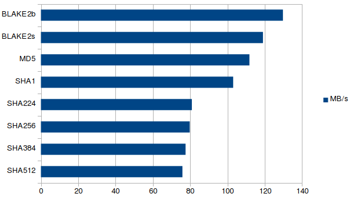
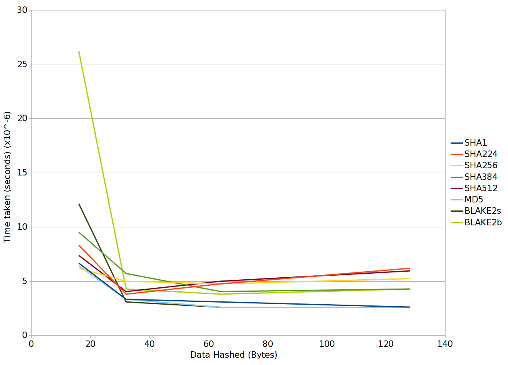
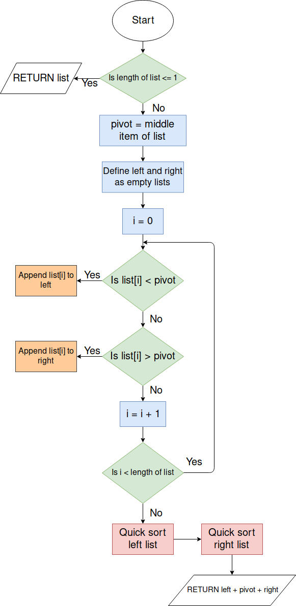

# Analysis

## Project Idea:

The idea for my project, is to have a program that acts as a vault for important files. It will encrypt files given, and store them in a specified location. Once they are encrypted, they will only be accessible from within the program, and will only be accessible within the program if you know the encryption key (passphrase) that you set when creating the “vault”.

Within the vault, you should be able to easily organise your files, add more to the vault, and remove (decrypt) files from the vault to any location (if possible).

My program would be useful for teachers, as they have to keep documents on student’s grades, and any other student details secure. Since this is my use case, I will have to thoroughly test the security and practicality of my program to make sure teachers want to use it, and trust the program with these files. Also, I will add an optional mobile app that the user can download, which lets them connect to the program via Bluetooth to unlock the vault. This is would be useful if you are a teacher, as if you leave the room with your phone in your pocket, and it is connected to the vault, if you have forgotten to lock the vault then a student might try to browse through it while you are gone, but with the app, as soon as you disconnect the Bluetooth connection it locks the vault, so if you forgot to close it then it closes itself.

The Bluetooth app should also be able to receive files from the PC app, so that the user can download files that are in the vault onto their mobile device. This would be useful for teachers that do not take their PC home (e.g not a laptop), so they can upload the files from the computer, to their phone so that they can edit the file at home or on the move (with another mobile app).

The program needs to work on both Windows, Linux and MacOS, as then teachers/users have more flexibility with what operating systems they can use it on, so they can easily go from machine to machine and carry their vault with them (on a USB stick for example), and they know that they can reliably use the program on most machines.

The user experience has to be pretty good. Good design practice will have to be used when making the GUI (e.g not putting the delete button next to the decrypt button), as I want my program to be easy to use by a wide range of people, so that even people who are not so good with computers can easily use the program.
 The way the user is directed around the program has to be logical as to not confuse the user, and adding a panic button to take you back to the main screen may be a good idea.

---

## Client:

An example client for my project could be a teacher/school, as they have to keep files about students secure. For example, pupil details, exam results and other important student details. 
 My program aims to help the teacher/school keep the pupil’s files safe, and prevent the files from being accessed if their device is stolen. It will encrypt files given to the program, and be secured by a pin code that is transferred over Bluetooth to the computer from a mobile device. Once the mobile device is unpaired from the computer, the app will lock again. This will prevent someone from having access to the files if the computer is unlocked and is stolen, as the mobile device will go out of range of the computer, so the computer will lock.

I sent a questionnaire to a member of the IT office at my school to ask what regulations there were about keeping a teacher’s files safe, and what encryption they would suggest for keeping the files secure.

---

<span style="color:#4286f4">Hi Josh,</span>

 What encryption should I use when encrypting the user’s files?
<span style="color:#4286f4">The bare minimum would be 128 bit AES, though 256 bit is recommended.</span>

Are there any standards or laws about what encryption method I should be using for files such as a teacher’s student files (one of the clients for this program)?
<span style="color:#4286f4">Data protection laws. The current UK Law is the Data Protection Act 1998. Though as of 25th May, the law will be General Data Protection Regulations (EU Law regarding all EU Citizens). This is a very complicated law, that is causing headaches for businesses worldwide. I’ve attached some links you might find useful regarding GDPR towards the end of this email.</span>

<span style="color:#4286f4">Hope this helps!</span>

 <span style="color:#4286f4">Many thanks</span>
<span style="color:#4286f4">Mr ___</span>

<https://www.eugdpr.org/>

<https://itpeernetwork.intel.com/gdpr-opportunity-rethink-security/>

<https://ico.org.uk/for-organisations/guide-to-the-general-data-protection-regulation-gdpr/>

<https://media.datalocker.com/marketing/GDPR_infographic_2017.pdf>

<https://www.kingston.com/en/usb/resources/eu-gdpr>

---

I will be using this information as guidance for what I have to take into consideration. I will keep in mind the data protection laws when I am storing the user’s files, and make sure I am within the regulations.

The EU General Data Protection Regulations consist of (As of 25/05/18): 

### Breach Notification:

If a data breach has been found and it might “result in a risk for the rights and freedoms of individuals”, then the person that the data belongs to has to be notified within 72 hours.

### Right to Access:

The person who’s data it is can at any point ask for confirmation as to whether or not data concerning them is being processed, where it is being processed if it is and for what purpose.

### Right to be Forgotten:

The data subject can ask for their data to be erased, and stop the processing of their data. This will be done depending on whether there is public interest in their data (e.g if a politician says something stupid then they can’t ask Google to delete it just because it makes them look bad), and if the data is no longer relevant (e.g your cookies from last week that were used for targeted ads).

### Data Portability:

The data subject should be allowed to ask to receive the data, and they should also be able to change which company is controlling their data.

### Privacy by Design:

Tells the controllers of the data to only use the data absolutely necessary for the purposes they need it for. For example, an advertisement company might use your cookies to target ads to you, however they can’t then use your location unless they are also using that to target ads. Basically don’t take more than you need.

For my project, as the user is the data controller, then they already have the right to access, the right to be forgotten and data portability. For the breach notification, they will probably know it has happened as someone needs to have physical access to where the data is stored to breach it.
However, with privacy by design, I will not be using any of the user’s data for advertising, or any other agenda. I will make this clear to the user when they first use the program. Also the security will be 

Another issue could be that if a file is deleted, the contents of the file might still remain. To fully remove the file I may have to use a one way function that ruins the data before deletion so that it cannot be accessed after it is deleted.

---

### Objectives:

1. GUI should:

   a. Be easy to use:

   ​	i. Logically laid out.

   ​	ii. Have simple options.

   b. Display the files currently stored in the vault, along with the file extension and the size of the file.

   c. Display the storage space remaining on the storage device the program is running on.

   d. The user should be able to easily encrypt and decrypt files:

   ​	i. Using easy to access buttons in the UI.

   ​	ii. Using drag and drop.

   e. Have an options menu, including the options to:

   ​	i. Change security level (from 128 bit AES to 256 bit AES).

   ​	ii. Change the location of the vault.

   ​	iii. Set the default login method (Bluetooth or no Bluetooth).

   ​	iiii. Change if the search in the file browser is recursive or not.

   f. Make it easy to manage the files in the vault (move to other folders in the vault, rename, etc).

   g. Have a secure login screen.

   ​	i. Ask the user to either input the key via their keyboard (no Bluetooth for that session), or connect via the app.

   ​	ii. Tell the user if the key is invalid or not, and smoothly transition into the main program.

   h. Look relatively good without being bloated.

   i. Allow the user to easily read file names, and easily tell folders and files apart.

   j. Let the user preview images without opening them (using thumbnails or an information screen).

2. App should:

   a. Be easy to use.

   b. Connect via Bluetooth to the PC.

   c. Allow the user to input their pin code easily.

   d. Tell the user if the pin code is invalid or not.

   e. Make it easy to recover from mistakes (e.g invalid pin code, or if they make a typo).

   f. Allow the user to see a list of files currently in the vault, and let the user download those files onto their mobile device.

3. File handling:

   a. Store the encrypted contents in the location specified by the user.

   b. Encrypt and decrypt relatively quickly, while still being secure.

   c. When the Bluetooth device goes out of range (if using Bluetooth),  encrypt all decrypted files and lock the program until the pin code is input correctly again.

   e. Have a recycling bin so that the user can recover their files.

   f. When a file is opened, check for changes once it is closed.

   g. Files stored in the vault should not be accessible from outside of the app.

   h. Names of the files stored in the vault should also not be view-able from outside of the app (encrypt the name).

---


# Design

## Bluetooth:

For the file store to be unlocked, I need to send the passcode to the computer via a Bluetooth connection.

For the computer and android device to connect to each other, one device has to be assigned as the server, so it makes sense to me to use the computer as the server, as it will be running for the entire duration that the user wants to use the program.

For the mobile app, I will be using Kivy to program the app. I am using Kivy so that the design is consistent with the design of the PC app. I will be using the android.bluetooth library that is included in the android SDK to transmit the data via Bluetooth.

For the Bluetooth server (on the pc), I will be using Python to receive the pin from the mobile device using PyBluez, check the sent pin, and send a message back saying if the code was valid or not.
 If the code is not valid, a message will be displayed on the computer that the code is invalid, and the code on the screen of the phone will be erased.

Here is a flow diagram for what Bluetooth will be like:


To send the files, I will need a protocol. A protocol is a set of rules for communicating over a network. A protocol will allow the program to distinguish data that is being sent is a key, file list or a file itself.

### Protocol

The protocol rules all have to be strings of bytes that are not likely to appear in a key, file list or a file. This is a necessity because otherwise mid way through sending a key, file list or file, if the program encounters a protocol rule within the key, list or file, then it may cause the program to get confused as to what is being sent, or if the current key, list or file has finished being sent.

For each of the possible items that are going to be sent, each item needs a start header, and an end header.
Start header:

```
!<operation>!
```

End header:

```
~!END!
```

For operations that do not have any extra data (arguments), then only the start header is sent.

For sending more complex operations,  I will use objects that hold the data, pickle them (object sterilisation), and send the object data sandwiched between the `!<operation>!` header (start header) and the `~!END!` header. For more complex operations that have multiple arguments, a separator is used to separate those arguments:

```
~~!~~
```

Here is an example with multiple arguments:

```
!<operation>!<argument1>~~!~~<argument2>~!END!
```

This is especially useful for files, as this way I can send the metadata in one big lump, then send the file bit by bit. Here is what a file would look like when it is sent:

```
!FILE!<metadata_object>~~!~~<data>~!END!
```

For the key however, since it will always be small ( < 16 bytes), I will just send it with a `#` at the start, and a `~` to finish the message. This is acceptable because when the PC program starts, it doesn't expect any requests from the client, so it is just waiting for the key. The key should also only be made up of numbers.

```
#<key>~
```

For items such as file metadata, I will use Python pickle to send an object (more of a structure) containing the metadata, rather than using separators, as then it is much easier for me to add information I want to send.

### Sending files over Bluetooth:

To send a file from the vault, first it has to be decrypted to a temporary location. I could instead send the data from within AES, so that when a block is decrypted it is sent, however I don't plan on writing AES in Python since speed is essential for AES (and a new Bluetooth socket would have to be set up if using a different language).

Metadata will be sent as an object before sending the file contents, as talked about in the above section.

An example class for file metadata may look like this:


```python
class fileMetadata:
    def __init__(self, name, size, isFolder):
        self.name = name 		 # The name of the file being sent.
        self.size = size		 # The size of the file being sent.        
        self.isFolder = isFolder # Boolean for if the file is actually a folder.
```

This is more of a structure than an object, as it has no methods, and is just a collection of data.

After the metadata is sent, a separator will have to be sent to separate the metadata from the file data itself. I discuss this in the above section.

For the file itself, I will send the file in chunks, so that

1. I don't use too much memory (since mobile devices usually have a small amount of memory compared to regular computers).
2. The Bluetooth adapter can keep up with the amount being sent.

This reduces the stress on both the mobile device and the PC.

Once the full file is sent, an end header is sent to tell the program that the full file has been transmitted.

---

## File Storage:

For storing the files, I will store the encrypted files in a directory set by the user.
The directory will be managed using a tree structure, where the root folder contains folders for each file, with the name of every folder and file being encrypted, as otherwise anyone can see the name of your file.

The encryption method I will use AES 128 bit, as it will slightly compromise security over using 256 bit, however it will be faster to decrypt files for use, giving the user a better experience, however I might add an option to use 256 in the settings if the user needs more security over performance.
For the encryption key, the key will be set up every time a new vault is created (this includes first starting the program). It will tell the user to enter the new key, and then from that moment forwards in that vault, that key will remain the same, and will be used every time a file is encrypted/decrypted in the vault.

When a file is encrypted, the key is appended to the start of the data, and is then encrypted. This is so that when the data is decrypted, only the first block has to be decrypted and compared with the key entered to check if the key entered was correct, rather than decrypting the whole file just to find out that the key was incorrect. This will also be used to check the key entered at login, where the login will try to find the first file it can within the vault, decrypt the first block of that file and compare it with the input.

The key will have to be hashed if I send it over Bluetooth, as it may get intercepted, and it is also a good idea to hash it on the computer program as well, as if someone somehow manages to get the key, it will not be the user’s original input, so if the user uses it for something else, their other accounts will be fine.

Here is a data flow diagram showing how the data is handled once logged into the program:


The key is also passed to any stages that encrypt or decrypt, as at this point the user should already be logged in.

When a file is edited, the file should be checked to see if any changes have been made, and if there has been changes, remove the version of the file currently in the vault, and encrypt the latest version into the vault.

To do this, I need a way of getting a checksum of the file before and after it has been opened. I need a fast algorithm so that the user is not waiting too long for the file to open and close, but it also needs to be unlikely that there will be a collision (where if they change the file and the checksum gives an answer that is the same as before the file was changed, that would be a collision).
I will discuss which checksum I will be using in the next section.

---

## Choosing the right algorithms:

When encrypting, decrypting and hashing data in my program, I want it to be as fast as possible without compromising too much on security. 

### Hashing:

When hashing the key when it is input, the algorithm has to be very secure, and speed does not matter as much. A member of the SHA2 family of algorithms would be a good algorithm to do this, as it is quite slow, but it is very secure (SHA1 was found to have a lot of hash collisions). Speed does not matter as much for the key, as the input data will only ever be less than 16 bytes. A faster algorithm will only provide a few milliseconds over SHA, so there is no point compromising on security for a negligible time decrease.

For getting the checksum of files, the algorithm has to be very fast, as it will be done on the data in the file before and after the file is opened to check for changes. If this algorithm is slow, then the overall user experience will be much worse if the algorithm takes ages to open and close files. I will test each algorithm I am thinking of using for hashing and compare them using this algorithm (Python):

```python
import hashlib				# Library of hashing algorithms.
from random import randint  # Used to generate the data.
from time import time		# Used to measure how long the operation takes.

def generate(times, size):	# Generates data, each block of length "size", and "times" number of blocks.
    data = []
    for i in range(times):
        for j in range(size):
            data.append(randint(0, 255))	# Randomly generate a byte.
    return bytearray(data)

def test(times, size):
    data = generate(times, size)    # Generate the data
    start = time()					# Get the start time
    for i in range(times):
        hashlib.sha256(data[i*size:(i+1)*size]).hexdigest()	# Do the hash (in this case SHA256)

    return (times*size)/(time()-start)		# Return the bytes per second.

print(test(1000, 128))	# Run the program.
```

I will run this algorithm on the same computer and make sure background tasks are closed, so that the results are not affected by other programs.

#### Here are the results:

Megabytes per second for each hash function (using 1000 blocks of 128 bytes (128 kilobytes)):



For my next tests, I will do data hashed against time. For this I will be using different sized files that I will make using this function:

```python
def generateFile(name, totalSize):
    fo = open(name, "wb")
    a = bytearray()
    for i in range(totalSize):
        a.append(randint(0, 255))
    fo.write(a)
    fo.close()
```

First I will test each hash function with encrypting very small data (<= 1 KiB). These were the results:


This image can be found larger in the <b>Large Images</b> section as <b>Figure 3</b>.

Here is the start of the graph, as that is the most interesting bit:



The axis on this graph are the same as the one before it.

Here we can see that SHA256 is the fastest at hashing 16 bytes, but is quickly surpassed by most of the algorithms. Both BLAKE algorithms had a bad performance at the start, but after 64 bytes both were doing alright. MD5 is the quickest overall out of the group. From these results I think I will use SHA256 for hashing the key, since the key is 16 bytes in length, and also because SHA is more aimed at security than BLAKE, and MD5 and SHA1 are obsolete in terms of security.

The BLAKE algorithms were designed for big data, which is what I am going to look at next:


In this graph, the gradient (rate of increase) of each line is the ratio of seconds to megabytes of each function (so $\frac{x}{y} = megabytes/second$). So the less steep the line is, the faster the operation.

SHA256 and SHA224 have taken the longest, at almost identical rates. BLAKE2s is quite slow, and this is because BLAKE2s is designed for 32-bit CPU architectures, and my CPU is 64-bit. MD5 and SHA1 are both the fastest, and have similar performance, but have security problems. BLAKE2b was the fastest out of the secure functions, so I will be using BLAKE2b for checksums in the program, as checksums need to be calculated quickly, as discussed before.

### Encryption:

For encryption, I will definitely be using AES, because it is the standard and has been tested extremely thoroughly by the public. I do not want to compromise on security, and AES is still pretty fast anyway.

I will use 128 bit AES mainly, as it is still proven to be secure from attacks, and may include the option to use 256 bit if desired by the user. The majority of users will not need AES 256 level security, but I will include it for people that may need it.

---

## AES:

### History:

In 1997, the encryption standard at the time, DES, was becoming obsolete due to the advancements in the computer industry. This resulted in the National Institute of Standards and Technology in the United States to call for a new advanced encryption standard (AES).

They held a competition that consisted of 15 different algorithms that had been submitted by different teams. The algorithm that won was an algorithm called Rijndael, an algorithm created by two Belgian cryptographers – Vincent Rijamen and Joan Daemen.

One of the reasons AES has been more successful than DES so far is that AES was thoroughly tested by members of the public during the competition, analysing every aspect of the algorithms to find a way to break them. On the other hand, DES was created in secrecy by IBM in the 70s, and the algorithm was only released a few years later.

This open-source approach ended up helping the new Advanced Encryption Standard, as the program could be heavily analysed by people all across the globe.

### The Algorithm (<u>128 bit AES</u>):

#### <u>How the data is handled:</u>

AES works by using a block cipher, so it splits the data given into 128 bit, 192 bit or 256 bit chunks depending on what AES you choose (128, 192 or 256). You then use the algorithm on each block to get the cipher text, then you write it to the new file, and move onto the next block.

AES is a symmetric cipher, so only one key is needed to both encrypt and decrypt the data.

Here is an example for 128 bit AES encryption:


Decryption works exactly the same, however the cipher text is split up and decrypted.

Each 128 bit "block" of data can also be called a "state".

#### <u>Before the operation starts:</u>

First, the data has to be a multiple of 16 in length. If it isn't then more bytes need to be added to the end such that the data is 16 bytes in length (padding).

However, the padding cannot just be 0's at the end, as when we decrypt the block, we have no way of distinguishing these 0's from the rest of the data, or know if they are supposed to be there. To get around this, when we add the padding, we give each byte the value of how many more bytes we need to add to get the length of the block to 16 bytes. This sounds confusing, but here is an example:

Say we had a block that was = <b>[1, 2, 3, 4, 5, 6, 7, 8, 9, 10, 11, 12, 13]</b>

This block is not 16 bytes in length. To pad this block, we need to add 3 lots of the number 3 to the end (since 16 - length of the block = 3). The new block would look like this:

[1, 2, 3, 4, 5, 6, 7, 8, 9, 10, 11, 12, 13, <b>3, 3, 3</b>]

When we go to decrypt this block, we check to see if the value of the last byte in the block is lower than 16, and that if the number occurs the same number of times as the value, then we remove these bytes.


For each round of the encryption, a different key has to be used. To make the cipher decipherable, these keys have to be derived from the original key given. For 128 bit AES (the main one I will be using in the program), the 16 byte key has to be transformed into a 176 byte list of 16 byte keys (11 keys in total, one for every round).

The first 16 bytes are the key, and then from there, the algorithm is started. Here is the algorithm with example:
<b>Figure 1 (A larger version can be found in the "Large Images" section)</b>

The algorithm in psudocode:

```pseudocode
function expandKey(inputKey)
	expanded := inputKey
	bytesGenerated := 16
	rconIteration  := 1
	temp := uint8[4]
	
	while bytesGenerated < 176
		temp = expanded[bytesGenerated - 4:bytesGenerated]
		
		if bytesGenerated MOD 16 == 0 then
			temp[0], temp[1], temp[2], temp[3] = temp[1], temp[2], temp[3], temp[0]
			temp[0], temp[1], temp[2], temp[3] = sBox[temp[0]], sBox[temp[1]], sBox[temp[2]], sBox[temp[3]]
			
			temp[0] = temp[0] XOR rcon[rconIteration]
			rconIteration = rconIteration + 1
		end if
		
		for i := 0 to 4
			expanded[bytesGenerated] = expanded[bytesGenerated - 16] XOR temp[y]
			bytesGenerated = bytesGenerated + 1
		end
	return expanded
end
```


The array of round keys starts off the exact same as the original key. Then if the length of the round key array is a multiple of 16 (which it is), the last 4 bytes of the previous round key (in this case the last 4 bytes of the original key) is:

1. Rotated (The first element of the 4 bytes is put at the end).
2. Substituted (Using the Rijndael Substitution-Box found at: https://en.wikipedia.org/wiki/Rijndael_S-box).
3. First byte of the 4 is XOR-ed with it's corresponding Round Constant (depending on the round number the key will be used in).
4. The result is appended to the array of round keys.

If the length of the round key array is not a multiple of 16, then the last 4 bytes in the array are XOR-ed with 4 bytes of the array that are 16 bytes before hand (shown in <b>Figure 1</b>).

This process is repeated until the length of the round key array is 176 bytes, then we will have one 16 byte key for each of the 11 rounds.

And that's all of the preparations done.

### <u>The operation:</u>

Here is a diagram of the operation (I will explain each step in detail below):


In total there are 11 rounds (9 regular rounds). For each round, the corresponding round key (that we calculated beforehand) is used in the operation.

The 16 bytes in the state can be represented in a 4x4 grid, to make it easier to visualise what is happening at each stage:


##### Add Round Key:

The Add Round Key step is literally just XOR-ing each byte in the current block of 16 bytes, with each byte in the 16 byte round key, and returning the state.

Here is pseudocode for the <b>Add Round Key</b> step:

```pseudocode
function addRoundKey(state, roundKey)
	for i := to 16
		state[i] = state[i] XOR roundKey[i]
	return state
```


##### Sub Bytes:

Sub bytes substitutes each byte in the state with it's corresponding value in the Rijndael substitution box:


When using the sub-box, you have to think of each byte as hexadecimal (0xYZ). 
Each row of the sub box is the value of the Y value (16s) in the hexadecimal representation of the byte.
Each column of the sub box is the value of the Z value (1s) in the hexadecimal representation of the byte.

For example, if I had the hex `0x1A`, it would be substituted by the value: `0xA2`
, as it is row "1", column "A".

Here is the pseudocode for the **Sub Bytes** step:

```pseudocode
function subBytes(state)
	for i := 0 to 16
		state[i] = sBox[state[i]]
	return state
```

It is pretty much the same as **Add Round Key** but instead of XORing you substitute each byte of the state with the corresponding byte in the sub-box (sBox).


##### Shift Rows:

Shift Rows shifts the rows (really?) left depending on the row number.

For example, the first row is shifted left by 0, second row shifted by 1 and so on:


Here is the algorithm for **Shift Rows**:

```pseudocode
function shiftRows(state)
	temp := []
	
	temp[ 0] = state[ 0]
	temp[ 1] = state[ 5]
	temp[ 2] = state[10]
	temp[ 3] = state[15]
	
	temp[ 4] = state[ 4]
	temp[ 5] = state[ 9]
	temp[ 6] = state[14]
	temp[ 7] = state[ 3]
	
	temp[ 8] = state[ 8]
	temp[ 9] = state[13]
	temp[10] = state[ 2]
	temp[11] = state[ 7]
	
	temp[12] = state[12]
	temp[13] = state[ 1]
	temp[14] = state[ 6]
	temp[15] = state[11]
	
	return temp
```

The array is indexed to correspond to the images above.


##### Mix Columns:

Mix columns is the most confusing step of AES, so I will try to break it down into small pieces.

The mix columns calculation is this:
$$
\begin{bmatrix}
 r_0\\
 r_1\\
 r_2\\
 r_3\\
\end{bmatrix} = \begin{bmatrix}
 2 & 3 & 1 & 1\\
 1 & 2 & 3 & 1\\
 1 & 1 & 2 & 3\\
 3 & 1 & 1 & 2\\
\end{bmatrix}
\begin{bmatrix}
 a_0\\
 a_1\\
 a_2\\
 a_3\\
\end{bmatrix}
$$
Where $r_0$ to $r_3$ is the result of the operation, and $a_0$ to $a_3$ is the 4 bytes that make up the input column.

This is matrix multiplication, but we need to do dot product multiplication. This is where we multiply each corresponding element in each row of the pre-defined matrix (the one with numbers already in it), with the corresponding element in $a_0$ to $a_3$, and then adds them up MOD2, also known as XOR (so that it is still 1 byte).

One way to represent this is like this:
$$
r_0= (2\times a_0)\oplus(3\times a_1)\oplus(1\times a_2)\oplus(1\times a_3)\\
r_1 = (1\times a_0)\oplus(2\times a_1)\oplus(3\times a_2)\oplus(1\times a_3)\\
r_2 = (1\times a_0)\oplus(1\times a_1)\oplus(2\times a_2)\oplus(3\times a_3)\\
r_3 = (3\times a_0)\oplus(1\times a_1)\oplus(1\times a_2)\oplus(2\times a_3)
$$
To dot product two binary numbers, they need to be represented using a Galois field.

A number can be represented by using a Galois field. A Galois field is just a way to represent a number as a polynomial, e.g  $5x^2 + 2x+3  $, where $x^2$ is $10^2$, so the number of 100s in the number (for decimal), while $x$ is the number of tens. In this case, this Galois field would represent the number 523, as there are 5 hundreds, 2 tens and 3 ones.

For example, if we wanted to represent the decimal number: 25301 as a Galois field, it would be:
$$
2x^4+5x^3+3x^2+1
$$
Note that the 0 in 25301​ is not included, as $0x = 0$.

To represent a binary number, the same logic applies. For example, to represent the binary number `10011011` as a Galois field, it would be:
$$
x^7+x^4+x^3+x^1+1
$$

To get back to decimal, we can replace the $x$ with the number 2, as binary is base 2:
$$
2^7+2^4+2^3+2^1+1 = 155 = 10011011
$$


The dot product of two Galois fields is like expanding brackets: $(x+2)(x+3) = x^2+5x+6$,  which is $(x\times x)+(2\times x)+(x\times 3)+(3\times 2)$,  so we just multiply each item in each bracket together.

Now I will do an example of doing one result ($r_0$) of mix columns.

Lets use these values of $a_0$ to $a_3$ for the example:
$$
\begin{bmatrix}
 2 & 3 & 1 & 1\\
 1 & 2 & 3 & 1\\
 1 & 1 & 2 & 3\\
 3 & 1 & 1 & 2\\
\end{bmatrix}
\begin{bmatrix}
 d4\\
 d4\\
 d4\\
 d5\\
\end{bmatrix}
$$
To get $r_0$ I have to do:
$$
r_0= (2\times a_0)\oplus(3\times a_1)\oplus(1\times a_2)\oplus(1\times a_3)
$$
which is:
$$
r_0= (2*d4)\oplus(3*d4)\oplus(1*d4)\oplus(1*d5)
$$
in this example.

I am using $d4, d4, d4, d5$ as test values as they are test vectors used on this page: https://en.wikipedia.org/wiki/Rijndael_MixColumns, to check that we get the right answer.

Now I need to convert the hex values $d4$ and $d5$ to binary:

$d4$ in binary is $11010100$

$d5$ in binary is $11010101$

Now i need to convert both of these into Galois fields:
$$
\begin{align*}
11010100 &= x^7 + x^6 + x^4 + x^2\\
\quad 11010101 &= x^7 + x^6 + x^4 + x^2 + 1
\end{align*}
$$
Then I need to multiply them all by their corresponding value in the pre-defined table expressed as a Galois field (e.g. $2 \equiv x$):
$$
\begin{align*}
(x^7 + x^6 + x^4 + x^2)(x) &= x^8 + x^7 + x^5 + x^3\\
(x^7 + x^6 + x^4 + x^2)(x + 1) &= x^8 + x^7 + x^7 + x^6 + x^5 + x^4 + x^3 + x^2 \\&= x^8 + 2x^7 + x^6 + x^5 + x^4 + x^3 + x^2\\
(x^7 + x^6 + x^4 + x^2)(1) &= x^7 + x^6 + x^4 + x^2\\
(x^7 + x^6 + x^4 + x^2 + 1)(1) &= x^7 + x^6 + x^4 + x^2 + 1\\
\end{align*}
$$

---

But hang on a second, the answer to $d4 * 3$  and $d4 * 2$ both have a $x^8$ term, which means it's bigger than 255 (since $2^8$ = 256), so it is no longer a byte, which means that it no longer fits in with 128 bit AES.

To fix this, we replace all of the $x^8$ terms with this pre-determined polynomial (Rijndael's finite field),  reducing by MOD2 as we go along: 
$$
x^8 \equiv x^4 + x^3 + x + 1
$$
Let's try this with d4*3 :
$$
\begin{align*}
3d4 &= x^8 + 2x^7 + x^6 + x^5 + x^4 + x^3 + x^2\\
&= (x^4 + x^3 + x + 1) + 2x^7 + x^6 + x^5 + x^4 + x^3 + x^2\\
&= 2x^7 + x^6 + x^5 + 2x^4 + 2x^3 + x^2 + x + 1\\
&= 0x^7 + x^6 + x^5 + 0x^4 + 0x^3 + x^2 + x + 1 \space \space \space \text{Here is where I did MOD2} \\
&= x^6 + x^5 + x^2 + x + 1
\end{align*}
$$
Again with d4*2:
$$
\begin{align*}
2d4 &= x^8 + x^7 + x^5 + x^3 \\
&= (x^4 + x^3 + x + 1) + x^7 + x^5 + x^3\\
&= x^7 + x^5 + x^4 + 2x^3 + x + 1\\
&= x^7 + x^5 + x^4 + x + 1
\end{align*}
$$

Now, with our new values for a_0  to a_3, we can finally do the equation:
$$
\begin{align*}
r_0 &= (2\times d4)\oplus(3\times d4)\oplus(1\times d4)\oplus(1\times d5)\\
r_0 &= (x^7 + x^5 + x^4 + x + 1)\oplus(x^6 + x^5 + x^2 + x + 1)\oplus(x^7 + x^6 + x^4 + x^2)\oplus(x^7 + x^6 + x^4 + x^2 + 1)\\
r_0 &= (2^7 + 2^5 + 2^4 + 2 + 1)\oplus(2^6 + 2^5 + 2^2 + 2 + 1)\oplus(2^7 + 2^6 + 2^4 + 2^2)\oplus(2^7 + 2^6 + 2^4 + 2^2 + 1)\\
\end{align*}
$$

$$
\begin{align*}
r_0 = 10110011\\ 01100111\\ 11010100\\ \oplus\space\space 11010101\over
= 11010101 \\
\\
r_0 = 213 (decimal)
\end{align*}
$$
And, thank god, that is the correct answer for the test vector on this page: https://en.wikipedia.org/wiki/Rijndael_MixColumns.

To get $r_1$, $r_2$ and $r_3$, you repeat the process using the equations for each defined at the top of this section.

This whole process has to be done on each column.

On a computer, this would be very demanding on the processor, however since the range of the inputs is 0-255 (since the number has to be represented by 1 byte), you can make a lookup table with all of the 256 possible outputs, for each of the multiplications, for each of the 256 possible inputs. This drastically increases speed, and also makes it easier to program. You would have a table for multiplication by 2 and 3, and for the inverse function of Mix Columns you would need multiplication by 9, 11 and 13.

This trades a few kilobytes of memory for a drastic improvement in speed.

This makes the pseudocode for **Mix Columns** very simple:

```pseudocode
// mul2 and mul3 are the pre-defined tables talked about above.
function mixColumns(state)
	temp := []
	
	temp[ 0] = mul2[state[0]] XOR mul3[state[1]] XOR state[2] XOR state[3]
	temp[ 1] = state[0] XOR mul2[state[1]] XOR mul3[state[2]] XOR state[3]
	temp[ 2] = state[0] XOR state[1] XOR mul2[state[2]] XOR mul3[state[3]]
	temp[ 3] = mul3[state[0]] XOR state[1] XOR state[2] XOR mul2[state[3]]
	
	temp[ 4] =  mul2[state[4]] XOR mul3[state[5]] XOR state[6] XOR state[7]
    temp[ 5] =  state[4] XOR mul2[state[5]] XOR mul3[state[6]] XOR state[7]
    temp[ 6] = state[4] XOR state[5] XOR mul2[state[6]] XOR mul3[state[7]]
    temp[ 7] = mul3[state[4]] XOR state[5] XOR state[6] XOR mul2[state[7]]

    temp[ 8] = mul2[state[8]] XOR mul3[state[9]] XOR state[10] XOR state[11]
    temp[ 9] = state[8] XOR mul2[state[9]] XOR mul3[state[10]] XOR state[11]
    temp[10] = state[8] XOR state[9] XOR mul2[state[10]] XOR mul3[state[11]]
    temp[11] = mul3[state[8]] XOR state[9] XOR state[10] XOR mul2[state[11]]

    temp[12] = mul2[state[12]] XOR mul3[state[13]] XOR state[14] XOR state[15]
    temp[13] = state[12] XOR mul2[state[13]] XOR mul3[state[14]] XOR state[15]
    temp[14] = state[12] XOR state[13] XOR mul2[state[14]] XOR mul3[state[15]]
    temp[15] = mul3[state[12]] XOR state[13] XOR state[14] XOR mul2[state[15]]
    
    return temp
}

```


#### <u>Decryption</u>

Decryption is just encryption, but in reverse. This uses the inverse functions of each function used to encrypt the data. Here is the algorithm:


It is literally just the encryption algorithm in reverse.

Before decryption, the exact same steps need to be taken as in encryption, apart from the padding because  all the blocks should have already been encrypted, so each block should be 16 in length.


##### Inverse Add Round Key:

Add round key is it's own inverse, as XOR is the same forwards as it is backwards.


##### Inverse Sub Bytes:

Inverse sub bytes is the same as sub bytes, it just has an inverse of the S-Box.


##### Inverse Shift Rows:

Inverse shift rows does what shift rows does, but shifts each row right instead of left.

In the diagram below it takes the shifted data and orders it again.


##### Inverse Mix Columns:

Inverse mix columns works the same as normal mix columns, but with a different matrix to multiply each element with:
$$
\begin{bmatrix}
 a_0\\
 a_1\\
 a_2\\
 a_3\\
\end{bmatrix} = \begin{bmatrix}
 14 & 11 & 13 & 9\\
 9 & 14 & 11 & 13\\
 13 & 9 & 14 & 11\\
 11 & 13 & 9 & 14\\
\end{bmatrix}
\begin{bmatrix}
 r_0\\
 r_1\\
 r_2\\
 r_3\\
\end{bmatrix}
$$
The a's are the original data, the r's are the encrypted data.

Just like with normal mix columns, you can just use lookup tables for each possible answer to each possible input.

And that's all for AES.

---

## SHA256:

SHA256 (in the Secure Hash Algorithm 2 family) takes an input of 32 bytes (256 bits), and gives a 32 byte output based on the input, but is meaningless. This is useful for passwords, or pin codes like in my program, where you don't want the original password to be known, but for the password to still be unique.

A small difference in the input gives you a drastic change in the output. For example, if I put in:

```
"test string"
```

I get:

```
d5579c46dfcc7f18207013e65b44e4cb4e2c2298f4ac457ba8f82743f31e930b
```

But when I put in:

```
"test strinh"
```

I get:

```
4e4d20e9fc77e913bf56cc69a2b4685d761a9e44d833198612e80a72dcd563f1
```

A vastly different output to the one above.
This is important, as there should be no pattern to the output, otherwise the original password could be guessed based off of similar inputs.

Now you might be asking "Why are you using 256 bit SHA, when size key you need for AES is 128 bits?". It is because the more bits you have, the less likely you are to have collisions with other inputs. The security of SHA-1 (128 bit SHA) (measured in bits) is less than 63 bits due to collisions (if it was fully secure it would be the full 128 bits).

What I am doing instead, is taking the output of SHA256, splitting it in half, and XORing each half with each other to get a 128 bit output. This doesn't affect how secure it is, as you still have the extra step of XOR, making it still more secure than SHA-1.

### The Algorithm:

Bear in mind that SHA works on a bitwise level, so while I will be explaining it, I will be talking in terms of bits.

#### How the message is handled:

When doing operations on the data, it will be done in 32 bit words. The message is split into 512 bit blocks, containing sixteen 32 bit words.


SHA is operates on every 32 bit word.

Since the maximum key size for my AES will be 16 bytes (128 bits), I don't need to worry about splitting the message into 512 bit chunks, as the input will only ever be 128 bits as SHA will only ever be used for the AES key. So, for the examples below I won't go into detail on how a message bigger than 512 bits will be handled.

#### Before the operation starts:

Before we start, we need to <b>pad the message</b> $M$ so that it is 512 bits in length.

Let $l$ = the length of the message $M​$.

First, we need to append the bit  $1$  to the end of the message, followed by $k$  $0$  bits, where $k$ is the smallest positive solution to the equation:
$$
l + 1 + k \equiv 448\space mod512
$$
To get $k$, the algorithm would look something like this (I wrote this in Python 3):

```python
k = 0
while ((l+1+k)-448) % 512 != 0:
    k += 1
```

Then, you append the binary representation of the length of the message $l$ as a 64 bit binary number. This makes the message 256 bits in length.

Let's do an example: $M$ = "i don't know".
$$
\begin{align*}
&l = 12\times 8 = 96\\
&\text{Append a "1":}\\
&M = \text{b"i don't know"}+1\\
&448-(96+1) = 351 \space \text{Zero Bits}\\
&M = \text{b"i don't know"}+1+351(0s)\\
&l = 96 =01100000\\
&\text{Final Padded Message:}\\
&M = \text{b"i don't know"}+1+351(0s)+56(0s)+01100000\\
\end{align*}
$$
The message has to be 512 bits in length so that it works with the calculations later.

Then, we also need to <b>set the initial hash values</b> for each word in the current block. The initial hash values set by the creators of SHA:

> "These words were obtained by taking the first thirty-two bits of the fractional parts of the square roots of the first eight prime numbers. "

$$
H_0 = 6a09e667\\
H_1 = bb67ae85\\
H_2 = 3c6ef372\\
H_3 = a54ff53a\\
H_4 = 510e527f\\
H_5 = 9b05688c\\
H_6 = 1f83d9ab\\
H_7 = 5be0cd19\\
$$

Next, each 32 bit word in the message has to be expanded from 32 bits to 64 bits.

Here is the algorithm:


To do this, we need two functions,  sigma 0 $\sigma_0$ and sigma 1 $\sigma_1$.

##### Sigma 0 (Expansion) ($\sigma_0$):

Sigma 0 (Expansion) looks like this:
$$
\sigma_0(x) = (x >>> 7) \oplus (x >>> 18) \oplus (x >>  3)
$$
$>>>$ means that we rotate the 32 bit word $x$ right by the number given ($y$). What this does is shift the bytes along $y$ places to the right, and wraps them around to the start of $x$.

I will do an example of $>>>$ with a 4 bit nibble:
$$
\begin{align*}
f(x) &= x >>> 1\\
f(1011) &= 1011 >>> 1\\
f(1011) &= 1101
\end{align*}
$$
As you can see, the $1$ bit at the end gets moved to the front, as I shifted it right by 1.

$>>$ Means shift the 32 bit word $x$ right by the number given ($y$). This is different from $>>>$, because instead of wrapping the bits around to the beginning of the word again, we just shove a $0$ bit at the front instead.

$\bigoplus$ is just XOR.

For example:
$$
\begin{align*}
f(x) &= x >> 1\\
f(1011) &= 1011 >> 1\\
f(1011) &= 0101\\
\\
g(x) &= x >> 2\\
g(0101) &= 0101 >> 2\\
g(0101) &= 0001
\end{align*}
$$
Here the byte is shifted right, and the bytes are removed as they are shifted.


##### Sigma 1 (Expansion)($\sigma_1$):

Sigma 1(Expansion)($\sigma_1$) is the same as Sigma 0 (Expansion)($\sigma_0$), apart from how much you rotate and shift the word:
$$
\sigma_0(x) = (x >>> 17) \oplus (x >>> 19) \oplus (x >> 10)
$$


#### The operation:

All addition is MOD(2^32).

Here is the full algorithm:

<b>Figure 2 (Found larger on "Large Images" section)</b>


In the diagram above, H is the array of initial hash values discussed earlier, wordList is a 2D array containing the 32 bit words. || means append, so $h0||h1||h2||...$ just appends the items together. K is the array with the round constants in (see https://csrc.nist.gov/csrc/media/publications/fips/180/4/archive/2012-03-06/documents/fips180-4.pdf section 4.2.2).

The step "Expand wordList[x]" is covered in the section above.

All of the SHA functions operate on 32 bit words, and return a new 32 bit word. I will now explain what the functions Sigma0 ($\Sigma_0$), Sigma1 ($\Sigma_1$), Ch and Maj.


##### Sigma 0 ($\Sigma_0$):

$\Sigma_0$ is this equation:
$$
\Sigma_0(x) = (x >>> 2) \oplus (x >>> 13) \oplus (x >>> 22)
$$
This looks confusing, but let me break it down.

$>>>$ means that we rotate (shift and move displaced numbers to the begining/end of the number) the number right by the number specified.

$\bigoplus$ means that we XOR the items either side with each other.

Here is an example of the rotate function:
$$
\begin{align*}
A &= 1001110\\
A >>> 2 &= 1010011 \quad \text{The last two bits are moved to the end.}
\end{align*}
$$


Let me do an example with a 32 bit word:
$$
\begin{align*}
&A = 10010111011011111000110111011101\\
&\Sigma_0 = (10010111011011111000110111011101 >>> 2) \oplus (10010111011011111000110111011101 >>> 13) \oplus\\&... (10010111011011111000110111011101 >>> 22)\\
&(10010111011011111000110111011101 >>> 2) = 01100101110110111110001101110111 \\ 
&\text{The two bits at the end have been moved to the front one by one.}\\
&(10010111011011111000110111011101 >>> 13) = 11110001101110111011001011101101\\
&(10010111011011111000110111011101 >>> 22) = 01110111011001011101101111100011\\
&01100101110110111110001101110111 \space\oplus\space 11110001101110111011001011101101 \space\oplus\space 01110111011001011101101111100011\\
&= 11100011000001011000101001111001
\end{align*}
$$

Sorry if that is a bit small.

It isn't too difficult it's just understanding what the $>>>$ does.


##### Sigma 1 ($\Sigma_1$):

Sigma 1 ($\Sigma_1$) is pretty much the same as $\Sigma_0$, the only difference being the amount you rotate by:
$$
\Sigma_0(x) = (x >>> 6)\oplus(x >>> 11)\oplus(x>>>25)
$$


##### Ch:

The Ch function looks like this:
$$
Ch(x, y, z) = (x \and y) \oplus (\neg x \and z)
$$
This also looks a bit confusing, but it really isn't too bad.

The $\and$ symbol is the bitwise operator AND.

The $\oplus$ symbol is the bitwise operator XOR.

The $\neg$ symbol is the bitwise operator NOT.

I will do one example run with Ch with three 4 bit nibbles to keep it simple:
$$
\begin{align*}
&Ch(1011, 1001, 0011) = (1011 \and 1001) \oplus (\neg1011 \and 0011)\\\\
&\quad1011\over\and\space1001\\
&=1001\\\\
&Ch(1011, 1001, 0011) = 1001 \oplus (\neg1011 \and 0011)\\
&\neg1001 = 0110\\\\
&\quad0110\over\and\space0011\\
&=0010\\\\
&Ch(1011, 1001, 0011) = 1001 \oplus 0010\\\\
&\quad1001\over\oplus\space0010\\
&=1011\\\\
&Ch(1011, 1001, 0011) = 1011
\end{align*}
$$

##### Maj:

the Maj function looks like this:
$$
Maj(x, y, z) = (x \and y) \oplus (x \and z) \oplus (y \and z)
$$
You should recognise the symbols in this one, since they appear in the other ones used in SHA that we have covered.
Here is an example with three 4 bit nibbles:
$$
\begin{align*}
&Maj(1011, 1001, 0011) = (1011 \and 1001) \oplus (1011 \and 0011) \oplus (1001 \and 0011)\\\\
&\quad1011\over\and\space1001\\
&=1001\\\\
&\quad1011\over\and\space0011\\
&=0011\\\\
&\quad1001\over\and\space0011\\
&=0001\\\\
&Maj(1011, 1001, 0011) = 1001 \oplus 0011 \oplus 0001\\\\
&\quad\space 1001\\& \quad\space 0011\\&\oplus\space 0001
\over=0101\\\\
&Maj(1011, 1001, 0011) = 0101
\end{align*}
$$

---

## BLAKE 2b:

BLAKE was a finalist in the SHA 3 contest. The SHA 3 contest was announced on November 2nd 2007, as a new hash function was needed, that was very different from the SHA 2 family of hash functions in case a huge issue was found with the SHA 2 family.

BLAKE did not win, as it was too similar to SHA2:

> _“desire for SHA-3 to complement the existing SHA-2 algorithms … BLAKE
> is rather similar to SHA-2.”_

_https://blake2.net/acns/slides.html_

However, BLAKE was the fastest out of all of the competitors (at 8.4 cycles per byte, cycles being the fetch decode execute cycle of a processor), and was tested to be secure. This meant that even though BLAKE did not win the competition, it is still used in numerous programs. Due to BLAKE's speed, it is ideal for getting the checksum of large data.

No preparations have to be done so lets just jump right into the algorithm.

### The Algorithm:

#### How the data is read:

8 initial hash values of size 64-bits are initialised at the start (using pre-defined values), and these are worked on throughout the program.

The data is read in 128 bytes, where each byte is then converted into a 64-bit word (just shove some 0s on the front). Each chunk is operated on using the 8 hash values, creating 8 new hash values. These new hash values are used in computation using the next block and so on.

Here is a diagram showing how the data is converted into data that can be processed:


To transform a list of 16 64-bit words into 1 64-bit word, you do this algorithm (where $a$ is the list of words):
$$
new = a[0] \oplus (a[1] << 8) \oplus (a[2] << 16) \oplus (a[3] << 24) \oplus (a[4] << 32) \oplus (a[5] << 40) \oplus (a[6] << 48) \oplus (a[7] << 56)
$$
What this does is XOR's the bytes in the array with each other in a way that produces a single word at the end.

#### The operation:


Each block has to be compressed and returned as 8 hash values. Above is the compression function. $t$ is the number of bytes in total that have been compressed so far, $h$ is a list of the 8 current hashes, and $k$ is the list of 8 initial hash values set here ***https://tools.ietf.org/pdf/rfc7693.pdf  section 2.6***, the same initial hash values of SHA512.

The operation is quite simple compared to other hash functions like SHA512, as it was built for speed.

The **Mix the data** step looks like this:

```pseudocode
for i := 0 to 12
	v = mix(v, 0, 4,  8, 12, m[sigma[i][0]], m[sigma[i][1]])
    v = mix(v, 1, 5,  9, 13, m[sigma[i][2]], m[sigma[i][3]])
    v = mix(v, 2, 6, 10, 14, m[sigma[i][4]], m[sigma[i][5]])
    v = mix(v, 3, 7, 11, 15, m[sigma[i][6]], m[sigma[i][7]])

    v = mix(v, 0, 5, 10, 15, m[sigma[i][ 8]], m[sigma[i][ 9]])
    v = mix(v, 1, 6, 11, 12, m[sigma[i][10]], m[sigma[i][11]])
    v = mix(v, 2, 7,  8, 13, m[sigma[i][12]], m[sigma[i][13]])
    v = mix(v, 3, 4,  9, 14, m[sigma[i][14]], m[sigma[i][15]])
```

Sigma ($\sigma$) is a 2-dimensional array containing some constant values, that determine what index of the current working vector $v$ (a 16 length array of 64-bit words) will be mixed with what other index of $v$. Sigma is defined here: ***https://tools.ietf.org/pdf/rfc7693.pdf section 2.7*** as:
$$
\sigma[0] = [0, 1, 2, 3, 4, 5, 6, 7, 8, 9, 10, 11, 12, 13, 14, 15]\\
\sigma[1] = [14, 10, 4, 8, 9, 15, 13, 6, 1, 12, 0, 2, 11, 7, 5, 3]\\
\sigma[2] = [11, 8, 12, 0, 5, 2, 15, 13, 10, 14, 3, 6, 7, 1, 9, 4]\\
\sigma[3] = [7, 9, 3, 1, 13, 12, 11, 14, 2, 6, 5, 10, 4, 0, 15, 8]\\
\sigma[4] = [9, 0, 5, 7, 2, 4, 10, 15, 14, 1, 11, 12, 6, 8, 3, 13]\\
\sigma[5] = [2, 12, 6, 10, 0, 11, 8, 3, 4, 13, 7, 5, 15, 14, 1, 9]\\
\sigma[6] = [12, 5, 1, 15, 14, 13, 4, 10, 0, 7, 6, 3, 9, 2, 8, 11]\\
\sigma[7] = [13, 11, 7, 14, 12, 1, 3, 9, 5, 0, 15, 4, 8, 6, 2, 10]\\
\sigma[8] = [6, 15, 14, 9, 11, 3, 0, 8, 12, 2, 13, 7, 1, 4, 10, 5]\\
\sigma[9] = [10, 2, 8, 4, 7, 6, 1, 5, 15, 11, 9, 14, 3, 12, 13, 0]\\
$$
$\sigma$ is defined for BLAKE2s, and BLAKE2s only has 10 rounds, while BLAKE2b has 12, so $\sigma_0$ and $\sigma_1$ are repeated again to make the array 12 in length.

Notice that in the first lot of mixing, the vector is mixed row by row normally (with the same indexing as AES), but in the second lot of mixing, the indices change. They shift each column up depending on the column. Column 0 is shifted 0 places, column 1 is shifted 1 place up, column 2 is shifted 2 places up, and column 3 is shifted 3 places up. This is a much better way of shifting each column than doing it before hand.

The main mixing function takes the inputs:
$$
mix(v, \space a, \space b, \space c, \space d, \space x, \space y)
$$
Where $v$ is the current vector (16 64-bit words), $a$, $b$, $c$, $d$, $x$, and $y$ are the indices of the working vector you want to work with. Here is the main mixing algorithm:


So all together, this is the BLAKE2b checksum algorithm:


The second step ($h[0] = h[0] \oplus 01010000 \oplus hL$) XORs $h[0]$ with $0101kknn$, where $kk$ is the length of the key (which is optional, so I probably will never use it), and $nn$ is the hash length desired.

---

## Quick Sort

My program will need a quick sort for sorting the files by:

- Size
- Name

I have chosen quick sort because it is quicker than most sorts (it's in the name!) with a big-O notation of $O(n \log n)$ on average, with the worst case being $O(n^2)$. Merge sort has a big-O notation of $O(n \log n)$, and worst case of $O(n \log n)$, so why am I not using merge sort? Merge sort is supposed to be quicker mathematically, however merge sort has to access the array of items more often, usually resulting in putting more strain on the hardware, and also slows the overall process down because getting items from memory takes a fair amount of time. Here is a good video comparing merge sort and quick sort (along with a few other algorithms): https://youtu.be/ZZuD6iUe3Pc

The algorithm goes like this (using a list of items to be sorted):

1. Take the item in the middle of the list. Call this the "pivot".
2. Compare each item either side of the pivot. If the item is bigger than the pivot, add it to a new list called "right", if the item is smaller than the pivot, add the item to a new list called "left".
3. Then repeat this process with the left and right lists (making this algorithm recursive).
4. Once the current left and right lists have been sorted, append the left list and right list with the pivot in the middle.

Here is the pseudocode of the algorithm:

```pseudocode
function quickSort(list)
	if length(list) <= 1 then
		return list
	else
		left   = []
		middle = []
		right  = []
		pivot  = list[int(length(list)/2)]
		for i = 0 to length(list) do
			if list[i] < pivot then
				left.append(list[i])
			else if list[i] > pivot then
				right.append(list[i])
			else
				middle.append(list[i])
			end
		end
		return quickSort(left)+middle+quickSort(right)
	end
end
```

Here is a flow diagram to represent this:




---

## UI Research:

For the UI of both apps, I will use Kivy (a Python module) to make both the mobile app and the PC program. I have chosen Kivy because using it on both the app and the main program means that the design will stay consistent, and Kivy does look quite nice "out of the box".

### Main Program (on PC):

The main program has to be designed to be easy to use, and actions that are used a lot should be easily accessible. I think I will go for a similar layout to a program that already exists, SanDisk Secure Access:


SanDisk Secure Access did inspire this project, however I do not want to make a carbon copy of it. I will take what SanDisk have done right, and improve the areas they lacked on.

<b>SanDisk did these things right:</b>

- The layout is pretty good because all buttons you would need regularly are available, and it doesn't differ too much in design from the Windows file explorer, so it feels familiar to it's users.
- Shows the user how much space is left on their device.
- Shows useful information about each file.
- The user can easily sort the list of files however they want.
- More options are hidden unless needed regularly.
- Allows the user to search the vault for a file.
- I can easily drag files in and out of the program.

<b>What I think SanDisk did not do too well:</b>

- Looks a bit cluttered with all the extra stuff at the bottom. If I wanted to see other files on my computer I would open my file manager, and if I wanted to add files to the vault I can just drag it in easily.

- Faded pictures in the background are distracting.

- Some buttons are quite small, so may be hard for some users to click.

- Aesthetically alright but could be better.

- Some icons are confusing when first using the program (like the folder with the green arrow inside of it; too much going on).

- Size is displayed in kilobytes, which is alright but is kind of hard to read for files larger than 1 megabyte.


Taking all of these points into consideration, here is a possible design for the UI of my program:


Everything grey is a clickable button. This helps the user distinguish between buttons and information. The most important buttons are large, as they will be used the most. The user can sort by name or size, and can search the entire vault for a search term.

The information button displays more information, such as:

- The time the file (if it is a file) was added to the vault.
- The full directory path from the vault.
- The size of the file/folder.
- The option to delete the file/folder.

The button with the home picture on it takes the user back to the root directory of the vault. The recycling bin button is for the recycling folder, where the files that have been deleted can be either restored or deleted. The cog wheel button is settings, where all the settings are kept. I gave the settings it's separate section to avoid clutter, as most users will probably not need to use it very often.

The user can sort the files by name alphabetically, or they can sort by size. Space remaining on the current device is shown underneath the search bar.

While searching through large folders, the search results should update every so often since it may take a while to search the full file tree.

When using the recycling bin, the program will look exactly the same, but warn the user that they are in the recycling bin "mode", so when they click files, instead of decrypting the file and opening it the file is instead moved back into the vault, recovering it to where it originally came from.

The login screen will have 2 modes:

1. Login without Bluetooth (can't use any Bluetooth functions while logged in).
2. Login with Bluetooth.

I will also make it so that you can easily switch between Bluetooth and non-Bluetooth login, whether that be a button on the login screen, or in the configuration file. Also, when in non-Bluetooth mode, the user will not need to have PyBluez installed, neither will they need Bluetooth on their PC.

When navigating the app, the navigation should be easy and simple so that the user does not get lost. I will have 2 main screens, a login screen and a main screen (to view files and open other functions once logged in), and within the main screen I will have a screen for settings, and a few other popups.

Here is a class diagram to show the relationship between screens and popups:


These are only the custom classes, so regular buttons and labels and such will be left out of this diagram.

The Encryption/Decryption popup should be opened when the user encrypts/decrypts a file, and should display information including how fast the file is being enc/decrypted (in kb or mb per second), the percentage of the file that has been enc/decrypted so far, and how many items have been done out of the total files to be enc/decrypted. There should also be a progress bar at the bottom, showing the percentage visually.

The Bluetooth sending popup should show the exact same information, but for the current status of the file being sent over Bluetooth.

The add file and add folder popups should both be similar in design, however the add file popup will let the user encrypt a file or folder to the vault, while the add folder popup will allow the user to create a new folder within the vault.

Popups are designed for one purpose only, and are usually used briefly before they are closed again. Screens will be used throughout the program, acting as the base of the GUI, where child widgets can be added to the screen, such as buttons, text inputs and views (such as scroll views). The screens will inherit from Kivy's Screen class, and the popups will inherit from Kivy's Popup class. The screens get managed by a ScreenManager, also a Kivy widget. The ScreenManager is then added to the app's root widget (the base widget of an app).

A hierarchy diagram for the entire GUI would look something like this (since Popups can be added and removed to any widget when needed, I will not include them in this diagram):


Each layer has it's own colour, since I couldn't think of a better way of making this clear without making the image extremely wide. "0..*" means 0 to many of this widget can exist at any time. This shows all of the widgets that will be on each screen at all times (unless obstructed by a popup) as default.

Here is a top-down view of how the GUI will flow while the user is using the program:


### The App:

The app's UI design should be very simple, as I do not need to add much.
All it needs to be is a number pad with a display, an enter button and a screen to have open while you are connected to the PC, and a file browser similar to the one on the PC app.
Here is a prototype I made in Processing (A java based "software sketchbook):


It is very minimal, as I decided to keep it as minimal as possible so that the user doesn't get confused, and to keep clutter at a minimum. 

Once the vault is unlocked, the user should be given the option to browse files in the vault from their phone, and select files to download, or instead just minimise the app and continue using their phone. The vault should only close once the user has exited the app, rather than when they minimise the app.

The user should be able to browse the folders independently from the computer program (so both programs can be looking at different folders), browsing the files should be a seamless experience, and when searching for files, the searching work should be done on the computer so that precious phone battery is not wasted, and also because it is quicker in general to just send the search results to the mobile once they are generated.

The app should have a pin-code screen and a file browsing screen. The pin-code screen should only be used when the PC program is logged out.

Here is a top-down diagram of how the GUI will flow while the user is using the program:


## The program as a whole:

My program will handle a fair amount of data, so here is a IPSO (Input, Processing, Storage, Output) chart to simplify it a little:


There are many different use cases for my program. Some people may want to travel with the data, some people may just want to use it on one computer. In this section I will outline different ways I intend my program to be used.


### Using a USB stick:

People who want to take the data with them to other places, a USB stick is a good idea. All the user has to do is download my program, put it on the USB stick and set the vault directory as a directory on the USB stick. No more setup should be needed. The program should be able to run on Windows, MacOS and Linux so using the USB on most devices should not be an issue. Here is a data flow diagram showing how the user may handle the data:


### Storing the files at home:

People who may not need to travel as much with their data may just want to store their files at home, however if they want to take files to work/other places I will try to make it as easy as possible to do so.

The user should be able to decrypt the files they need to a folder (possibly on a USB stick), or download files from the Vault to their mobile device. This is worse than just using the whole app on the USB stick as mentioned in the last section, as the files will not be encrypted once they are in the folder or downloaded onto the mobile device. It is not recommended to do this if you want to edit the files while away from home, unless you can edit it on your device, however if not you may as well just put the files onto a USB stick.

A data flow diagram for this use case would look something like this:


If you wanted to edit the files at work without putting the entire program on a USB, you could instead decrypt the file and put it on a USB, take it to work, edit the file, go home and then encrypt it back into the vault, however the file is not encrypted.


# Technical Solution

All intensive AES and BLAKE are written in Go, while everything else is written in Python, however the sorts are Cythonized (Python that has been compiled to a C shared object, using a mix of static variables and dynamic variables). Python communicates with Go using stdin and stdout pipes. SHA is written in Python because it is only needed a couple of times during the program, and only ever has to hash small data, so it does not need to be as fast as possible.

### The File Structure of the code:

```
code
├── mobile
│   ├── btShared.py
│   ├── buildozer.spec
│   ├── fileSelectionScreen.py
│   ├── main.py
│   ├── mainScreen.py
│   ├── pad.kv
│   ├── padScreen.py
│   ├── SHA.py
│   ├── sortsCy.c
│   └── sortsCy.cpython-37m-x86_64-linux-gnu.so
└── python-go
    ├── AES
    ├── aesFName.py
    ├── aes.go
    ├── aes_test.go
    ├── AESWin.exe
    ├── BLAKE
    ├── blake.go
    ├── config.cfg
    ├── configOperations.py
    ├── fileClass.py
    ├── kivyStuff
    │   ├── kvFiles
    │   │   ├── loginScBT.kv
    │   │   ├── loginSc.kv
    │   │   ├── mainScClasses.kv
    │   │   ├── mainSc.kv
    │   │   └── settingsSc.kv
    │   ├── loginClass.py
    │   ├── mainBtns.py
    │   ├── mainFileStatusPops.py
    │   ├── mainScClass.py
    │   ├── mainSmallPops.py
    │   └── ui.py
    ├── settingsScreen.py
    ├── SHA.py
    ├── sortsCy.c
    ├── sortsCy.cpython-37m-x86_64-linux-gnu.so
    ├── sortsCythonSource
    │   ├── build
    │   │   └── temp.linux-x86_64-3.7
    │   │       └── sortsCy.o
    │   ├── setup.py
    │   └── sortsCy.pyx
    └── start.py

7 directories, 39 files
```

I have taken out all of the `__pycache__` folders that Python generates.

This is the output of `tree code` in my projects' `code` directory. You can find my project at https://github.com/Lytchett-Minster/nea-12ColcloughJ.

The `code` directory, surprisingly, holds the code for my project. Inside is one folder for the mobile app (`mobile`), and one folder for the PC app (`python-go`). The PC app is started by running `start.py` . `start.py` imports `kivyStuff/ui.py` and runs it. This means that any Python files in `kivyStuff` can import any of the files that are in the same directory as `start.py` (`python-go`), and any Python files in `kivyStuff`. It also makes it easier to find the start script, as it isn't as buried.

The `assets` directory holds all the images needed for the GUI of the PC program (the images on the buttons). Here is a `tree` of the `assets` folder:

```
assets/
├── exports
│   ├── addFile.png
│   ├── backUpFolder.png
│   ├── folder.png
│   ├── home.png
│   ├── padlock.png
│   ├── recycling.png
│   ├── refresh-icon.png
│   ├── remove file.png
│   ├── search.png
│   └── settings.png
└── psd
    ├── add file.psd
    ├── back up folder.psd
    ├── folder.psd
    ├── padlock.psd
    └── remove file.psd

2 directories, 15 files
```

Some images are taken from the internet, so they do not have `.psd` files (photoshop files).


## AES:

Here is the code for AES:

```go
package main

import (
  "fmt"       // For sending output on stout
  "os"        // For opening files
  "io"        // For reading files
  "io/ioutil" // ^
  "strings"   // For converting string key to an array of bytes
  "strconv"   // ^
)

// Global lookup tables.
var sBox = [256]byte {0x63,0x7C,0x77,0x7B,0xF2,0x6B,0x6F,0xC5,0x30,0x01,0x67,0x2B,0xFE,0xD7,0xAB,0x76,
                      0xCA,0x82,0xC9,0x7D,0xFA,0x59,0x47,0xF0,0xAD,0xD4,0xA2,0xAF,0x9C,0xA4,0x72,0xC0,
                      0xB7,0xFD,0x93,0x26,0x36,0x3F,0xF7,0xCC,0x34,0xA5,0xE5,0xF1,0x71,0xD8,0x31,0x15,
                      0x04,0xC7,0x23,0xC3,0x18,0x96,0x05,0x9A,0x07,0x12,0x80,0xE2,0xEB,0x27,0xB2,0x75,
                      0x09,0x83,0x2C,0x1A,0x1B,0x6E,0x5A,0xA0,0x52,0x3B,0xD6,0xB3,0x29,0xE3,0x2F,0x84,
                      0x53,0xD1,0x00,0xED,0x20,0xFC,0xB1,0x5B,0x6A,0xCB,0xBE,0x39,0x4A,0x4C,0x58,0xCF,
                      0xD0,0xEF,0xAA,0xFB,0x43,0x4D,0x33,0x85,0x45,0xF9,0x02,0x7F,0x50,0x3C,0x9F,0xA8,
                      0x51,0xA3,0x40,0x8F,0x92,0x9D,0x38,0xF5,0xBC,0xB6,0xDA,0x21,0x10,0xFF,0xF3,0xD2,
                      0xCD,0x0C,0x13,0xEC,0x5F,0x97,0x44,0x17,0xC4,0xA7,0x7E,0x3D,0x64,0x5D,0x19,0x73,
                      0x60,0x81,0x4F,0xDC,0x22,0x2A,0x90,0x88,0x46,0xEE,0xB8,0x14,0xDE,0x5E,0x0B,0xDB,
                      0xE0,0x32,0x3A,0x0A,0x49,0x06,0x24,0x5C,0xC2,0xD3,0xAC,0x62,0x91,0x95,0xE4,0x79,
                      0xE7,0xC8,0x37,0x6D,0x8D,0xD5,0x4E,0xA9,0x6C,0x56,0xF4,0xEA,0x65,0x7A,0xAE,0x08,
                      0xBA,0x78,0x25,0x2E,0x1C,0xA6,0xB4,0xC6,0xE8,0xDD,0x74,0x1F,0x4B,0xBD,0x8B,0x8A,
                      0x70,0x3E,0xB5,0x66,0x48,0x03,0xF6,0x0E,0x61,0x35,0x57,0xB9,0x86,0xC1,0x1D,0x9E,
                      0xE1,0xF8,0x98,0x11,0x69,0xD9,0x8E,0x94,0x9B,0x1E,0x87,0xE9,0xCE,0x55,0x28,0xDF,
                      0x8C,0xA1,0x89,0x0D,0xBF,0xE6,0x42,0x68,0x41,0x99,0x2D,0x0F,0xB0,0x54,0xBB,0x16}

var invSBox = [256]byte {0x52,0x09,0x6A,0xD5,0x30,0x36,0xA5,0x38,0xBF,0x40,0xA3,0x9E,0x81,0xF3,0xD7,0xFB,
                         0x7C,0xE3,0x39,0x82,0x9B,0x2F,0xFF,0x87,0x34,0x8E,0x43,0x44,0xC4,0xDE,0xE9,0xCB,
                         0x54,0x7B,0x94,0x32,0xA6,0xC2,0x23,0x3D,0xEE,0x4C,0x95,0x0B,0x42,0xFA,0xC3,0x4E,
                         0x08,0x2E,0xA1,0x66,0x28,0xD9,0x24,0xB2,0x76,0x5B,0xA2,0x49,0x6D,0x8B,0xD1,0x25,
                         0x72,0xF8,0xF6,0x64,0x86,0x68,0x98,0x16,0xD4,0xA4,0x5C,0xCC,0x5D,0x65,0xB6,0x92,
                         0x6C,0x70,0x48,0x50,0xFD,0xED,0xB9,0xDA,0x5E,0x15,0x46,0x57,0xA7,0x8D,0x9D,0x84,
                         0x90,0xD8,0xAB,0x00,0x8C,0xBC,0xD3,0x0A,0xF7,0xE4,0x58,0x05,0xB8,0xB3,0x45,0x06,
                         0xD0,0x2C,0x1E,0x8F,0xCA,0x3F,0x0F,0x02,0xC1,0xAF,0xBD,0x03,0x01,0x13,0x8A,0x6B,
                         0x3A,0x91,0x11,0x41,0x4F,0x67,0xDC,0xEA,0x97,0xF2,0xCF,0xCE,0xF0,0xB4,0xE6,0x73,
                         0x96,0xAC,0x74,0x22,0xE7,0xAD,0x35,0x85,0xE2,0xF9,0x37,0xE8,0x1C,0x75,0xDF,0x6E,
                         0x47,0xF1,0x1A,0x71,0x1D,0x29,0xC5,0x89,0x6F,0xB7,0x62,0x0E,0xAA,0x18,0xBE,0x1B,
                         0xFC,0x56,0x3E,0x4B,0xC6,0xD2,0x79,0x20,0x9A,0xDB,0xC0,0xFE,0x78,0xCD,0x5A,0xF4,
                         0x1F,0xDD,0xA8,0x33,0x88,0x07,0xC7,0x31,0xB1,0x12,0x10,0x59,0x27,0x80,0xEC,0x5F,
                         0x60,0x51,0x7F,0xA9,0x19,0xB5,0x4A,0x0D,0x2D,0xE5,0x7A,0x9F,0x93,0xC9,0x9C,0xEF,
                         0xA0,0xE0,0x3B,0x4D,0xAE,0x2A,0xF5,0xB0,0xC8,0xEB,0xBB,0x3C,0x83,0x53,0x99,0x61,
                         0x17,0x2B,0x04,0x7E,0xBA,0x77,0xD6,0x26,0xE1,0x69,0x14,0x63,0x55,0x21,0x0C,0x7D}

var rcon = [256]byte {0x8d,0x01,0x02,0x04,0x08,0x10,0x20,0x40,0x80,0x1b,0x36,0x6c,0xd8,0xab,0x4d,0x9a,    // https:// en.wikipedia.org/wiki/Rijndael_key_schedule
                      0x2f,0x5e,0xbc,0x63,0xc6,0x97,0x35,0x6a,0xd4,0xb3,0x7d,0xfa,0xef,0xc5,0x91,0x39,
                      0x72,0xe4,0xd3,0xbd,0x61,0xc2,0x9f,0x25,0x4a,0x94,0x33,0x66,0xcc,0x83,0x1d,0x3a,
                      0x74,0xe8,0xcb,0x8d,0x01,0x02,0x04,0x08,0x10,0x20,0x40,0x80,0x1b,0x36,0x6c,0xd8,
                      0xab,0x4d,0x9a,0x2f,0x5e,0xbc,0x63,0xc6,0x97,0x35,0x6a,0xd4,0xb3,0x7d,0xfa,0xef,
                      0xc5,0x91,0x39,0x72,0xe4,0xd3,0xbd,0x61,0xc2,0x9f,0x25,0x4a,0x94,0x33,0x66,0xcc,
                      0x83,0x1d,0x3a,0x74,0xe8,0xcb,0x8d,0x01,0x02,0x04,0x08,0x10,0x20,0x40,0x80,0x1b,
                      0x36,0x6c,0xd8,0xab,0x4d,0x9a,0x2f,0x5e,0xbc,0x63,0xc6,0x97,0x35,0x6a,0xd4,0xb3,
                      0x7d,0xfa,0xef,0xc5,0x91,0x39,0x72,0xe4,0xd3,0xbd,0x61,0xc2,0x9f,0x25,0x4a,0x94,
                      0x33,0x66,0xcc,0x83,0x1d,0x3a,0x74,0xe8,0xcb,0x8d,0x01,0x02,0x04,0x08,0x10,0x20,
                      0x40,0x80,0x1b,0x36,0x6c,0xd8,0xab,0x4d,0x9a,0x2f,0x5e,0xbc,0x63,0xc6,0x97,0x35,
                      0x6a,0xd4,0xb3,0x7d,0xfa,0xef,0xc5,0x91,0x39,0x72,0xe4,0xd3,0xbd,0x61,0xc2,0x9f,
                      0x25,0x4a,0x94,0x33,0x66,0xcc,0x83,0x1d,0x3a,0x74,0xe8,0xcb,0x8d,0x01,0x02,0x04,
                      0x08,0x10,0x20,0x40,0x80,0x1b,0x36,0x6c,0xd8,0xab,0x4d,0x9a,0x2f,0x5e,0xbc,0x63,
                      0xc6,0x97,0x35,0x6a,0xd4,0xb3,0x7d,0xfa,0xef,0xc5,0x91,0x39,0x72,0xe4,0xd3,0xbd,
                      0x61,0xc2,0x9f,0x25,0x4a,0x94,0x33,0x66,0xcc,0x83,0x1d,0x3a,0x74,0xe8,0xcb,0x8d}

var mul2 = [256]byte {0x00,0x02,0x04,0x06,0x08,0x0a,0x0c,0x0e,0x10,0x12,0x14,0x16,0x18,0x1a,0x1c,0x1e,
                      0x20,0x22,0x24,0x26,0x28,0x2a,0x2c,0x2e,0x30,0x32,0x34,0x36,0x38,0x3a,0x3c,0x3e,
                      0x40,0x42,0x44,0x46,0x48,0x4a,0x4c,0x4e,0x50,0x52,0x54,0x56,0x58,0x5a,0x5c,0x5e,
                      0x60,0x62,0x64,0x66,0x68,0x6a,0x6c,0x6e,0x70,0x72,0x74,0x76,0x78,0x7a,0x7c,0x7e,
                      0x80,0x82,0x84,0x86,0x88,0x8a,0x8c,0x8e,0x90,0x92,0x94,0x96,0x98,0x9a,0x9c,0x9e,
                      0xa0,0xa2,0xa4,0xa6,0xa8,0xaa,0xac,0xae,0xb0,0xb2,0xb4,0xb6,0xb8,0xba,0xbc,0xbe,
                      0xc0,0xc2,0xc4,0xc6,0xc8,0xca,0xcc,0xce,0xd0,0xd2,0xd4,0xd6,0xd8,0xda,0xdc,0xde,
                      0xe0,0xe2,0xe4,0xe6,0xe8,0xea,0xec,0xee,0xf0,0xf2,0xf4,0xf6,0xf8,0xfa,0xfc,0xfe,
                      0x1b,0x19,0x1f,0x1d,0x13,0x11,0x17,0x15,0x0b,0x09,0x0f,0x0d,0x03,0x01,0x07,0x05,
                      0x3b,0x39,0x3f,0x3d,0x33,0x31,0x37,0x35,0x2b,0x29,0x2f,0x2d,0x23,0x21,0x27,0x25,
                      0x5b,0x59,0x5f,0x5d,0x53,0x51,0x57,0x55,0x4b,0x49,0x4f,0x4d,0x43,0x41,0x47,0x45,
                      0x7b,0x79,0x7f,0x7d,0x73,0x71,0x77,0x75,0x6b,0x69,0x6f,0x6d,0x63,0x61,0x67,0x65,
                      0x9b,0x99,0x9f,0x9d,0x93,0x91,0x97,0x95,0x8b,0x89,0x8f,0x8d,0x83,0x81,0x87,0x85,
                      0xbb,0xb9,0xbf,0xbd,0xb3,0xb1,0xb7,0xb5,0xab,0xa9,0xaf,0xad,0xa3,0xa1,0xa7,0xa5,
                      0xdb,0xd9,0xdf,0xdd,0xd3,0xd1,0xd7,0xd5,0xcb,0xc9,0xcf,0xcd,0xc3,0xc1,0xc7,0xc5,
                      0xfb,0xf9,0xff,0xfd,0xf3,0xf1,0xf7,0xf5,0xeb,0xe9,0xef,0xed,0xe3,0xe1,0xe7,0xe5}

var mul3 = [256]byte {0x00,0x03,0x06,0x05,0x0c,0x0f,0x0a,0x09,0x18,0x1b,0x1e,0x1d,0x14,0x17,0x12,0x11,
                      0x30,0x33,0x36,0x35,0x3c,0x3f,0x3a,0x39,0x28,0x2b,0x2e,0x2d,0x24,0x27,0x22,0x21,
                      0x60,0x63,0x66,0x65,0x6c,0x6f,0x6a,0x69,0x78,0x7b,0x7e,0x7d,0x74,0x77,0x72,0x71,
                      0x50,0x53,0x56,0x55,0x5c,0x5f,0x5a,0x59,0x48,0x4b,0x4e,0x4d,0x44,0x47,0x42,0x41,
                      0xc0,0xc3,0xc6,0xc5,0xcc,0xcf,0xca,0xc9,0xd8,0xdb,0xde,0xdd,0xd4,0xd7,0xd2,0xd1,
                      0xf0,0xf3,0xf6,0xf5,0xfc,0xff,0xfa,0xf9,0xe8,0xeb,0xee,0xed,0xe4,0xe7,0xe2,0xe1,
                      0xa0,0xa3,0xa6,0xa5,0xac,0xaf,0xaa,0xa9,0xb8,0xbb,0xbe,0xbd,0xb4,0xb7,0xb2,0xb1,
                      0x90,0x93,0x96,0x95,0x9c,0x9f,0x9a,0x99,0x88,0x8b,0x8e,0x8d,0x84,0x87,0x82,0x81,
                      0x9b,0x98,0x9d,0x9e,0x97,0x94,0x91,0x92,0x83,0x80,0x85,0x86,0x8f,0x8c,0x89,0x8a,
                      0xab,0xa8,0xad,0xae,0xa7,0xa4,0xa1,0xa2,0xb3,0xb0,0xb5,0xb6,0xbf,0xbc,0xb9,0xba,
                      0xfb,0xf8,0xfd,0xfe,0xf7,0xf4,0xf1,0xf2,0xe3,0xe0,0xe5,0xe6,0xef,0xec,0xe9,0xea,
                      0xcb,0xc8,0xcd,0xce,0xc7,0xc4,0xc1,0xc2,0xd3,0xd0,0xd5,0xd6,0xdf,0xdc,0xd9,0xda,
                      0x5b,0x58,0x5d,0x5e,0x57,0x54,0x51,0x52,0x43,0x40,0x45,0x46,0x4f,0x4c,0x49,0x4a,
                      0x6b,0x68,0x6d,0x6e,0x67,0x64,0x61,0x62,0x73,0x70,0x75,0x76,0x7f,0x7c,0x79,0x7a,
                      0x3b,0x38,0x3d,0x3e,0x37,0x34,0x31,0x32,0x23,0x20,0x25,0x26,0x2f,0x2c,0x29,0x2a,
                      0x0b,0x08,0x0d,0x0e,0x07,0x04,0x01,0x02,0x13,0x10,0x15,0x16,0x1f,0x1c,0x19,0x1a}

var mul9 = [256]byte {0x00,0x09,0x12,0x1b,0x24,0x2d,0x36,0x3f,0x48,0x41,0x5a,0x53,0x6c,0x65,0x7e,0x77,
                      0x90,0x99,0x82,0x8b,0xb4,0xbd,0xa6,0xaf,0xd8,0xd1,0xca,0xc3,0xfc,0xf5,0xee,0xe7,
                      0x3b,0x32,0x29,0x20,0x1f,0x16,0x0d,0x04,0x73,0x7a,0x61,0x68,0x57,0x5e,0x45,0x4c,
                      0xab,0xa2,0xb9,0xb0,0x8f,0x86,0x9d,0x94,0xe3,0xea,0xf1,0xf8,0xc7,0xce,0xd5,0xdc,
                      0x76,0x7f,0x64,0x6d,0x52,0x5b,0x40,0x49,0x3e,0x37,0x2c,0x25,0x1a,0x13,0x08,0x01,
                      0xe6,0xef,0xf4,0xfd,0xc2,0xcb,0xd0,0xd9,0xae,0xa7,0xbc,0xb5,0x8a,0x83,0x98,0x91,
                      0x4d,0x44,0x5f,0x56,0x69,0x60,0x7b,0x72,0x05,0x0c,0x17,0x1e,0x21,0x28,0x33,0x3a,
                      0xdd,0xd4,0xcf,0xc6,0xf9,0xf0,0xeb,0xe2,0x95,0x9c,0x87,0x8e,0xb1,0xb8,0xa3,0xaa,
                      0xec,0xe5,0xfe,0xf7,0xc8,0xc1,0xda,0xd3,0xa4,0xad,0xb6,0xbf,0x80,0x89,0x92,0x9b,
                      0x7c,0x75,0x6e,0x67,0x58,0x51,0x4a,0x43,0x34,0x3d,0x26,0x2f,0x10,0x19,0x02,0x0b,
                      0xd7,0xde,0xc5,0xcc,0xf3,0xfa,0xe1,0xe8,0x9f,0x96,0x8d,0x84,0xbb,0xb2,0xa9,0xa0,
                      0x47,0x4e,0x55,0x5c,0x63,0x6a,0x71,0x78,0x0f,0x06,0x1d,0x14,0x2b,0x22,0x39,0x30,
                      0x9a,0x93,0x88,0x81,0xbe,0xb7,0xac,0xa5,0xd2,0xdb,0xc0,0xc9,0xf6,0xff,0xe4,0xed,
                      0x0a,0x03,0x18,0x11,0x2e,0x27,0x3c,0x35,0x42,0x4b,0x50,0x59,0x66,0x6f,0x74,0x7d,
                      0xa1,0xa8,0xb3,0xba,0x85,0x8c,0x97,0x9e,0xe9,0xe0,0xfb,0xf2,0xcd,0xc4,0xdf,0xd6,
                      0x31,0x38,0x23,0x2a,0x15,0x1c,0x07,0x0e,0x79,0x70,0x6b,0x62,0x5d,0x54,0x4f,0x46}

var mul11 = [256]byte {0x00,0x0b,0x16,0x1d,0x2c,0x27,0x3a,0x31,0x58,0x53,0x4e,0x45,0x74,0x7f,0x62,0x69,
                       0xb0,0xbb,0xa6,0xad,0x9c,0x97,0x8a,0x81,0xe8,0xe3,0xfe,0xf5,0xc4,0xcf,0xd2,0xd9,
                       0x7b,0x70,0x6d,0x66,0x57,0x5c,0x41,0x4a,0x23,0x28,0x35,0x3e,0x0f,0x04,0x19,0x12,
                       0xcb,0xc0,0xdd,0xd6,0xe7,0xec,0xf1,0xfa,0x93,0x98,0x85,0x8e,0xbf,0xb4,0xa9,0xa2,
                       0xf6,0xfd,0xe0,0xeb,0xda,0xd1,0xcc,0xc7,0xae,0xa5,0xb8,0xb3,0x82,0x89,0x94,0x9f,
                       0x46,0x4d,0x50,0x5b,0x6a,0x61,0x7c,0x77,0x1e,0x15,0x08,0x03,0x32,0x39,0x24,0x2f,
                       0x8d,0x86,0x9b,0x90,0xa1,0xaa,0xb7,0xbc,0xd5,0xde,0xc3,0xc8,0xf9,0xf2,0xef,0xe4,
                       0x3d,0x36,0x2b,0x20,0x11,0x1a,0x07,0x0c,0x65,0x6e,0x73,0x78,0x49,0x42,0x5f,0x54,
                       0xf7,0xfc,0xe1,0xea,0xdb,0xd0,0xcd,0xc6,0xaf,0xa4,0xb9,0xb2,0x83,0x88,0x95,0x9e,
                       0x47,0x4c,0x51,0x5a,0x6b,0x60,0x7d,0x76,0x1f,0x14,0x09,0x02,0x33,0x38,0x25,0x2e,
                       0x8c,0x87,0x9a,0x91,0xa0,0xab,0xb6,0xbd,0xd4,0xdf,0xc2,0xc9,0xf8,0xf3,0xee,0xe5,
                       0x3c,0x37,0x2a,0x21,0x10,0x1b,0x06,0x0d,0x64,0x6f,0x72,0x79,0x48,0x43,0x5e,0x55,
                       0x01,0x0a,0x17,0x1c,0x2d,0x26,0x3b,0x30,0x59,0x52,0x4f,0x44,0x75,0x7e,0x63,0x68,
                       0xb1,0xba,0xa7,0xac,0x9d,0x96,0x8b,0x80,0xe9,0xe2,0xff,0xf4,0xc5,0xce,0xd3,0xd8,
                       0x7a,0x71,0x6c,0x67,0x56,0x5d,0x40,0x4b,0x22,0x29,0x34,0x3f,0x0e,0x05,0x18,0x13,
                       0xca,0xc1,0xdc,0xd7,0xe6,0xed,0xf0,0xfb,0x92,0x99,0x84,0x8f,0xbe,0xb5,0xa8,0xa3}

var mul13 = [256]byte {0x00,0x0d,0x1a,0x17,0x34,0x39,0x2e,0x23,0x68,0x65,0x72,0x7f,0x5c,0x51,0x46,0x4b,
                       0xd0,0xdd,0xca,0xc7,0xe4,0xe9,0xfe,0xf3,0xb8,0xb5,0xa2,0xaf,0x8c,0x81,0x96,0x9b,
                       0xbb,0xb6,0xa1,0xac,0x8f,0x82,0x95,0x98,0xd3,0xde,0xc9,0xc4,0xe7,0xea,0xfd,0xf0,
                       0x6b,0x66,0x71,0x7c,0x5f,0x52,0x45,0x48,0x03,0x0e,0x19,0x14,0x37,0x3a,0x2d,0x20,
                       0x6d,0x60,0x77,0x7a,0x59,0x54,0x43,0x4e,0x05,0x08,0x1f,0x12,0x31,0x3c,0x2b,0x26,
                       0xbd,0xb0,0xa7,0xaa,0x89,0x84,0x93,0x9e,0xd5,0xd8,0xcf,0xc2,0xe1,0xec,0xfb,0xf6,
                       0xd6,0xdb,0xcc,0xc1,0xe2,0xef,0xf8,0xf5,0xbe,0xb3,0xa4,0xa9,0x8a,0x87,0x90,0x9d,
                       0x06,0x0b,0x1c,0x11,0x32,0x3f,0x28,0x25,0x6e,0x63,0x74,0x79,0x5a,0x57,0x40,0x4d,
                       0xda,0xd7,0xc0,0xcd,0xee,0xe3,0xf4,0xf9,0xb2,0xbf,0xa8,0xa5,0x86,0x8b,0x9c,0x91,
                       0x0a,0x07,0x10,0x1d,0x3e,0x33,0x24,0x29,0x62,0x6f,0x78,0x75,0x56,0x5b,0x4c,0x41,
                       0x61,0x6c,0x7b,0x76,0x55,0x58,0x4f,0x42,0x09,0x04,0x13,0x1e,0x3d,0x30,0x27,0x2a,
                       0xb1,0xbc,0xab,0xa6,0x85,0x88,0x9f,0x92,0xd9,0xd4,0xc3,0xce,0xed,0xe0,0xf7,0xfa,
                       0xb7,0xba,0xad,0xa0,0x83,0x8e,0x99,0x94,0xdf,0xd2,0xc5,0xc8,0xeb,0xe6,0xf1,0xfc,
                       0x67,0x6a,0x7d,0x70,0x53,0x5e,0x49,0x44,0x0f,0x02,0x15,0x18,0x3b,0x36,0x21,0x2c,
                       0x0c,0x01,0x16,0x1b,0x38,0x35,0x22,0x2f,0x64,0x69,0x7e,0x73,0x50,0x5d,0x4a,0x47,
                       0xdc,0xd1,0xc6,0xcb,0xe8,0xe5,0xf2,0xff,0xb4,0xb9,0xae,0xa3,0x80,0x8d,0x9a,0x97}

var mul14 = [256]byte {0x00,0x0e,0x1c,0x12,0x38,0x36,0x24,0x2a,0x70,0x7e,0x6c,0x62,0x48,0x46,0x54,0x5a,
                       0xe0,0xee,0xfc,0xf2,0xd8,0xd6,0xc4,0xca,0x90,0x9e,0x8c,0x82,0xa8,0xa6,0xb4,0xba,
                       0xdb,0xd5,0xc7,0xc9,0xe3,0xed,0xff,0xf1,0xab,0xa5,0xb7,0xb9,0x93,0x9d,0x8f,0x81,
                       0x3b,0x35,0x27,0x29,0x03,0x0d,0x1f,0x11,0x4b,0x45,0x57,0x59,0x73,0x7d,0x6f,0x61,
                       0xad,0xa3,0xb1,0xbf,0x95,0x9b,0x89,0x87,0xdd,0xd3,0xc1,0xcf,0xe5,0xeb,0xf9,0xf7,
                       0x4d,0x43,0x51,0x5f,0x75,0x7b,0x69,0x67,0x3d,0x33,0x21,0x2f,0x05,0x0b,0x19,0x17,
                       0x76,0x78,0x6a,0x64,0x4e,0x40,0x52,0x5c,0x06,0x08,0x1a,0x14,0x3e,0x30,0x22,0x2c,
                       0x96,0x98,0x8a,0x84,0xae,0xa0,0xb2,0xbc,0xe6,0xe8,0xfa,0xf4,0xde,0xd0,0xc2,0xcc,
                       0x41,0x4f,0x5d,0x53,0x79,0x77,0x65,0x6b,0x31,0x3f,0x2d,0x23,0x09,0x07,0x15,0x1b,
                       0xa1,0xaf,0xbd,0xb3,0x99,0x97,0x85,0x8b,0xd1,0xdf,0xcd,0xc3,0xe9,0xe7,0xf5,0xfb,
                       0x9a,0x94,0x86,0x88,0xa2,0xac,0xbe,0xb0,0xea,0xe4,0xf6,0xf8,0xd2,0xdc,0xce,0xc0,
                       0x7a,0x74,0x66,0x68,0x42,0x4c,0x5e,0x50,0x0a,0x04,0x16,0x18,0x32,0x3c,0x2e,0x20,
                       0xec,0xe2,0xf0,0xfe,0xd4,0xda,0xc8,0xc6,0x9c,0x92,0x80,0x8e,0xa4,0xaa,0xb8,0xb6,
                       0x0c,0x02,0x10,0x1e,0x34,0x3a,0x28,0x26,0x7c,0x72,0x60,0x6e,0x44,0x4a,0x58,0x56,
                       0x37,0x39,0x2b,0x25,0x0f,0x01,0x13,0x1d,0x47,0x49,0x5b,0x55,0x7f,0x71,0x63,0x6d,
                       0xd7,0xd9,0xcb,0xc5,0xef,0xe1,0xf3,0xfd,0xa7,0xa9,0xbb,0xb5,0x9f,0x91,0x83,0x8d}


func keyExpansionCore(inp [4]byte, i int) ([4]byte) {
  // Shift the inp left by moving the first byte to the end (rotate).
  inp[0], inp[1], inp[2], inp[3] = inp[1], inp[2], inp[3], inp[0]

  // S-Box the bytes
  inp[0], inp[1], inp[2], inp[3] = sBox[inp[0]], sBox[inp[1]], sBox[inp[2]], sBox[inp[3]]

  // rcon, the round constant
  inp[0] ^= rcon[i]

  return inp
}

func expandKey(inputKey []byte) ([176]byte) {
  var expandedKeys [176]byte
  // first 16 bytes of the expandedkeys should be the same 16 as the original key
  for i := 0; i < 16; i++ {
    expandedKeys[i] = inputKey[i]
  }
  var bytesGenerated int = 16 // needs to get to 176 to fill expandedKeys with 11 keys, one for every round.
  var rconIteration int = 1
  var temp [4]byte

  for bytesGenerated < 176{
    // Read 4 bytes for use in keyExpansionCore
    copy(temp[:], expandedKeys[bytesGenerated-4:bytesGenerated])

    if bytesGenerated % 16 == 0 {    // Keys are length 16 bytes so every 16 bytes generated, expand.
      temp = keyExpansionCore(temp, rconIteration)
      rconIteration += 1
    }

    for y := 0; y < 4; y++ {
      expandedKeys[bytesGenerated] = expandedKeys[bytesGenerated - 16] ^ temp[y]  // XOR first 4 bytes of previous key with the temporary list.
      bytesGenerated += 1
    }
  }

  return expandedKeys
}

func addRoundKey(state []byte, roundKey []byte) ([]byte) {       // Add round key is also it's own inverse
  for i := 0; i < 16; i++ {
    state[i] ^= roundKey[i] // XOR each byte of the key with each byte of the state.
  }
  return state
}

func subBytes(state []byte) []byte {
  for i := 0; i < 16; i++ {
    state[i] = sBox[state[i]]
  }
  return state
}

func invSubBytes(state []byte) []byte {
  for i := 0; i < 16; i++ {
    state[i] = invSBox[state[i]]
  }
  return state
}

func shiftRows(state []byte) ([]byte) {
  return []byte{state[ 0], state[ 5], state[10], state[15],
                state[ 4], state[ 9], state[14], state[ 3],
                state[ 8], state[13], state[ 2], state[ 7],
                state[12], state[ 1], state[ 6], state[11]}
  //  Shifts it like this:
  // 
  //  0  4  8 12         0  4  8 12   Shifted left by 0
  //  1  5  9 13  ---->  5  9 13  1   Shifted left by 1
  //  2  6 10 14  ----> 10 14  2  6   Shifted left by 2
  //  3  7 11 15        15  3  7 11   Shifted left by 3
}

func invShiftRows(state []byte) ([]byte) {
  return []byte{state[ 0], state[13], state[10], state[ 7],
                state[ 4], state[ 1], state[14], state[11],
                state[ 8], state[ 5], state[ 2], state[15],
                state[12], state[ 9], state[ 6], state[ 3]}

  //   0  4  8 12         0  4  8 12   Shifted right by 0
  //   5  9 13  1  ---->  1  5  9 13   Shifted right by 1
  //  10 14  2  6  ---->  2  6 10 14   Shifted right by 2
  //  15  3  7 11         3  7 11 15   Shifted right by 3
}

func mixColumns(state []byte) ([]byte) {
  return []byte{mul2[state[0]] ^ mul3[state[1]] ^ state[2] ^ state[3],
                state[0] ^ mul2[state[1]] ^ mul3[state[2]] ^ state[3],
                state[0] ^ state[1] ^ mul2[state[2]] ^ mul3[state[3]],
                mul3[state[0]] ^ state[1] ^ state[2] ^ mul2[state[3]],

                mul2[state[4]] ^ mul3[state[5]] ^ state[6] ^ state[7],
                state[4] ^ mul2[state[5]] ^ mul3[state[6]] ^ state[7],
                state[4] ^ state[5] ^ mul2[state[6]] ^ mul3[state[7]],
                mul3[state[4]] ^ state[5] ^ state[6] ^ mul2[state[7]],

              mul2[state[8]] ^ mul3[state[9]] ^ state[10] ^ state[11],
              state[8] ^ mul2[state[9]] ^ mul3[state[10]] ^ state[11],
              state[8] ^ state[9] ^ mul2[state[10]] ^ mul3[state[11]],
              mul3[state[8]] ^ state[9] ^ state[10] ^ mul2[state[11]],

            mul2[state[12]] ^ mul3[state[13]] ^ state[14] ^ state[15],
            state[12] ^ mul2[state[13]] ^ mul3[state[14]] ^ state[15],
            state[12] ^ state[13] ^ mul2[state[14]] ^ mul3[state[15]],
            mul3[state[12]] ^ state[13] ^ state[14] ^ mul2[state[15]]}
}

func invMixColumns(state []byte) ([]byte) {
  return []byte{mul14[state[0]] ^ mul11[state[1]] ^ mul13[state[2]] ^ mul9[state[3]],
                mul9[state[0]] ^ mul14[state[1]] ^ mul11[state[2]] ^ mul13[state[3]],
                mul13[state[0]] ^ mul9[state[1]] ^ mul14[state[2]] ^ mul11[state[3]],
                mul11[state[0]] ^ mul13[state[1]] ^ mul9[state[2]] ^ mul14[state[3]],

                mul14[state[4]] ^ mul11[state[5]] ^ mul13[state[6]] ^ mul9[state[7]],
                mul9[state[4]] ^ mul14[state[5]] ^ mul11[state[6]] ^ mul13[state[7]],
                mul13[state[4]] ^ mul9[state[5]] ^ mul14[state[6]] ^ mul11[state[7]],
                mul11[state[4]] ^ mul13[state[5]] ^ mul9[state[6]] ^ mul14[state[7]],

              mul14[state[8]] ^ mul11[state[9]] ^ mul13[state[10]] ^ mul9[state[11]],
              mul9[state[8]] ^ mul14[state[9]] ^ mul11[state[10]] ^ mul13[state[11]],
              mul13[state[8]] ^ mul9[state[9]] ^ mul14[state[10]] ^ mul11[state[11]],
              mul11[state[8]] ^ mul13[state[9]] ^ mul9[state[10]] ^ mul14[state[11]],

            mul14[state[12]] ^ mul11[state[13]] ^ mul13[state[14]] ^ mul9[state[15]],
            mul9[state[12]] ^ mul14[state[13]] ^ mul11[state[14]] ^ mul13[state[15]],
            mul13[state[12]] ^ mul9[state[13]] ^ mul14[state[14]] ^ mul11[state[15]],
            mul11[state[12]] ^ mul13[state[13]] ^ mul9[state[14]] ^ mul14[state[15]]}
}


func encrypt(state []byte, expandedKeys [176]byte, regularRounds int) ([]byte) {
  state = addRoundKey(state, expandedKeys[:16])

  for i := 0; i < regularRounds; i++ {
    state = subBytes(state)
    state = shiftRows(state)
    state = mixColumns(state)
    state = addRoundKey(state, expandedKeys[(16 * (i+1)):(16 * (i+2))])
  }
  // Last round
  state = subBytes(state)
  state = shiftRows(state)
  state = addRoundKey(state, expandedKeys[160:])

  return state
}

func decrypt(state []byte, expandedKeys [176]byte, regularRounds int) ([]byte) {
  state = addRoundKey(state, expandedKeys[160:])
  state = invShiftRows(state)
  state = invSubBytes(state)

  for i := regularRounds; i != 0; i-- {
    state = addRoundKey(state, expandedKeys[(16 * (i)):(16 * (i+1))])
    state = invMixColumns(state)
    state = invShiftRows(state)
    state = invSubBytes(state)
  }
  // Last round
  state = addRoundKey(state, expandedKeys[:16])

  return state
}


func check(e error) {     // Used for checking errors when reading/writing to files.
  if e != nil {
    panic(e)
  }
}

func compareSlices(slice1, slice2 []byte) bool {    // Function used for checking first block of a file with the key when decrypting.
  if len(slice1) != len(slice2) {
    return false
  } else {
    for i := 0; i < len(slice1); i++ {
      if slice1[i] != slice2[i] {
        return false
      }
    }
  }
  return true
}

func encryptFile(key []byte, f, w string) {
  a, err := os.Open(f)    // Open original file to get statistics
  check(err)
  aInfo, err := a.Stat()  // Get statistics
  check(err)

  fileSize := int(aInfo.Size()) // Get size of original file

  var expandedKeys [176]byte
  expandedKeys = expandKey(key) // Expand the key for each round

  if _, err := os.Stat(w); err == nil { // If file already exists, delete it
    os.Remove(w)
  }

  var bufferSize int = 32768  // The buffer size is 2^15 (I went up powers of 2 to find best performance)

  if fileSize < bufferSize {    // If the buffer size is larger than the file size, just read the whole file.
    bufferSize = fileSize
  }

  var buffCount int = 0   // Keeps track of how far through the file we are

  e, err := os.OpenFile(w, os.O_CREATE|os.O_WRONLY|os.O_APPEND, 0644) // Open file for appending.
  check(err)  // Check it opened correctly

  // Append key so that when decrypting, the key can be checked before decrypting the whole file.
  e.Write(encrypt(key, expandedKeys, 9))
  e.Seek(16, 0) // Move where we are writing to past the key.

  for buffCount < fileSize {    // Same as a while buffCount < fileSize: in python3
    if bufferSize > (fileSize - buffCount) {
      bufferSize = fileSize - buffCount    // If this is the last block, read the amount of data left in the file.
    }

    buff := make([]byte, bufferSize)  // Make a slice the size of the buffer
    _, err := io.ReadFull(a, buff) // Read the contents of the original file, but only enough to fill the buff array.
                                   // The "_" tells go to ignore the value returned by io.ReadFull, which in this case is the number of bytes read.
    check(err)

    if len(buff) % 16 != 0 {  // If the buffer is not divisable by 16 (usually the end of a file), then padding needs to be added.
      var extraNeeded int
      var l int = len(buff)
      for l % 16 != 0 {       // extraNeeded holds the value for how much padding the block needs.
        l++
        extraNeeded++
      }

      for i := 0; i < extraNeeded; i++{                  // Add the number of extra bytes needed to the end of the block, if the block is not long enough.
        buff = append(buff, byte(extraNeeded))  // For example, the array [1, 1, 1, 1, 1, 1, 1, 1] would have the number 8 appended to then end 8 times to make the array 16 in length.
      } // This is so that when the block is decrypted, the pattern can be recognised, and the correct amount of padding can be removed.
    }

    var encBuff []byte    // Make a buffer to hold encrypted data.
    for i := 0; i < bufferSize; i += 16 {
      encBuff = append(encBuff, encrypt(buff[i:i+16], expandedKeys, 9)...)
    }
    e.Write(encBuff)  // Buffer is used because accessing the file every 16 bytes slows down the process a lot.

    buffCount += bufferSize
  }
  a.Close()  // Close the files used.
  e.Close()
}


func decryptFile(key []byte, f, w string) {
  a, err := os.Open(f)
  check(err)
  aInfo, err := a.Stat()
  check(err)

  fileSize := int(aInfo.Size())-16 // Take away length of added key for checksum

  var expandedKeys [176]byte

  expandedKeys = expandKey(key)

  if _, err := os.Stat(w); err == nil { // If file exists, delete it
    os.Remove(w)
  }

  var bufferSize int = 32768

  if fileSize < bufferSize {
    bufferSize = fileSize
  }

  var buffCount int = 0

  e, err := os.OpenFile(w, os.O_CREATE|os.O_WRONLY|os.O_APPEND, 0644) // Open file for appending.
  check(err)

  // Check first block is key
  firstBlock := make([]byte, 16)
  _, er := io.ReadFull(a, firstBlock)
  check(er)
  decFirst := decrypt(firstBlock, expandedKeys, 9)

  if compareSlices(key, decFirst) {
    a.Seek(16, 0)               // Move read head 16 bytes into the file
    for buffCount < fileSize{   // While the data done is less than the fileSize
      if bufferSize > (fileSize - buffCount) {
        bufferSize = fileSize - buffCount
      }

      buff := make([]byte, bufferSize)
      _, err := io.ReadFull(a, buff)  // Ignore the number of bytes read (_)
      check(err)

      var decBuff []byte
      for i := 0; i < bufferSize; i += 16 {
        if fileSize - i == 16 {     // If on the last block of whole file
          var decrypted []byte = decrypt(buff[i:i+16], expandedKeys, 9)   // Decrypt 128 bit chunk of buffer
          // Store in variable as we are going to change it.
          var focus int = int(decrypted[len(decrypted)-1])
          var focusCount int = 0

          if focus < 16 {     // If the last number is less than 16 (the maximum amount of padding to add is 15)
            for j := 15; int(decrypted[j]) == focus; j-- {
              if int(decrypted[j]) == focus {focusCount++}
            }
            if focus == focusCount {
              decrypted = decrypted[:(16-focus)]  // If the number of bytes at the end is equal to the value of each byte, then remove them, as it is padding.
            }
          }
          decBuff = append(decBuff, decrypted...) // ... is to say that I want to append the items in the array to the decBuff, rather than append the array itself.
        } else {
          decBuff = append(decBuff, decrypt(buff[i:i+16], expandedKeys, 9)...)
        }
      }
      e.Write(decBuff)

      buffCount += bufferSize
    }
  } else {
    panic("Invalid Key")  // If first block is not equal to the key, then do not bother trying to decrypt the file.
  }
  a.Close()
  e.Close()
}


func checkKey(key []byte, f string)  bool{
  a, err := os.Open(f)    // Open an encrypted file to check first block against key
  check(err)

  var expandedKeys [176]byte

  expandedKeys = expandKey(key) // Expand the key

  // Check first block is key
  firstBlock := make([]byte, 16)
  _, er := io.ReadFull(a, firstBlock)   // Fill a slice of length 16 with the first block of 16 bytes in the file.
  check(er)
  firstDecrypted := decrypt(firstBlock, expandedKeys, 9)    // Decrypt first block

  a.Close()
  return compareSlices(key, firstDecrypted) // Compare decrypted first block with the key.
}

func strToInt(str string) (int, error) {    // Used for converting string to integer, as go doesn't have that built in for some reason
    n := strings.Split(str, ".")    // Splits by decimal point
    return strconv.Atoi(n[0])       // Returns integer of whole number
}


func main() {
  bytes, err := ioutil.ReadAll(os.Stdin)
  check(err)
  fields := strings.Split(string(bytes), ", ")       // Splits input by ", "
  keyString := strings.Split(string(fields[3]), " ") // Splits the key by " "

  var key []byte
  for i := 0; i < len(keyString); i++ {
    a, err := strToInt(keyString[i])
    check(err)
    key = append(key, byte(a))
  }

  if string(fields[0]) == "y" {
    encryptFile(key, string(fields[1]), string(fields[2]))
  } else if string(fields[0]) == "n" {
    decryptFile(key, string(fields[1]), string(fields[2]))
  } else if string(fields[0]) == "test" {
    valid := checkKey(key, string(fields[1]))
    if valid {
      fmt.Println("-Valid-")
    } else {
      fmt.Println("-NotValid-")
    }
  } else {
    panic("Invalid options.")
  }
}
```

The program accepts the fields `<encryptionType>, <field1>, <field2>, <key>`, where `<field1>`is the first argument of the function you want to execute, and `<field2>` is the second argument. If there is no second argument, then this can just be set to `0`. The key is input like this: `1 2 3 4 5 6 7 8 9 10 11 12 13 14 15` (it is hashed first though), where it is then split by the space in-between each number, and each number is converted to a byte, where it can be used in the functions that need it.

`aes.go` is compiled to `AES` for Linux/MacOS, and `AESWin.exe` for Windows.


## SHA:

Here is the code for SHA256:

```python
k = [0x428a2f98, 0x71374491, 0xb5c0fbcf, 0xe9b5dba5,    # Round constants
     0x3956c25b, 0x59f111f1, 0x923f82a4, 0xab1c5ed5,
     0xd807aa98, 0x12835b01, 0x243185be, 0x550c7dc3,
     0x72be5d74, 0x80deb1fe, 0x9bdc06a7, 0xc19bf174,
     0xe49b69c1, 0xefbe4786, 0x0fc19dc6, 0x240ca1cc,
     0x2de92c6f, 0x4a7484aa, 0x5cb0a9dc, 0x76f988da,
     0x983e5152, 0xa831c66d, 0xb00327c8, 0xbf597fc7,
     0xc6e00bf3, 0xd5a79147, 0x06ca6351, 0x14292967,
     0x27b70a85, 0x2e1b2138, 0x4d2c6dfc, 0x53380d13,
     0x650a7354, 0x766a0abb, 0x81c2c92e, 0x92722c85,
     0xa2bfe8a1, 0xa81a664b, 0xc24b8b70, 0xc76c51a3,
     0xd192e819, 0xd6990624, 0xf40e3585, 0x106aa070,
     0x19a4c116, 0x1e376c08, 0x2748774c, 0x34b0bcb5,
     0x391c0cb3, 0x4ed8aa4a, 0x5b9cca4f, 0x682e6ff3,
     0x748f82ee, 0x78a5636f, 0x84c87814, 0x8cc70208,
     0x90befffa, 0xa4506ceb, 0xbef9a3f7, 0xc67178f2]

def makeBitArray(inp):
    bitArray = []
    for element in inp:
        tempByte = intToBits(element)
        for bit in tempByte:
            bitArray.append(bit)
    return bitArray

def intToBits(inp, bitLength=8):
    tempByte = []
    for x in range(bitLength):
        tempByte.append(0)  #Initialize
    for i in range(bitLength):
        tempByte[(bitLength-1)-i] = (inp >> i) & 1 #Goes through bits backwards so append backwards.
    return tempByte

def bitsToInt(inp):
    return int("".join(str(i) for i in inp), 2)


def pad(inpBits):   #https://csrc.nist.gov/csrc/media/publications/fips/180/4/archive/2012-03-06/documents/fips180-4.pdf section 5.1
    l = len(inpBits)
    if (l % 512 == 0) and l != 0:
        return inpBits
    else:
        inpBits.append(1) #Add one to the end of the message
        # 448%512 = k + l + 1
        #k = 448-(l+1)
        k = 448-(l+1)
        for i in range(k):
            inpBits.append(0)
        #Pad with message length expessed as 64 bit binary number
        lengthBits = intToBits(l, 64)
        for x in lengthBits:
            inpBits.append(x)
        return inpBits


def checkLessThan32(num):
    if num < 32:
        return num
    else:
        return num - 32

def checkShiftInBounds(word, num):
    if (num < 0) or (num >= 32):
        return 0
    else:
        return word[num]


def notArray(array, l=32):
    temp = []
    for x in range(l):
        temp.append(0)
    for i in range(l):
        if array[i] == 1:
            temp[i] = 0
        else:
            temp[i] = 1
    return temp

def xorArrays(array1, array2):
    temp = [0, 0, 0, 0, 0, 0, 0, 0, 0, 0, 0, 0, 0, 0, 0, 0, 0, 0, 0, 0, 0, 0, 0, 0, 0, 0, 0, 0, 0, 0, 0, 0]
    for i in range(32):
        temp[i] = array1[i] ^ array2[i]
    return temp

def andBitArrays(array1, array2):
    temp = [0, 0, 0, 0, 0, 0, 0, 0, 0, 0, 0, 0, 0, 0, 0, 0, 0, 0, 0, 0, 0, 0, 0, 0, 0, 0, 0, 0, 0, 0, 0, 0]
    for i in range(32):
        temp[i] = array1[i] & array2[i]
    return temp

def RotR(word, amount):
    temp = [0, 0, 0, 0, 0, 0, 0, 0, 0, 0, 0, 0, 0, 0, 0, 0, 0, 0, 0, 0, 0, 0, 0, 0, 0, 0, 0, 0, 0, 0, 0, 0] #32Bits

    for i in range(32):
        temp[i] = word[checkLessThan32(i-amount)]
    return temp

def addMod2W(array1, array2, W=32):
    if len(array1) != len(array2):
        raise IndexError("Arrays not same size - ", array1, array2)
    return intToBits((bitsToInt(array1) + bitsToInt(array2)) % 2**W, 32)

def ShR(x, n):
    temp = [0, 0, 0, 0, 0, 0, 0, 0, 0, 0, 0, 0, 0, 0, 0, 0, 0, 0, 0, 0, 0, 0, 0, 0, 0, 0, 0, 0, 0, 0, 0, 0]

    for i in range(32):
        temp[i] = checkShiftInBounds(x, i-n)
    return temp

def SigExpansion0(x):
    return xorArrays(xorArrays(RotR(x, 7), RotR(x, 18)), ShR(x, 3))

def SigExpansion1(x):
    return xorArrays(xorArrays(RotR(x, 17), RotR(x, 19)), ShR(x, 10))

def Sig0(x):
    return xorArrays(xorArrays(RotR(x, 2), RotR(x, 13)), RotR(x, 22))

def Sig1(x):
    return xorArrays(xorArrays(RotR(x, 6), RotR(x, 11)), RotR(x, 25))

def Ch(x, y, z):
    return xorArrays(andBitArrays(x, y), andBitArrays(notArray(x), z))

def Maj(x, y, z):
    return xorArrays(xorArrays(andBitArrays(x, y), andBitArrays(x, z)), andBitArrays(y, z))

def sha256(inp):
    #Initial hash values - https://csrc.nist.gov/csrc/media/publications/fips/180/4/archive/2012-03-06/documents/fips180-4.pdf section 5.3.3
    hList = [0x6a09e667,    # H0
             0xbb67ae85,    # H1
             0x3c6ef372,    # H2
             0xa54ff53a,    # H3
             0x510e527f,    # H4
             0x9b05688c,    # H5
             0x1f83d9ab,    # H6
             0x5be0cd19]    # H7

    bits = makeBitArray(inp)
    bits = pad(bits)
    bits = [bits[x:x+32] for x in range(0, len(bits), 32)]  #Split padded message into 32 bit words
    bits = bits+[[0, 0, 0, 0, 0, 0, 0, 0, 0, 0, 0, 0, 0, 0, 0, 0, 0, 0, 0, 0, 0, 0, 0, 0, 0, 0, 0, 0, 0, 0, 0, 0] for y in range(48)] # Add 48 empty words, as the data input will always be less than 16 (48+16 = 64) to make data block 256 bytes (64 * 32 = 2048, 2048 / 8 = 256).
    #Main part

    for x in range(16, 64): #Expand current bits to be 64 words
        bits[x] = addMod2W(addMod2W(addMod2W(bits[x-16], SigExpansion0(bits[x-15])), bits[x-7]), SigExpansion1(bits[x-2]))

    a = intToBits(hList[0], 32)
    b = intToBits(hList[1], 32)
    c = intToBits(hList[2], 32)
    d = intToBits(hList[3], 32)
    e = intToBits(hList[4], 32)
    f = intToBits(hList[5], 32)
    g = intToBits(hList[6], 32)
    h = intToBits(hList[7], 32)

    for i in range(64):
        temp1 = addMod2W(addMod2W(addMod2W(addMod2W(h, Sig1(e)), Ch(e, f, g)), intToBits(k[i], 32)), bits[i])
        S0 = Sig0(a)
        maj = Maj(a, b, c)

        h = g
        g = f
        f = e
        e = addMod2W(d, temp1)
        d = c
        c = b
        b = a
        a = addMod2W(temp1, addMod2W(S0, maj))

    resultBits = addMod2W(intToBits(hList[0], 32), a)+addMod2W(intToBits(hList[1], 32), b)+addMod2W(intToBits(hList[2], 32), c)+addMod2W(intToBits(hList[3], 32), d)+addMod2W(intToBits(hList[4], 32), e)+addMod2W(intToBits(hList[5], 32), f)+addMod2W(intToBits(hList[6], 32), g)+addMod2W(intToBits(hList[7], 32), h)
    # Looks really ugly but works better

    resultBytes = [resultBits[x:x+8] for x in range(0, len(resultBits), 8)]
    result = []
    for byte in resultBytes:
        result.append(bitsToInt(byte))
    return result

def getSHA128of16(data):
    out = sha256(data)
    return [out[i]^out[i+16] for i in range(16)] # XOR each half together
```

Each byte is made into an array of bits. Doing it this way made it easier to debug, however probably made the algorithm much slower than it needed to be. However, I don't really care too much about how fast SHA is, as it is only used a few times in the program, and only ever works on very small amounts of data, so it will probably be unnoticeable for the user.

The file is called SHA.py, and is imported by LoginScreen (default login without Bluetooth), which is in `code/kivyStuff/loginClass.py`.


